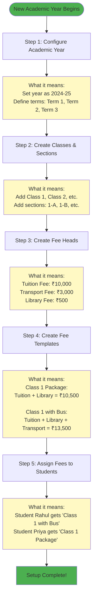
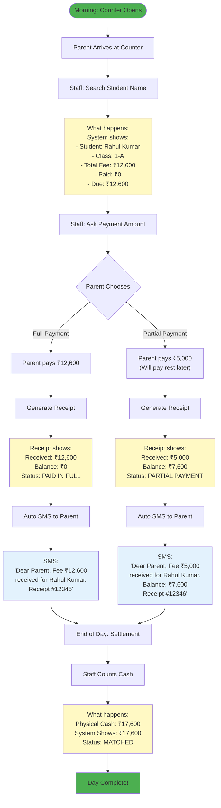
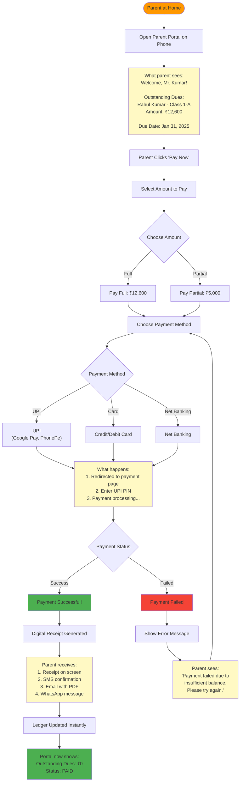

# Fee Management System - Beginner's Guide

## Introduction for Newcomers

Welcome! This guide explains the complete fee management system in simple terms. Whether you're new to school administration or fee management software, this guide will help you understand how everything works together.

---

## What is This System?

Think of this system as a **complete digital solution for managing school fees** - from setting up fee structures to collecting payments, tracking defaulters, and generating reports.

**Real-World Analogy:** 
Imagine running a small shop. You need to:
1. Set prices for items (Fee Structure)
2. Sell items and give receipts (Fee Collection)
3. Track who owes you money (Defaulter Management)
4. Count cash at day-end (Reconciliation)
5. See how much you earned (Reports)

This system does all of that, but for school fees!

---

## Who Uses This System?

### 1. **Super Admin** (School Director/Principal)
- Sets up the entire system
- Approves major changes
- Views all reports

### 2. **Accounts Admin** (Accounts Manager)
- Manages fee structures
- Handles reconciliation
- Generates reports

### 3. **Fee Counter Staff** (Cashier)
- Collects fees daily
- Generates receipts
- Handles cash/cheque

### 4. **Parents** (Via Parent Portal)
- Views dues
- Pays fees online
- Downloads receipts

### 5. **Class Teachers**
- Views defaulter students
- Follows up with parents

---

## Complete System Journey - Explained Simply

### Phase 1: System Setup (One-Time Setup)



**Real Example:**
```
Greenwood School - Academic Year 2024-25

Classes Created:
- Class 1 (Sections: A, B, C)
- Class 2 (Sections: A, B)

Fee Heads Created:
- Tuition Fee: ₹12,000/year
- Transport Fee: ₹4,000/year
- Library Fee: ₹600/year

Fee Template: "Class 1 Standard Package"
- Tuition: ₹12,000
- Library: ₹600
- Total: ₹12,600

Students Assigned:
- Rahul Kumar (Class 1-A): Standard Package = ₹12,600
- Priya Sharma (Class 1-A): Standard + Transport = ₹16,600
```

---

### Phase 2: Daily Operations (Every Day)



**Real Example:**
```
Date: January 15, 2025
Counter Staff: Mrs. Sharma

Transaction 1:
- Time: 9:30 AM
- Student: Rahul Kumar (Class 1-A)
- Amount Due: ₹12,600
- Amount Paid: ₹12,600 (Cash)
- Receipt #: FEE/2025/00123
- Balance: ₹0
- SMS Sent: 

Transaction 2:
- Time: 10:15 AM
- Student: Priya Sharma (Class 1-A)
- Amount Due: ₹16,600
- Amount Paid: ₹5,000 (Cash)
- Receipt #: FEE/2025/00124
- Balance: ₹11,600
- SMS Sent: 

End of Day:
- Total Cash Collected: ₹17,600
- Total in System: ₹17,600
- Status:  Matched
```

---

### Phase 3: Online Payment (Parent's Perspective)



**Real Example:**
```
Parent: Mr. Rajesh Kumar
Student: Rahul Kumar (Class 1-A)
Date: January 10, 2025, 8:30 PM

Step 1: Login to Parent Portal
- Username: rahul.parent@email.com
- Sees: Outstanding ₹12,600

Step 2: Click "Pay Now"
- Selects: Full Payment ₹12,600
- Convenience Fee: ₹126 (1%)
- Total: ₹12,726

Step 3: Choose Payment Method
- Selects: UPI (Google Pay)

Step 4: Complete Payment
- Redirected to Razorpay
- Enters UPI PIN
- Payment Success!

Step 5: Confirmation
- Receipt #: ONLINE/2025/00045
- SMS: "Dear Parent, payment of ₹12,726 received..."
- Email: PDF receipt attached
- WhatsApp: Receipt image sent

Portal Updated:
- Outstanding: ₹0
- Status:  PAID IN FULL
```

---

### Phase 4: Handling Defaulters (Month-End)


**Real Example:**
```
Student: Priya Sharma (Class 1-A)
Outstanding: ₹11,600
Due Date: January 31, 2025

Timeline:

February 1 (Day 1 Overdue):
- System auto-identifies as defaulter
- SMS sent: "Dear Parent, fee overdue..."
- Status: Level 1 - Reminder Sent

February 8 (Day 8 Overdue):
- No payment received
- Escalated to Level 2
- Assigned to: Mrs. Gupta (Class Teacher)
- Mrs. Gupta calls parent
- Parent promises to pay by Feb 15

February 15:
- No payment received
- Escalated to Level 3
- Principal meeting scheduled
- Parent requests payment plan

February 18:
- Payment plan approved:
  - ₹5,000 on Feb 20
  - ₹6,600 on March 10
- No hold applied (plan accepted)

February 20:
- Parent pays ₹5,000
- Balance: ₹6,600
- Next due: March 10
```

---

## Common Scenarios Explained

### Scenario 1: Partial Payment

**Situation:** Parent can only pay part of the fee

```
Student: Rahul Kumar
Total Fee: ₹12,600
Parent has: ₹5,000

What happens:
1. Staff accepts ₹5,000
2. Receipt generated showing:
   - Paid: ₹5,000
   - Balance: ₹7,600
3. Student ledger updated
4. Parent can pay balance later
5. No penalty if within due date
```

### Scenario 2: Advance Payment

**Situation:** Parent pays for next term in advance

```
Student: Priya Sharma
Current Term Fee: ₹16,600
Parent pays: ₹33,200 (double)

What happens:
1. ₹16,600 applied to current term
2. ₹16,600 kept as advance
3. Next term: Advance auto-applied
4. Parent doesn't need to pay again
```

### Scenario 3: Sibling Discount

**Situation:** Two siblings in same school

```
Student 1: Rahul Kumar (Class 1)
Fee: ₹12,600

Student 2: Rohan Kumar (Class 3)
Fee: ₹14,000

Sibling Discount: 10% on younger child

What happens:
1. Rahul's fee: ₹12,600 - 10% = ₹11,340
2. Rohan's fee: ₹14,000 (no discount)
3. Total for both: ₹25,340
4. Discount auto-applied by system
```

### Scenario 4: Fee Cancellation & Refund

**Situation:** Student leaves school mid-year

```
Student: Amit Verma
Paid: ₹12,600 (full year)
Leaves: After 3 months

What happens:
1. Accounts admin calculates refund
2. Refund amount: ₹9,450 (9 months)
3. Submits for approval
4. Principal approves
5. Refund processed
6. Receipt cancelled
7. Ledger updated
```

---

## How Modules Work Together - Simple Explanation

### Example: Complete Fee Payment Journey

```
1. SETUP (Module 10 + Module 1)
   ↓
   Admin creates fee structure
   ↓
   
2. ASSIGNMENT (Module 1)
   ↓
   Fee assigned to student
   ↓
   
3. REMINDER (Module 9)
   ↓
   Parent receives due date reminder
   ↓
   
4. PAYMENT (Module 3 or Module 4)
   ↓
   Parent pays at counter OR online
   ↓
   
5. CONFIRMATION (Module 9)
   ↓
   Parent receives receipt via SMS/Email
   ↓
   
6. RECONCILIATION (Module 5)
   ↓
   Accounts team matches with bank
   ↓
   
7. REPORTING (Module 7)
   ↓
   Principal views collection report
   ↓
   
8. AUDIT (Module 8)
   ↓
   All actions logged for compliance
```

---

## Key Concepts Explained

### What is a "Fee Head"?
**Simple:** A category of fee
**Example:** Tuition Fee, Transport Fee, Library Fee

### What is a "Fee Template"?
**Simple:** A package of multiple fee heads
**Example:** "Standard Package" = Tuition + Library + Sports

### What is a "Student Ledger"?
**Simple:** Complete payment history of one student
**Example:** 
```
Rahul Kumar - Ledger
- Fee Assigned: ₹12,600
- Paid on Jan 15: ₹5,000
- Paid on Feb 10: ₹7,600
- Total Paid: ₹12,600
- Balance: ₹0
```

### What is "Reconciliation"?
**Simple:** Matching system records with bank records
**Example:**
```
System says: Collected ₹1,00,000
Bank says: Deposited ₹1,00,000
Status:  Matched
```

### What is "Maker-Checker"?
**Simple:** Two-person approval for important actions
**Example:**
```
Maker (Staff): Requests refund of ₹10,000
Checker (Principal): Reviews and approves
Then: Refund processed
```

---

## Learning Path for New Users

### Week 1: Understanding Basics
- Learn about fee heads and templates
- Understand student ledger
- Practice viewing reports

### Week 2: Daily Operations
- Learn to generate receipts
- Handle partial payments
- Send payment confirmations

### Week 3: Advanced Features
- Bank reconciliation
- Defaulter management
- Report generation

### Week 4: Administration
- User management
- System configuration
- Approval workflows

---

This beginner-friendly guide explains the entire system in simple terms with real examples!
