# Fee Management System - Beginner's Guide

## Introduction for Newcomers

Welcome! This guide explains the complete fee management system in simple terms. Whether you're new to school administration or fee management software, this guide will help you understand how everything works together.

---

## What is This System?

Think of this system as a **complete digital solution for managing school fees** - from setting up fee structures to collecting payments, tracking defaulters, and generating reports.

**Real-World Analogy:** 
Imagine running a small shop. You need to:
1. Set prices for items (Fee Structure)
2. Sell items and give receipts (Fee Collection)
3. Track who owes you money (Defaulter Management)
4. Count cash at day-end (Reconciliation)
5. See how much you earned (Reports)

This system does all of that, but for school fees!

---

## Who Uses This System?

### 1. **Super Admin** (School Director/Principal)
- Sets up the entire system
- Approves major changes
- Views all reports

### 2. **Accounts Admin** (Accounts Manager)
- Manages fee structures
- Handles reconciliation
- Generates reports

### 3. **Fee Counter Staff** (Cashier)
- Collects fees daily
- Generates receipts
- Handles cash/cheque

### 4. **Parents** (Via Parent Portal)
- Views dues
- Pays fees online
- Downloads receipts

### 5. **Class Teachers**
- Views defaulter students
- Follows up with parents

---

## Complete System Journey - Explained Simply

### Phase 1: System Setup (One-Time Setup)

```mermaid
flowchart TD
    Start([New Academic Year Begins]) --> Step1[Step 1: Configure Academic Year]
    
    Step1 --> Explain1["📝 What it means:<br/>Set year as 2024-25<br/>Define terms: Term 1, Term 2, Term 3"]
    Explain1 --> Step2[Step 2: Create Classes & Sections]
    
    Step2 --> Explain2["📝 What it means:<br/>Add Class 1, Class 2, etc.<br/>Add sections: 1-A, 1-B, etc."]
    Explain2 --> Step3[Step 3: Create Fee Heads]
    
    Step3 --> Explain3["📝 What it means:<br/>Tuition Fee: ₹10,000<br/>Transport Fee: ₹3,000<br/>Library Fee: ₹500"]
    Explain3 --> Step4[Step 4: Create Fee Templates]
    
    Step4 --> Explain4["📝 What it means:<br/>Class 1 Package:<br/>Tuition + Library = ₹10,500<br/><br/>Class 1 with Bus:<br/>Tuition + Library + Transport = ₹13,500"]
    Explain4 --> Step5[Step 5: Assign Fees to Students]
    
    Step5 --> Explain5["📝 What it means:<br/>Student Rahul gets 'Class 1 with Bus'<br/>Student Priya gets 'Class 1 Package'"]
    Explain5 --> SetupComplete[✅ Setup Complete!]
    
    style Start fill:#4CAF50
    style SetupComplete fill:#4CAF50
    style Explain1 fill:#FFF9C4
    style Explain2 fill:#FFF9C4
    style Explain3 fill:#FFF9C4
    style Explain4 fill:#FFF9C4
    style Explain5 fill:#FFF9C4
```



**Real Example:**
```
Greenwood School - Academic Year 2024-25

Classes Created:
- Class 1 (Sections: A, B, C)
- Class 2 (Sections: A, B)

Fee Heads Created:
- Tuition Fee: ₹12,000/year
- Transport Fee: ₹4,000/year
- Library Fee: ₹600/year

Fee Template: "Class 1 Standard Package"
- Tuition: ₹12,000
- Library: ₹600
- Total: ₹12,600

Students Assigned:
- Rahul Kumar (Class 1-A): Standard Package = ₹12,600
- Priya Sharma (Class 1-A): Standard + Transport = ₹16,600
```

---

### Phase 2: Daily Operations (Every Day)

```mermaid
flowchart TD
    Morning([Morning: Counter Opens]) --> Parent1[Parent Arrives at Counter]
    
    Parent1 --> Staff1[Staff: Search Student Name]
    Staff1 --> Explain1["📝 What happens:<br/>System shows:<br/>- Student: Rahul Kumar<br/>- Class: 1-A<br/>- Total Fee: ₹12,600<br/>- Paid: ₹0<br/>- Due: ₹12,600"]
    
    Explain1 --> Staff2[Staff: Ask Payment Amount]
    Staff2 --> ParentChoice{Parent Chooses}
    
    ParentChoice -->|Full Payment| FullPay["Parent pays ₹12,600"]
    ParentChoice -->|Partial Payment| PartialPay["Parent pays ₹5,000<br/>(Will pay rest later)"]
    
    FullPay --> Receipt1[Generate Receipt]
    PartialPay --> Receipt2[Generate Receipt]
    
    Receipt1 --> Explain2["📝 Receipt shows:<br/>Received: ₹12,600<br/>Balance: ₹0<br/>Status: PAID IN FULL"]
    
    Receipt2 --> Explain3["📝 Receipt shows:<br/>Received: ₹5,000<br/>Balance: ₹7,600<br/>Status: PARTIAL PAYMENT"]
    
    Explain2 --> SMS1[Auto SMS to Parent]
    Explain3 --> SMS2[Auto SMS to Parent]
    
    SMS1 --> SMSText1["📱 SMS:<br/>'Dear Parent, Fee ₹12,600<br/>received for Rahul Kumar.<br/>Receipt #12345'"]
    
    SMS2 --> SMSText2["📱 SMS:<br/>'Dear Parent, Fee ₹5,000<br/>received for Rahul Kumar.<br/>Balance: ₹7,600<br/>Receipt #12346'"]
    
    SMSText1 --> DayEnd[End of Day: Settlement]
    SMSText2 --> DayEnd
    
    DayEnd --> Count[Staff Counts Cash]
    Count --> Explain4["📝 What happens:<br/>Physical Cash: ₹17,600<br/>System Shows: ₹17,600<br/>Status: ✅ MATCHED"]
    
    Explain4 --> Complete[Day Complete!]
    
    style Morning fill:#4CAF50
    style Complete fill:#4CAF50
    style Explain1 fill:#FFF9C4
    style Explain2 fill:#FFF9C4
    style Explain3 fill:#FFF9C4
    style Explain4 fill:#FFF9C4
    style SMSText1 fill:#E3F2FD
    style SMSText2 fill:#E3F2FD
```



**Real Example:**
```
Date: January 15, 2025
Counter Staff: Mrs. Sharma

Transaction 1:
- Time: 9:30 AM
- Student: Rahul Kumar (Class 1-A)
- Amount Due: ₹12,600
- Amount Paid: ₹12,600 (Cash)
- Receipt #: FEE/2025/00123
- Balance: ₹0
- SMS Sent: ✅

Transaction 2:
- Time: 10:15 AM
- Student: Priya Sharma (Class 1-A)
- Amount Due: ₹16,600
- Amount Paid: ₹5,000 (Cash)
- Receipt #: FEE/2025/00124
- Balance: ₹11,600
- SMS Sent: ✅

End of Day:
- Total Cash Collected: ₹17,600
- Total in System: ₹17,600
- Status: ✅ Matched
```

---

### Phase 3: Online Payment (Parent's Perspective)

```mermaid
flowchart TD
    Start([Parent at Home]) --> Login[Open Parent Portal on Phone]
    
    Login --> Explain1["📝 What parent sees:<br/>Welcome, Mr. Kumar!<br/><br/>Outstanding Dues:<br/>Rahul Kumar - Class 1-A<br/>Amount: ₹12,600<br/><br/>🔴 Due Date: Jan 31, 2025"]
    
    Explain1 --> ClickPay[Parent Clicks 'Pay Now']
    ClickPay --> SelectAmount[Select Amount to Pay]
    
    SelectAmount --> AmountChoice{Choose Amount}
    
    AmountChoice -->|Full| Full["Pay Full: ₹12,600"]
    AmountChoice -->|Partial| Partial["Pay Partial: ₹5,000"]
    
    Full --> Gateway[Choose Payment Method]
    Partial --> Gateway
    
    Gateway --> GatewayChoice{Payment Method}
    
    GatewayChoice -->|UPI| UPI["📱 UPI<br/>(Google Pay, PhonePe)"]
    GatewayChoice -->|Card| Card["💳 Credit/Debit Card"]
    GatewayChoice -->|Net Banking| NetBanking["🏦 Net Banking"]
    
    UPI --> Explain2["📝 What happens:<br/>1. Redirected to payment page<br/>2. Enter UPI PIN<br/>3. Payment processing..."]
    
    Card --> Explain2
    NetBanking --> Explain2
    
    Explain2 --> Success{Payment Status}
    
    Success -->|Success| PaySuccess["✅ Payment Successful!"]
    Success -->|Failed| PayFailed["❌ Payment Failed"]
    
    PaySuccess --> Receipt[Digital Receipt Generated]
    Receipt --> Explain3["📝 Parent receives:<br/>1. Receipt on screen<br/>2. SMS confirmation<br/>3. Email with PDF<br/>4. WhatsApp message"]
    
    Explain3 --> Updated[Ledger Updated Instantly]
    Updated --> ShowUpdated["📝 Portal now shows:<br/>Outstanding Dues: ₹0<br/>Status: ✅ PAID"]
    
    PayFailed --> Retry[Show Error Message]
    Retry --> Explain4["📝 Parent sees:<br/>'Payment failed due to<br/>insufficient balance.<br/>Please try again.'"]
    
    Explain4 --> Gateway
    
    style Start fill:#FF9800
    style PaySuccess fill:#4CAF50
    style ShowUpdated fill:#4CAF50
    style PayFailed fill:#f44336
    style Explain1 fill:#FFF9C4
    style Explain2 fill:#FFF9C4
    style Explain3 fill:#FFF9C4
    style Explain4 fill:#FFF9C4
```



**Real Example:**
```
Parent: Mr. Rajesh Kumar
Student: Rahul Kumar (Class 1-A)
Date: January 10, 2025, 8:30 PM

Step 1: Login to Parent Portal
- Username: rahul.parent@email.com
- Sees: Outstanding ₹12,600

Step 2: Click "Pay Now"
- Selects: Full Payment ₹12,600
- Convenience Fee: ₹126 (1%)
- Total: ₹12,726

Step 3: Choose Payment Method
- Selects: UPI (Google Pay)

Step 4: Complete Payment
- Redirected to Razorpay
- Enters UPI PIN
- Payment Success!

Step 5: Confirmation
- Receipt #: ONLINE/2025/00045
- SMS: "Dear Parent, payment of ₹12,726 received..."
- Email: PDF receipt attached
- WhatsApp: Receipt image sent

Portal Updated:
- Outstanding: ₹0
- Status: ✅ PAID IN FULL
```

---

### Phase 4: Handling Defaulters (Month-End)

```mermaid
flowchart TD
    MonthEnd([Month-End: January 31]) --> System[System Auto-Identifies Defaulters]
    
    System --> Explain1["📝 System checks:<br/>Due Date: Jan 31<br/>Today: Feb 1<br/><br/>Students with balance > 0:<br/>- Priya Sharma: ₹11,600<br/>- Amit Verma: ₹12,600<br/>- Total: 45 students"]
    
    Explain1 --> AutoReminder[System Sends Auto Reminder]
    AutoReminder --> SMS["📱 SMS Sent:<br/>'Dear Parent,<br/>Fee of ₹11,600 is overdue<br/>for Priya Sharma.<br/>Please pay at earliest.'"]
    
    SMS --> Wait[Wait 7 Days]
    Wait --> Check{Payment Received?}
    
    Check -->|Yes| Paid["✅ Parent Paid<br/>Remove from defaulter list"]
    Check -->|No| Level2[Escalate to Level 2]
    
    Level2 --> Explain2["📝 What happens:<br/>1. Class teacher assigned<br/>2. Teacher calls parent<br/>3. Logs conversation"]
    
    Explain2 --> Wait2[Wait 7 More Days]
    Wait2 --> Check2{Payment Received?}
    
    Check2 -->|Yes| Paid
    Check2 -->|No| Level3[Escalate to Level 3]
    
    Level3 --> Explain3["📝 What happens:<br/>1. Principal meeting scheduled<br/>2. Payment plan offered<br/>3. Or academic hold applied"]
    
    Explain3 --> Hold[Apply Academic Hold]
    Hold --> Explain4["📝 Hold means:<br/>❌ Cannot download report card<br/>❌ Cannot appear in exams<br/>✅ Can attend classes<br/><br/>Released when payment made"]
    
    Explain4 --> PaymentMade{Parent Pays?}
    
    PaymentMade -->|Yes| ReleaseHold[Release Hold Immediately]
    PaymentMade -->|No| Legal[Send Legal Notice]
    
    ReleaseHold --> Explain5["📝 What happens:<br/>1. Hold removed<br/>2. Report card accessible<br/>3. Can appear in exams<br/>4. SMS sent to parent"]
    
    style MonthEnd fill:#FF9800
    style Paid fill:#4CAF50
    style ReleaseHold fill:#4CAF50
    style Hold fill:#f44336
    style Legal fill:#f44336
    style Explain1 fill:#FFF9C4
    style Explain2 fill:#FFF9C4
    style Explain3 fill:#FFF9C4
    style Explain4 fill:#FFF9C4
    style Explain5 fill:#FFF9C4
```



**Real Example:**
```
Student: Priya Sharma (Class 1-A)
Outstanding: ₹11,600
Due Date: January 31, 2025

Timeline:

February 1 (Day 1 Overdue):
- System auto-identifies as defaulter
- SMS sent: "Dear Parent, fee overdue..."
- Status: Level 1 - Reminder Sent

February 8 (Day 8 Overdue):
- No payment received
- Escalated to Level 2
- Assigned to: Mrs. Gupta (Class Teacher)
- Mrs. Gupta calls parent
- Parent promises to pay by Feb 15

February 15:
- No payment received
- Escalated to Level 3
- Principal meeting scheduled
- Parent requests payment plan

February 18:
- Payment plan approved:
  - ₹5,000 on Feb 20
  - ₹6,600 on March 10
- No hold applied (plan accepted)

February 20:
- Parent pays ₹5,000
- Balance: ₹6,600
- Next due: March 10
```

---

## Common Scenarios Explained

### Scenario 1: Partial Payment

**Situation:** Parent can only pay part of the fee

```
Student: Rahul Kumar
Total Fee: ₹12,600
Parent has: ₹5,000

What happens:
1. Staff accepts ₹5,000
2. Receipt generated showing:
   - Paid: ₹5,000
   - Balance: ₹7,600
3. Student ledger updated
4. Parent can pay balance later
5. No penalty if within due date
```

### Scenario 2: Advance Payment

**Situation:** Parent pays for next term in advance

```
Student: Priya Sharma
Current Term Fee: ₹16,600
Parent pays: ₹33,200 (double)

What happens:
1. ₹16,600 applied to current term
2. ₹16,600 kept as advance
3. Next term: Advance auto-applied
4. Parent doesn't need to pay again
```

### Scenario 3: Sibling Discount

**Situation:** Two siblings in same school

```
Student 1: Rahul Kumar (Class 1)
Fee: ₹12,600

Student 2: Rohan Kumar (Class 3)
Fee: ₹14,000

Sibling Discount: 10% on younger child

What happens:
1. Rahul's fee: ₹12,600 - 10% = ₹11,340
2. Rohan's fee: ₹14,000 (no discount)
3. Total for both: ₹25,340
4. Discount auto-applied by system
```

### Scenario 4: Fee Cancellation & Refund

**Situation:** Student leaves school mid-year

```
Student: Amit Verma
Paid: ₹12,600 (full year)
Leaves: After 3 months

What happens:
1. Accounts admin calculates refund
2. Refund amount: ₹9,450 (9 months)
3. Submits for approval
4. Principal approves
5. Refund processed
6. Receipt cancelled
7. Ledger updated
```

---

## How Modules Work Together - Simple Explanation

### Example: Complete Fee Payment Journey

```
1. SETUP (Module 10 + Module 1)
   ↓
   Admin creates fee structure
   ↓
   
2. ASSIGNMENT (Module 1)
   ↓
   Fee assigned to student
   ↓
   
3. REMINDER (Module 9)
   ↓
   Parent receives due date reminder
   ↓
   
4. PAYMENT (Module 3 or Module 4)
   ↓
   Parent pays at counter OR online
   ↓
   
5. CONFIRMATION (Module 9)
   ↓
   Parent receives receipt via SMS/Email
   ↓
   
6. RECONCILIATION (Module 5)
   ↓
   Accounts team matches with bank
   ↓
   
7. REPORTING (Module 7)
   ↓
   Principal views collection report
   ↓
   
8. AUDIT (Module 8)
   ↓
   All actions logged for compliance
```

---

## Key Concepts Explained

### What is a "Fee Head"?
**Simple:** A category of fee
**Example:** Tuition Fee, Transport Fee, Library Fee

### What is a "Fee Template"?
**Simple:** A package of multiple fee heads
**Example:** "Standard Package" = Tuition + Library + Sports

### What is a "Student Ledger"?
**Simple:** Complete payment history of one student
**Example:** 
```
Rahul Kumar - Ledger
- Fee Assigned: ₹12,600
- Paid on Jan 15: ₹5,000
- Paid on Feb 10: ₹7,600
- Total Paid: ₹12,600
- Balance: ₹0
```

### What is "Reconciliation"?
**Simple:** Matching system records with bank records
**Example:**
```
System says: Collected ₹1,00,000
Bank says: Deposited ₹1,00,000
Status: ✅ Matched
```

### What is "Maker-Checker"?
**Simple:** Two-person approval for important actions
**Example:**
```
Maker (Staff): Requests refund of ₹10,000
Checker (Principal): Reviews and approves
Then: Refund processed
```

---

## Learning Path for New Users

### Week 1: Understanding Basics
- Learn about fee heads and templates
- Understand student ledger
- Practice viewing reports

### Week 2: Daily Operations
- Learn to generate receipts
- Handle partial payments
- Send payment confirmations

### Week 3: Advanced Features
- Bank reconciliation
- Defaulter management
- Report generation

### Week 4: Administration
- User management
- System configuration
- Approval workflows

---

This beginner-friendly guide explains the entire system in simple terms with real examples!
