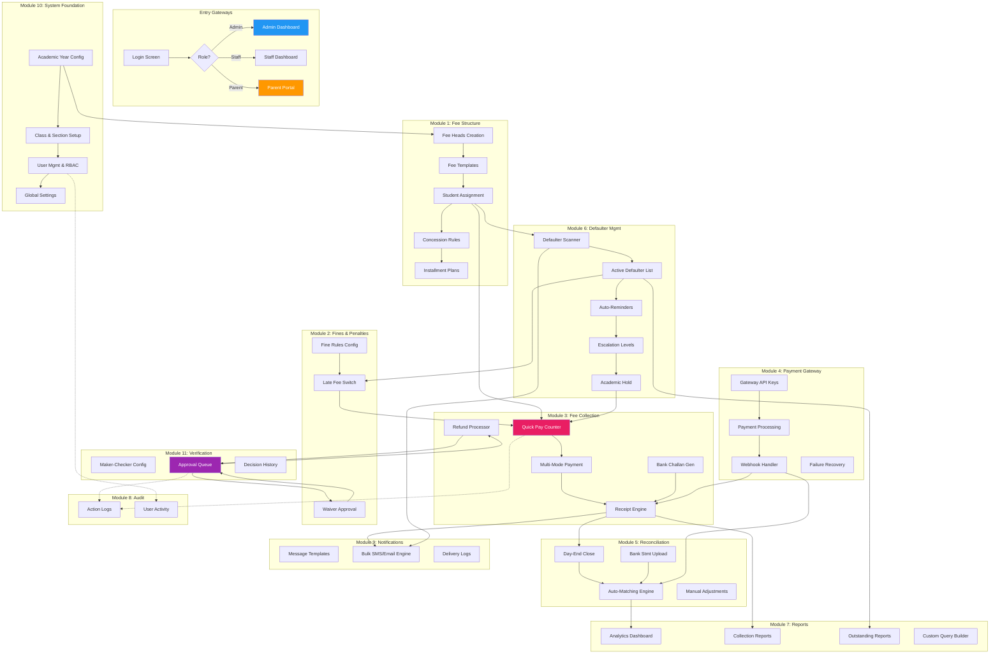
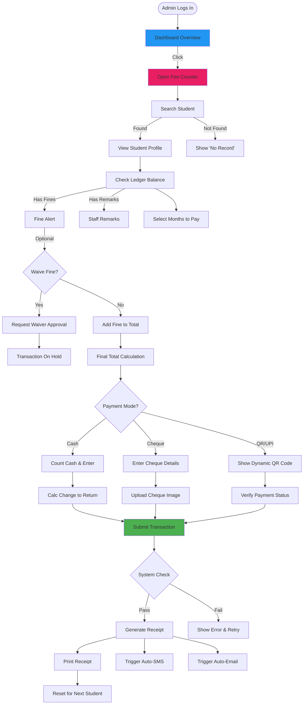
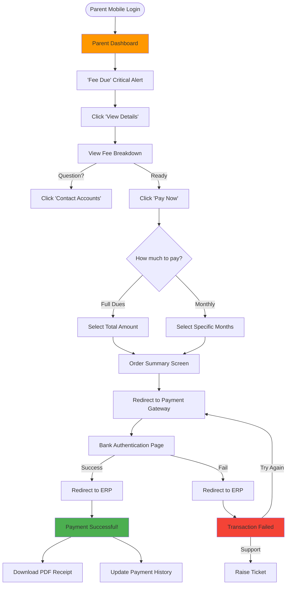

# Complete Fee Management System - UI/UX Big Picture

## System-Wide User Journey Map

This document visualizes how all 11 modules interconnect from a UI/UX perspective, showing the complete user experience across the entire fee management system.

---

## 1. Comprehensive System Architecture - UI/UX Perspective

This map visualizes the **entire application ecosystem**, showing every module, sub-module, and how data/users flow between them.

### Data Flow vs. Control Flow
This diagram represents **Control Flow** (User Navigation).
*   **Data Flow**: Data moves from Foundation -> Structure -> Collection -> Reconciliation -> Reporting.
*   **State**: The `StudentLedger` is the central "State Container" that most modules read from or write to.

---

## 2. Core Data Entities & Relationships

To ensure a seamless UX, the following "Data Objects" must be consistent across all screens.

| Entity | Description | Used In Modules |
| :--- | :--- | :--- |
| **Student Ledger** | The detailed financial history of a student. Contains Debits (Fees) and Credits (Payments). | 1, 2, 3, 4, 6, 7, 9 |
| **Receipt Object** | immutable record of payment. Contains Breakdown (Tuition, Bus), Mode, Timestamp. | 3, 4, 5, 7, 8 |
| **Fee Structure** | The rules engine. Defines "Who Pays What". Includes Heads, Templates, and Logic. | 1, 10 |
| **Transaction** | A raw money movement. Can be Cash, Cheque, or Online Gateway Reference. | 3, 4, 5 |
| **Approval Request** | A package of "Proposed Change" waiting for a decision. | 11, 2, 3 |

---

## 3. Comprehensive User Journeys

### A. Admin Perspective: The "Daily Collection" Lifecycle

This flow details exactly how an Admin handles a busy day at the fee counter, including all edge cases.

### B. Parent Perspective: The "Peace of Mind" Payment Flow

This flow maps the parent's emotional journey from anxiety (seeing dues) to relief (getting a receipt).

---

## 4. UI/UX Strategy & Design System

### Visual Language
*   **Primary Color (Admin)**: Enterprise Blue (`#2196F3`) - Trust, Professionalism.
*   **Primary Color (Parent)**: Warm Orange (`#FF9800`) - Engaging, Urgent but friendly.
*   **Success**: Green (`#4CAF50`) - Payment received, Approved.
*   **Warning**: Amber (`#FFC107`) - Pending Approval, Near Due Date.
*   **Danger**: Red (`#F44336`) - Overdue, Rejected, Failed Transaction.
*   **Typography**: Clean Sans-Serif (Inter or Roboto) for readability of dense financial tables.

### Component Logic
*   **Tables**: Must be high-density for Admins. Features: Sticky Headers, Sortable Columns, CSV Export.
*   **Forms**: Wizard-style for complex setups (e.g., Fee Structure). Single-page for quick actions (e.g., Receipt).
*   **Modals**: Use for quick confirmations or short forms (e.g., "Add Note").
*   **Drawers/Side Panels**: Use for detail views (e.g., clicking a Transaction ID opens a detailed breakdown side panel).

### Error Handling & Feedback
*   **Toast Notifications**: For transient success/info messages ("Receipt Generated").
*   **Inline Validation**: Instant feedback on form fields (e.g., "Amount cannot exceed balance").
*   **Global Error Boundary**: Friendly "Something went wrong" page for crashes, with a Support ID.
*   **Empty States**: Helpful illustrations when lists are empty (e.g., "No Defaulters Found - Good Job!").

### Accessibility (a11y) Standards
*   **Keyboard Navigation**: Full support for Tab traversal for power users (Data Entry clerks).
*   **Contrast Ratio**: WCAG AA standards for all text/background combinations.
*   **Screen Readers**: ARIA labels on all inputs and dynamic updates (Live Regions).

---

## 5. Technical UI Architecture

### State Management Strategy
*   **Server State (React Query / SWR)**: Used for fetching Fee Structures, Ledgers, and Report Data. Caching is critical here to reduce API load.
*   **Global Client State (Zustand / Redux)**: Used for:
    *   User Session (Auth Token, Role).
    *   UI State (Sidebar Open/Close, Dark Mode).
    *   Multi-step Form Wizards (Draft data).
*   **Form State (React Hook Form)**: Isolated state for complex forms with validation logic (Zod).

### Mobile Responsiveness
*   **Admin Panel**: "Desk-First" design. Complex tables allow horizontal scrolling or switch to "Card View" on mobile.
*   **Parent Portal**: "Mobile-First" design. Big buttons, clear typography, simplified detailed views.

---

## 6. Detailed Navigation Map

### Admin Panel
1.  **Dashboard**: Overview Stats.
2.  **Fee Collection**: Quick Receipt, Search, Challan.
3.  **Finance Operations**: Fee Structure, Fines, Gateways.
4.  **Student Management**: Ledger, Defaulters.
5.  **Approvals**: Pending Requests.
6.  **Reports**: Collection, Dues, Reconciliation.
7.  **Settings**: Users, Roles, Configuration.

### Parent Portal
1.  **Home**: Current Balance Card.
2.  **Pay Fees**: Payment Flow.
3.  **History**: Past Receipts.
4.  **Profile**: Notification Preferences.
