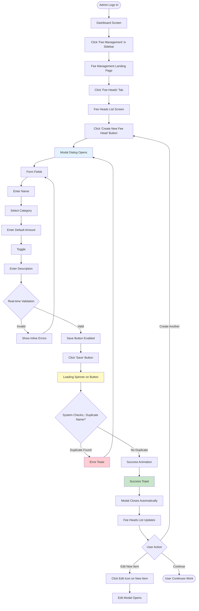
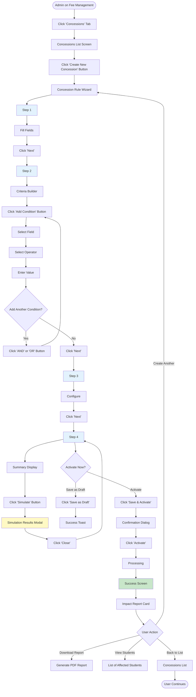
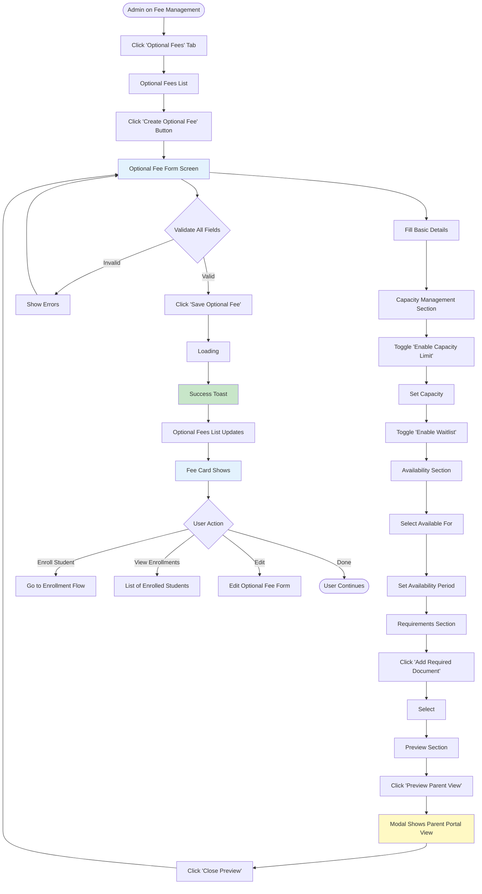

```mermaid
flowchart TD
    Start([Admin on Fee Management]) --> ClickPlans[Click 'Installment Plans' Tab]
    ClickPlans --> PlansList[Installment Plans List]
    
    PlansList --> ClickNew[Click 'Create New Plan' Button]
    ClickNew --> PlanForm[Installment Plan Form]
    
    PlanForm --> FillBasic[Fill Basic Info]
    
    FillBasic --> InstallmentBuilder[Installment Builder Section]
    
    InstallmentBuilder --> Installment1[Installment 1 Configuration]
    
    Installment1 --> FillInst1[Fill Details]
    
    FillInst1 --> ShowCalc1[Auto-Calculate]
    
    ShowCalc1 --> Installment2[Installment 2 Configuration]
    
    Installment2 --> FillInst2[Fill Details]
    
    FillInst2 --> ShowCalc2[Auto-Calculate]
    
    ShowCalc2 --> Installment3[Installment 3 Configuration]
    
    Installment3 --> FillInst3[Fill Details]
    
    FillInst3 --> ShowCalc3[Auto-Calculate]
    
    ShowCalc3 --> Installment4[Installment 4 Configuration]
    
    Installment4 --> FillInst4[Fill Details]
    
    FillInst4 --> ShowCalc4[Auto-Calculate]
    
    ShowCalc4 --> ValidateTotal{Validate:; Total = 100%?}
    
    ValidateTotal -->|Not 100%| ShowTotalError[Error Banner]
    ShowTotalError --> InstallmentBuilder
    
    ValidateTotal -->|Equals 100%| ShowSummary[Summary Section]
    
    ShowSummary --> DiscountSection[Optional]
    
    DiscountSection --> AddDiscount{Add Discount?}
    
    AddDiscount -->|Yes| ClickAddDiscount[Click 'Add Discount' Button]
    ClickAddDiscount --> DiscountModal[Discount Configuration Modal]
    
    DiscountModal --> FillDiscount[Fill]
    
    FillDiscount --> ApplyDiscount[Click 'Apply']
    ApplyDiscount --> UpdateSummary[Summary Updates]
    
    AddDiscount -->|No| ApplicabilitySection[Applicability Section]
    UpdateSummary --> ApplicabilitySection
    
    ApplicabilitySection --> SelectClasses[Select Applicable To]
    
    SelectClasses --> DefaultToggle[Toggle 'Set as Default Plan']
    
    DefaultToggle --> FinalReview[Final Review Card]
    
    FinalReview --> ClickSave[Click 'Save Plan' Button]
    ClickSave --> LoadingState[Loading]
    
    LoadingState --> SuccessScreen[Success Screen]
    
    SuccessScreen --> ActionOptions[Action Options]
    
    ActionOptions --> UserChoice{User Selects}
    
    UserChoice -->|Assign| AssignFlow[Bulk Assignment Screen]
    UserChoice -->|Set Default| SetDefault[Confirmation Dialog]
    UserChoice -->|Create Another| PlanForm
    UserChoice -->|Back| UpdatedList[Plans List Updates]
    
    UpdatedList --> End([User Continues])
    
    style InstallmentBuilder fill:#e3f2fd
    style ShowSummary fill:#fff9c4
    style UpdateSummary fill:#c8e6c9
    style SuccessScreen fill:#c8e6c9
    style ShowTotalError fill:#ffcdd2
```

# User Flows: Fee Structure Setup (UI/UX Perspective)

## Introduction

This document visualizes the **user interface journey** through the Fee Structure Setup module from a UI/UX design perspective. This module handles all configuration activities that must be completed before the academic year begins, defining what fees will be collected, how much will be charged, and when payments are due.

Each flowchart focuses on:
- **Screen states** and visual feedback
- **User actions** and decision points
- **Navigation paths** between interfaces
- **Error handling** and recovery flows

---

## Flow 1: Define Fee Head

### User Story
*"As a Fee Structure Admin, I want to create a new fee category (fee head) so that I can include it in fee templates for students."*

### Interface Flow



### Screen States

**1. Fee Heads List (Empty State)**
- Illustration: "No fee heads created yet"
- Message: "Create your first fee head to get started"
- Large "Create Fee Head" button centered

**2. Fee Heads List (Loaded State)**
- Table with columns: Name, Category, Default Amount, Type, Status, Actions
- Search bar at top
- Filter by category dropdown
- Sort by name/category/amount

**3. Create Modal (Empty State)**
- All fields blank with placeholder text
- Save button disabled (grayed out)
- Category dropdown shows all options
- Mandatory toggle defaults to OFF

**4. Create Modal (Filled State)**
- Fields populated with data
- Real-time validation (green checkmarks)
- Character count for description (max 500)
- Save button enabled (blue)

**5. Create Modal (Error State)**
- Invalid fields highlighted in red
- Error messages below fields
- Save button disabled
- Focus automatically on first error field

---

## Flow 2: Create Generic Fee Template

### User Story
*"As a Fee Structure Admin, I want to create a fee template for Class 10 Science students so that I can assign it to all students in that group at once."*

### Interface Flow

```mermaid
flowchart TD
    Start([Admin on Fee Management Page]) --> ClickTemplates[Click 'Templates' Tab]
    ClickTemplates --> TemplateList[Fee Templates List Screen]
    
    TemplateList --> ClickNew[Click 'Create New Template' Button]
    ClickNew --> TemplateForm[Template Creation Screen]
    
    TemplateForm --> Step1[Step 1]
    
    Step1 --> FillBasic[Fill Fields]
    
    FillBasic --> ValidateStep1{Validate Step 1}
    
    ValidateStep1 -->|Invalid| ShowStep1Errors[Show Errors]
    ShowStep1Errors --> Step1
    
    ValidateStep1 -->|Valid| ClickNext1[Click 'Next' Button]
    ClickNext1 --> Step2[Step 2]
    
    Step2 --> ShowAvailable[Left Panel]
    
    ShowAvailable --> SearchFee[Search]
    SearchFee --> FilteredList[List Filters to Show]
    
    FilteredList --> SelectTuition[Click on 'Tuition Fee']
    SelectTuition --> ClickAdd[Click 'Add' Button or Drag to Right]
    
    ClickAdd --> MoveToSelected[Item Moves to Right Panel]
    
    MoveToSelected --> EnterAmount[Amount Input Field Appears]
    EnterAmount --> AddMore[Add More Fee Heads]
    
    AddMore --> ShowTotal[Total Calculation (Auto)]
    
    ShowTotal --> ValidateStep2{Validate Step 2:; At least 1 fee head?}
    
    ValidateStep2 -->|No Fee Heads| ShowStep2Error[Warning Message]
    ShowStep2Error --> Step2
    
    ValidateStep2 -->|Has Fee Heads| ClickNext2[Click 'Next' Button]
    ClickNext2 --> Step3[Step 3]
    
    Step3 --> ShowSummary[Summary Card]
    
    ShowSummary --> ReviewChoice{User Reviews}
    
    ReviewChoice -->|Need Changes| ClickBack[Click 'Back' Button]
    ClickBack --> Step2
    
    ReviewChoice -->|Looks Good| ClickCreate[Click 'Create Template' Button]
    ClickCreate --> LoadingState[Loading Overlay]
    
    LoadingState --> SuccessScreen[Success Screen]
    
    SuccessScreen --> ShowOptions[Action Options]
    
    ShowOptions --> UserChoice{User Selects}
    
    UserChoice -->|View| ViewTemplate[Template Detail Page]
    UserChoice -->|Assign| AssignFlow[Go to Assignment Flow]
    UserChoice -->|Create Another| TemplateForm
    UserChoice -->|Back to List| UpdatedList[Templates List]
    
    UpdatedList --> End([User Continues])
    
    style Step1 fill:#e3f2fd
    style Step2 fill:#e3f2fd
    style Step3 fill:#e3f2fd
    style SuccessScreen fill:#c8e6c9
    style ShowTotal fill:#fff9c4
```

### Screen States

**1. Template List (Empty State)**
- Illustration: "No templates created"
- Suggestion: "Create templates for each class/stream combination"
- "Create Template" button prominent

**2. Template List (Grouped View)**
- Grouped by class (expandable accordions)
- Each template card shows: Name, Total amount, # of fee heads, Assignment status
- Quick actions: Edit, Duplicate, Assign, Delete

**3. Step 1: Basic Info**
- Clean form layout
- Academic year dropdown (current + next year)
- Class dropdown (1-12)
- Section: Multi-select checkboxes or "All" option
- Stream: Dropdown (Science/Commerce/Arts/General)

**4. Step 2: Fee Head Selection**
- Split-screen layout (50-50)
- Left: Available fee heads with search and category filters
- Right: Selected fee heads with amount inputs
- Drag-and-drop support
- Running total at bottom (sticky)

**5. Step 3: Review Summary**
- Card-based layout
- Editable inline (click to edit specific fields)
- "Back" button to previous steps
- "Create Template" button (primary, blue)

---

## Flow 3: Assign Fee Template to Student

### User Story
*"As an Accounts Admin, I want to assign the Class 10 Science template to a newly enrolled student so that their fee structure is set up correctly."*

### Interface Flow

```mermaid
flowchart TD
    Start([Admin on Dashboard]) --> ClickStudents[Click 'Student Fee Assignment' Menu]
    ClickStudents --> AssignmentPage[Fee Assignment Screen]
    
    AssignmentPage --> SelectMode[Select 'Individual Assignment' Tab]
    SelectMode --> SearchStudent[Student Search Section]
    
    SearchStudent --> TypeSearch[Type Student Name]
    TypeSearch --> ShowResults[Dropdown Shows Results]
    
    ShowResults --> SelectStudent[Click on 'Sarah Johnson (Class 10-A)']
    SelectStudent --> LoadStudent[Loading Spinner]
    
    LoadStudent --> StudentCard[Student Info Card Appears]
    
    StudentCard --> CheckStatus{Fee Already Assigned?}
    
    CheckStatus -->|Yes| ShowWarning[Warning Banner]
    ShowWarning --> WarningChoice{User Choice}
    
    WarningChoice -->|View| ViewExisting[View Current Fee Structure]
    WarningChoice -->|Modify| ModifyFlow[Go to Modification Flow]
    WarningChoice -->|Reassign| ConfirmReassign[Confirmation Dialog]
    
    ConfirmReassign --> ClickCancel[Click 'Cancel']
    ClickCancel --> AssignmentPage
    
    ConfirmReassign --> ClickConfirm[Click 'Yes, Replace']
    ClickConfirm --> SelectTemplate
    
    CheckStatus -->|No| SelectTemplate[Template Selection Section]
    
    SelectTemplate --> ShowTemplates[Dropdown Shows]
    
    ShowTemplates --> ClickRecommended[Click Recommended]
    
    ClickRecommended --> LoadTemplate[Loading Template Details...]
    LoadTemplate --> ShowPreview[Template Preview Card]
    
    ShowPreview --> CheckConcession{Apply Concession?}
    
    CheckConcession -->|Yes| ClickConcession[Click 'Add Concession' Button]
    ClickConcession --> ConcessionModal[Concession Selection Modal]
    
    ConcessionModal --> ShowEligible[Auto-Check Eligibility]
    
    ShowEligible --> SelectConcession[Select]
    SelectConcession --> ApplyConcession[Click 'Apply']
    
    ApplyConcession --> UpdatePreview[Preview Updates]
    
    CheckConcession -->|No| SelectInstallment[Installment Plan Section]
    UpdatePreview --> SelectInstallment
    
    SelectInstallment --> ShowPlans[Available Plans]
    
    ShowPlans --> ClickPlan[Select]
    ClickPlan --> ShowSchedule[Payment Schedule Table]
    
    ShowSchedule --> FinalReview[Final Review Section]
    
    FinalReview --> ClickAssign[Click 'Assign Fee Structure' Button]
    
    ClickAssign --> ConfirmDialog[Confirmation Dialog]
    
    ConfirmDialog --> ClickConfirmAssign[Click 'Confirm']
    ClickConfirmAssign --> ProcessingState[Processing Overlay]
    
    ProcessingState --> SuccessAnimation[Success Animation]
    
    SuccessAnimation --> SuccessMessage[Success Screen]
    
    SuccessMessage --> ActionButtons[Action Options]
    
    ActionButtons --> UserAction{User Selects}
    
    UserAction -->|Print| PrintReceipt[Open Print Dialog]
    UserAction -->|Send| SendNotif[Send Notification Screen]
    UserAction -->|Assign Another| SearchStudent
    UserAction -->|View Ledger| StudentLedger[Student Ledger Page]
    UserAction -->|Done| End([User Continues])
    
    style StudentCard fill:#e3f2fd
    style ShowPreview fill:#fff9c4
    style UpdatePreview fill:#c8e6c9
    style SuccessAnimation fill:#c8e6c9
    style ShowWarning fill:#ffe0b2
```

### Screen States

**1. Search Section**
- Large search input with icon
- Placeholder: "Search by student name, ID, or class"
- Live search results dropdown
- Recent searches shown if input empty

**2. Student Info Card**
- Profile photo (left)
- Student details (center)
- Current status badge (right): "Not Assigned"; "Assigned"; "Partial"
- Color-coded status

**3. Template Preview**
- Expandable/collapsible sections
- Fee heads in table format
- Total prominently displayed
- "Edit Template" link (opens template in new tab)

**4. Concession Modal**
- List of all concessions
- Eligibility indicator (checkmark or X)
- Reason for ineligibility shown on hover
- Preview of discount amount before applying

**5. Final Review Card**
- Summary of all selections
- Edit buttons for each section
- Total amount highlighted
- Payment schedule preview

---

## Flow 4: Configure Concession Rule

### User Story
*"As a Fee Structure Admin, I want to create a sibling discount rule so that families with multiple children automatically receive a 10% discount on the second child's fees."*

### Interface Flow



### Screen States

**1. Concessions List**
- Table view with columns: Name, Type, Value, Status, # Students, Actions
- Filter by: Status (Active/Inactive), Type (Percentage/Fixed)
- Sort by: Name, # Students, Total discount
- Quick toggle to activate/deactivate

**2. Criteria Builder**
- Visual rule builder (similar to query builders)
- Drag-and-drop interface
- AND/OR logic support
- Preview of matching students count (live update)
- Syntax validation

**3. Simulation Modal**
- Bar chart showing distribution
- Pie chart of discount by class
- Table of top beneficiaries
- Export to Excel button

**4. Impact Report**
- Summary statistics
- Before/After comparison
- List of affected students (paginated)
- Audit trail of who activated

---

## Flow 5: Set Up Optional Fee

### User Story
*"As a Fee Structure Admin, I want to create an optional School Bus Fee with capacity limits so that parents can opt-in during enrollment and we don't exceed bus capacity."*

### Interface Flow



### Screen States

**1. Optional Fees List**
- Card-based layout (grid view)
- Each card shows: Name, Amount, Capacity bar, Status
- Filter by: Category, Status, Availability
- Sort by: Name, Enrollments, Capacity

**2. Form Screen (Capacity Section)**
- Capacity input with visual indicator
- Route breakdown (if applicable)
- Real-time capacity calculator
- Warning if capacity too low

**3. Parent Portal Preview**
- Exactly as parents will see it
- Shows availability status
- "Enroll Now" button (disabled in preview)
- Capacity indicator (color-coded)

**4. Fee Card (List View)**
- Progress bar for capacity (green → yellow → red)
- Badge: "Available"; "Limited"; "Full"; "Waitlist"
- Quick stats: Enrolled, Waitlist, Revenue

---

## Flow 6: Create Installment Plan

### User Story
*"As a Fee Structure Admin, I want to create a quarterly installment plan so that parents can pay fees in 4 installments throughout the year instead of one lump sum."*

### Interface Flow



### Screen States

**1. Plans List**
- Table view: Name, # Installments, # Students, Default badge, Actions
- Quick view: Hover to see installment breakdown
- Filter by: Academic year, Default status
- Sort by: Name, # Students

**2. Installment Builder**
- Accordion-style (expandable sections)
- Each installment shows: Name, Date picker, Percentage slider, Amount (calculated)
- Running total at bottom (updates live)
- Visual timeline (horizontal bar showing distribution)

**3. Summary Visualization**
- Timeline chart showing installment dates
- Bar chart showing amount distribution
- Pie chart showing percentage breakdown
- Table with all details

**4. Discount Configuration**
- Conditional logic builder
- Preview of discounted amount
- Eligibility criteria (date-based, payment method, etc.)
- Impact calculator

---

## UI/UX Design Patterns Used

### Visual Feedback Patterns

**Loading States**
- Skeleton screens for list loading
- Button spinners for form submissions
- Progress bars for multi-step processes
- Percentage indicators for bulk operations

**Success States**
- Green color scheme
- Checkmark animations
- Toast notifications (auto-dismiss)
- Success screens with next actions

**Error States**
- Red color scheme
- Inline error messages
- Field-level validation
- Error summaries at top of forms

**Warning States**
- Orange/yellow color scheme
- Warning icons
- Confirmation dialogs for destructive actions
- Capacity warnings

### Form Design Patterns

**Multi-Step Wizards**
- Progress indicator at top
- Back/Next navigation
- Save draft option
- Step validation before proceeding

**Auto-Calculation**
- Real-time total updates
- Visual indicators for calculations
- Validation of totals (must equal 100%)
- Currency formatting

**Search and Filter**
- Live search with debouncing
- Filter chips (removable)
- Sort options (ascending/descending)
- Clear all filters button

### Data Visualization

**Capacity Indicators**
- Progress bars (color-coded)
- Percentage labels
- Visual warnings at thresholds
- Real-time updates

**Financial Summaries**
- Large, bold total amounts
- Breakdown tables
- Before/After comparisons
- Savings highlighted in green

---

## Mobile Responsive Considerations

**List Views (Mobile)**
- Card layout instead of tables
- Swipe actions for quick operations
- Bottom sheet for filters
- Floating action button for create

**Forms (Mobile)**
- Single column layout
- Larger touch targets (48px minimum)
- Native date/number pickers
- Sticky save button at bottom

**Wizards (Mobile)**
- Full-screen steps
- Swipe to navigate between steps
- Progress dots instead of bar
- Bottom navigation bar


