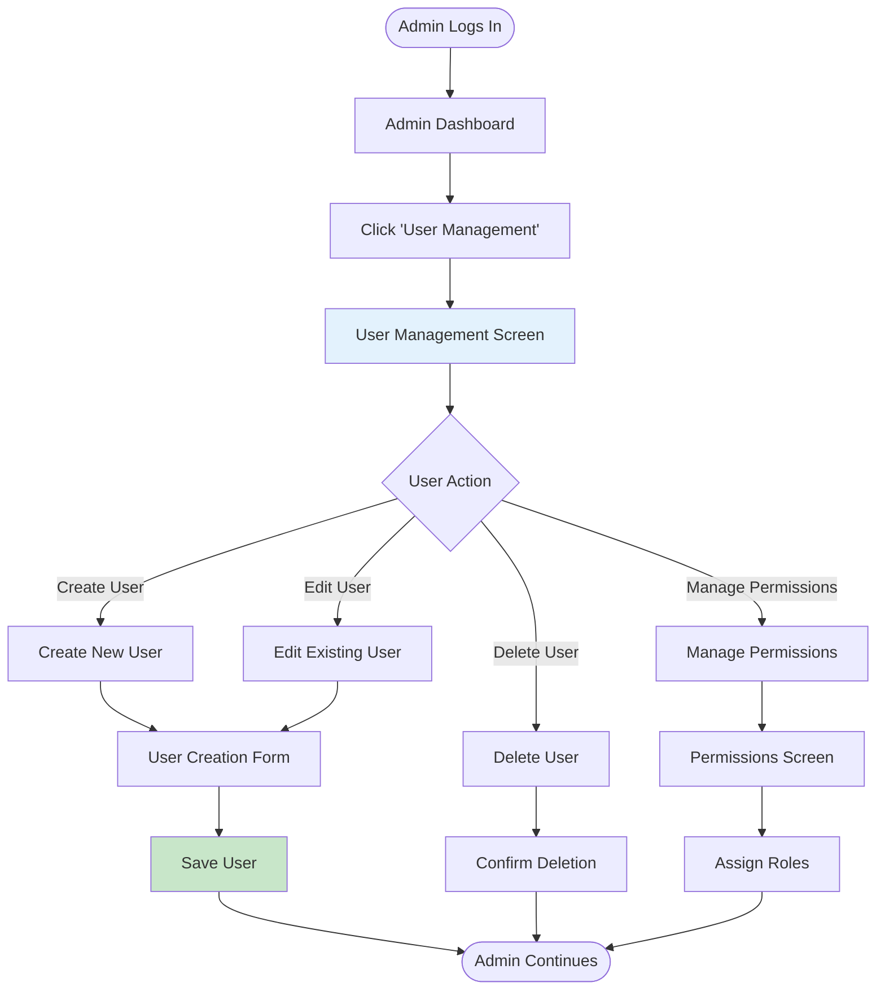
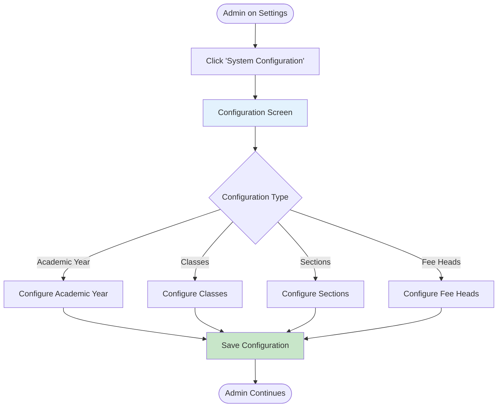
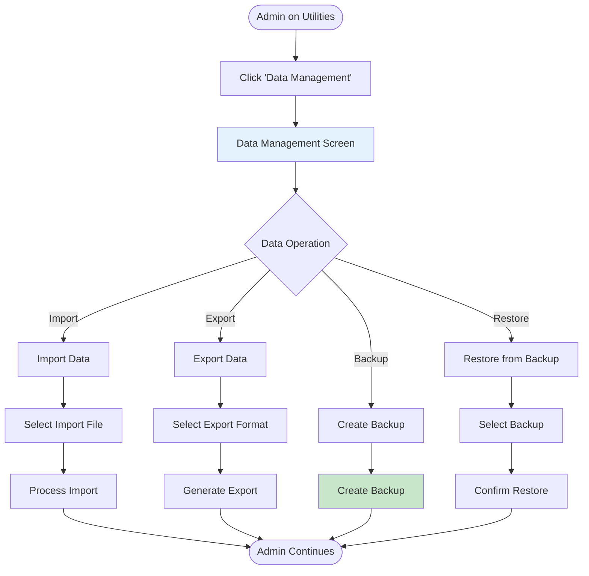
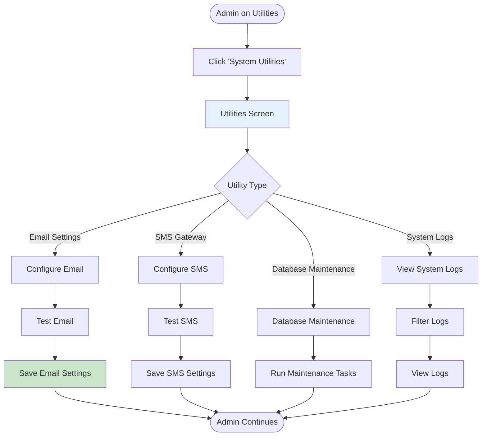

# User Flows: Utilities & Settings (UI/UX Perspective)

## Introduction

This document visualizes the **user interface journey** through the Utilities & Settings module from a UI/UX design perspective. This module provides system configuration, user management, and utility functions.

Each flowchart focuses on:
- **Screen states** and visual feedback
- **User actions** and decision points
- **Navigation paths** between interfaces
- **Error handling** and recovery flows

---

## Flow 41-44: User Management (Create, Edit, Delete, Permissions)

### User Story
*"As a Super Admin, I want to manage user accounts and permissions, so that staff have appropriate access to the system."*

### Interface Flow

---

## Flow 45-48: System Configuration (Academic Year, Classes, Sections, Fee Heads)

### User Story
*"As a Super Admin, I want to configure the academic year and class structure, so that the system is ready for the new session."*

### Interface Flow

---

## Flow 49-52: Data Management (Import, Export, Backup, Restore)

### User Story
*"As a Super Admin, I want to backup system data regularly, so that we can recover in case of data loss."*

### Interface Flow

---

## Flow 53-56: System Utilities (Email Settings, SMS Gateway, Database Maintenance, System Logs)

### User Story
*"As a Super Admin, I want to configure email and SMS settings, so that notifications are sent correctly."*

### Interface Flow

---

## UI/UX Design Patterns

**User Management**
- User list with search
- Role-based permissions
- Bulk operations
- Activity tracking

**System Configuration**
- Wizard-based setup
- Validation checks
- Preview before save
- Rollback capability

**Data Management**
- Import validation
- Export formats
- Automated backups
- Restore points

**System Utilities**
- Test connections
- Configuration validation
- Log filtering
- Maintenance scheduling
