# User Flows: Utilities & Settings (UI/UX Perspective)

## Introduction

This document visualizes the **user interface journey** through the Utilities & Settings module from a UI/UX design perspective. This module provides system configuration, user management, and utility functions.

Each flowchart focuses on:
- **Screen states** and visual feedback
- **User actions** and decision points
- **Navigation paths** between interfaces
- **Error handling** and recovery flows

---

## User Management Flows (41-44)

### Flow 41: Create User

**User Story:** *"As a Super Admin, I want to create a new user account, so that staff members can access the system."*

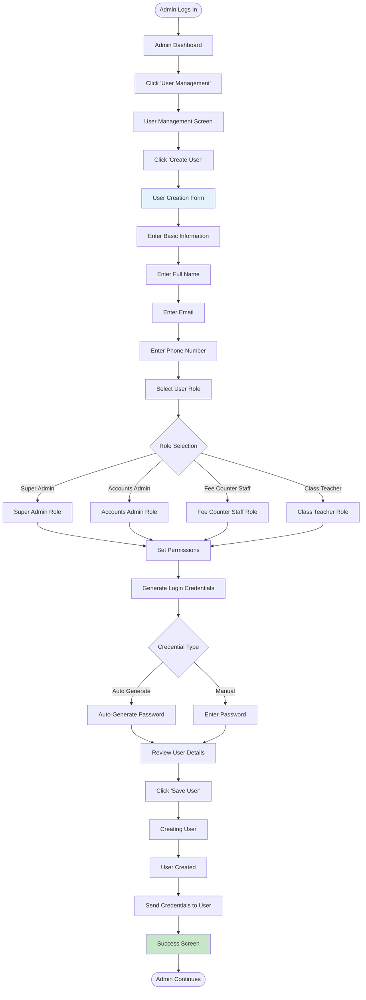

---

### Flow 42: Edit User

**User Story:** *"As a Super Admin, I want to edit user information, so that I can update staff details when needed."*

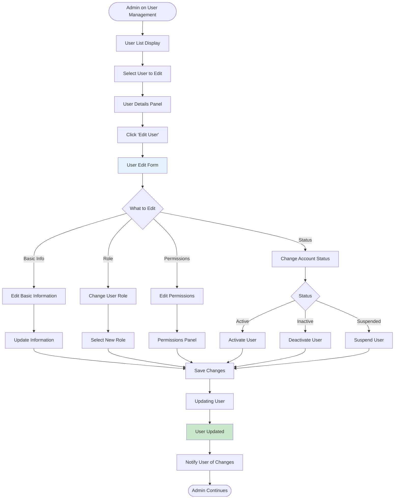

---

### Flow 43: Delete User

**User Story:** *"As a Super Admin, I want to delete a user account, so that former staff no longer have system access."*

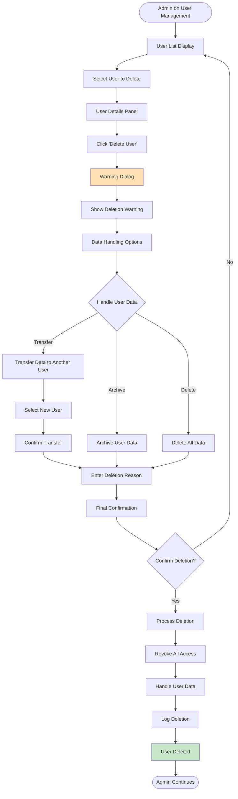

---

### Flow 44: Manage Permissions

**User Story:** *"As a Super Admin, I want to manage user permissions, so that staff have appropriate access levels."*

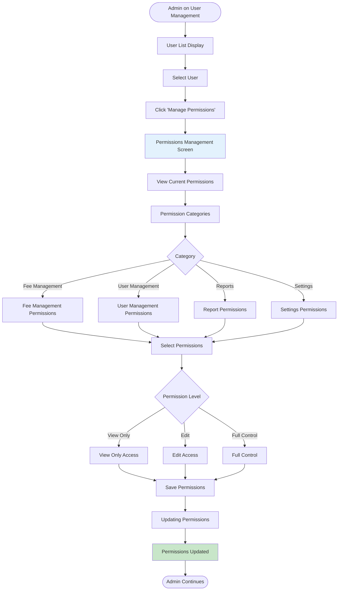

---

## System Configuration Flows (45-48)

### Flow 45: Configure Academic Year

**User Story:** *"As a Super Admin, I want to configure the academic year, so that the system is ready for the new session."*

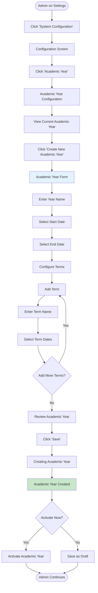

---

### Flow 46: Configure Classes

**User Story:** *"As a Super Admin, I want to configure classes, so that students can be organized properly."*

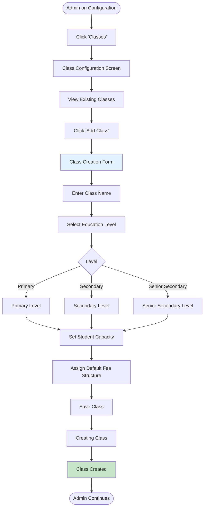

---

### Flow 47: Configure Sections

**User Story:** *"As a Super Admin, I want to configure sections within classes, so that students can be divided into manageable groups."*

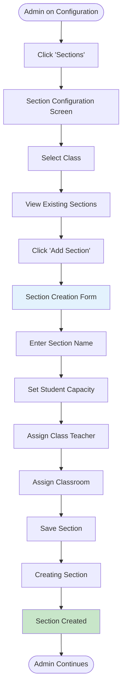

---

### Flow 48: Configure Fee Heads

**User Story:** *"As a Super Admin, I want to configure fee heads, so that different types of fees can be tracked separately."*

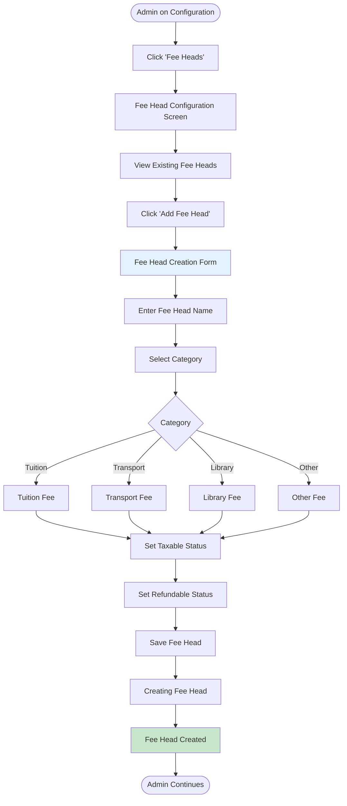

---

## Data Management Flows (49-52)

### Flow 49: Import Data

**User Story:** *"As a Super Admin, I want to import student data from a file, so that I can bulk upload information."*

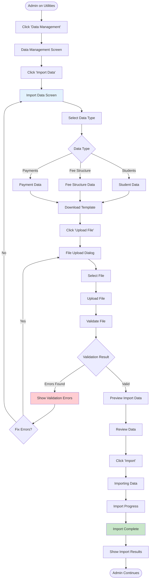

---

### Flow 50: Export Data

**User Story:** *"As a Super Admin, I want to export system data, so that I can analyze it externally or create backups."*

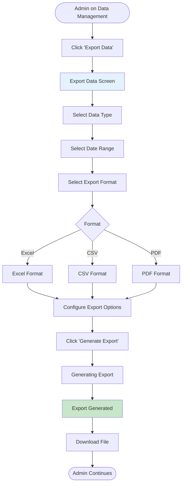

---

### Flow 51: Backup Data

**User Story:** *"As a Super Admin, I want to create a system backup, so that data can be recovered if needed."*

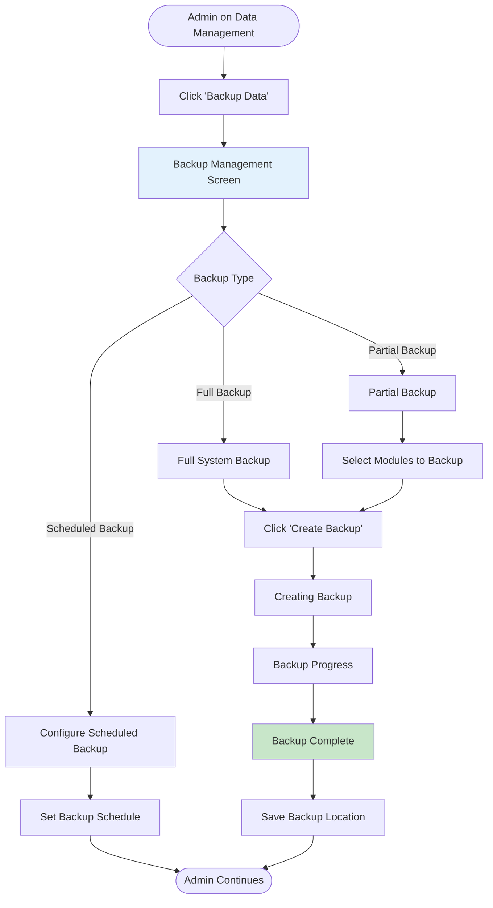

---

### Flow 52: Restore Data

**User Story:** *"As a Super Admin, I want to restore data from a backup, so that I can recover from data loss."*

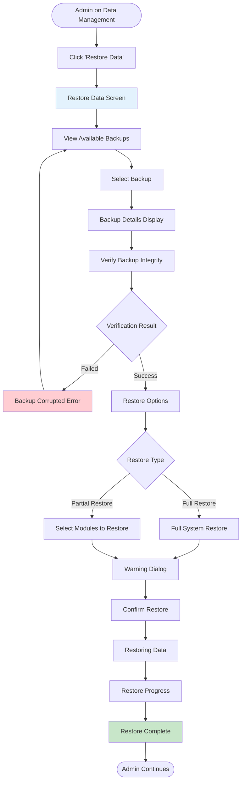

---

## System Utilities Flows (53-56)

### Flow 53: Email Settings

**User Story:** *"As a Super Admin, I want to configure email settings, so that system notifications are sent correctly."*

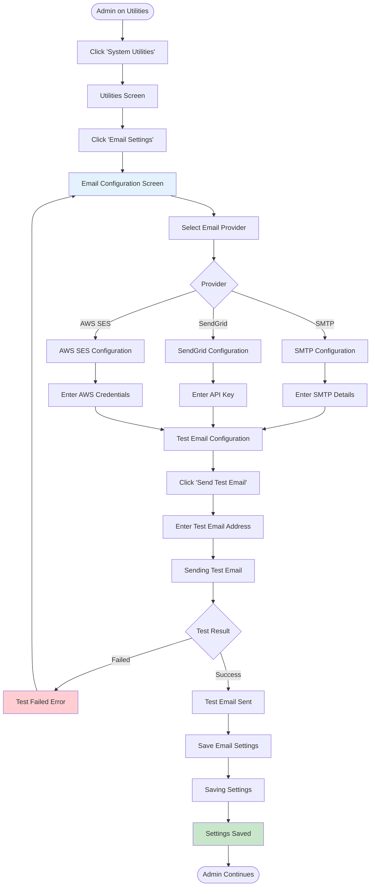

---

### Flow 54: SMS Gateway

**User Story:** *"As a Super Admin, I want to configure SMS gateway, so that SMS notifications can be sent to parents."*

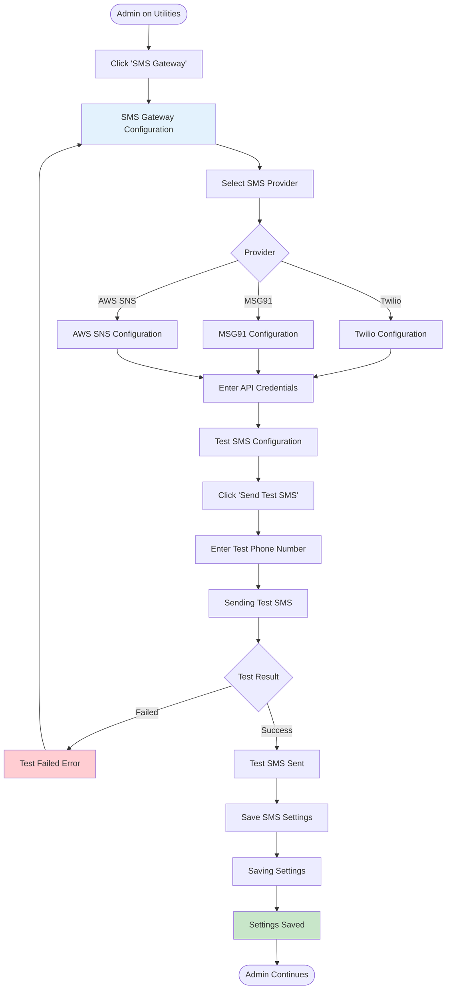

---

### Flow 55: Database Maintenance

**User Story:** *"As a Super Admin, I want to perform database maintenance, so that the system runs efficiently."*

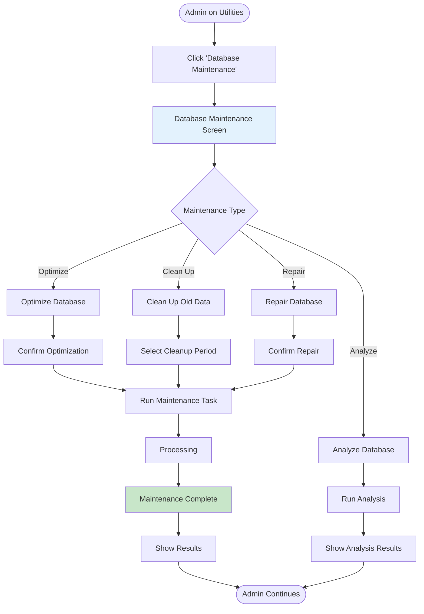

---

### Flow 56: System Logs

**User Story:** *"As a Super Admin, I want to view system logs, so that I can troubleshoot issues and monitor system health."*

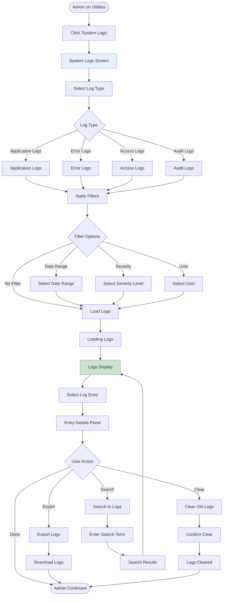

---

## UI/UX Design Patterns Used

### User Management
- User list with search and filter
- Role-based permissions matrix
- Bulk operations support
- Activity tracking

### System Configuration
- Wizard-based setup for complex configurations
- Validation checks at each step
- Preview before save
- Rollback capability

### Data Management
- Import validation with error reporting
- Multiple export formats
- Automated backup scheduling
- Restore point selection

### System Utilities
- Test connections before saving
- Configuration validation
- Log filtering and search
- Maintenance task scheduling

---

## Mobile Responsive Considerations

**User Management**
- Card-based user list
- Simplified permission toggles
- Quick actions menu
- Mobile-optimized forms

**System Configuration**
- Accordion sections
- Step-by-step wizards
- Touch-friendly controls
- Progress indicators

**Data Management**
- Simplified import/export
- Progress tracking
- Mobile file selection
- Quick backup access

**System Utilities**
- Simplified settings
- Test functionality
- Log viewing
- Quick actions
