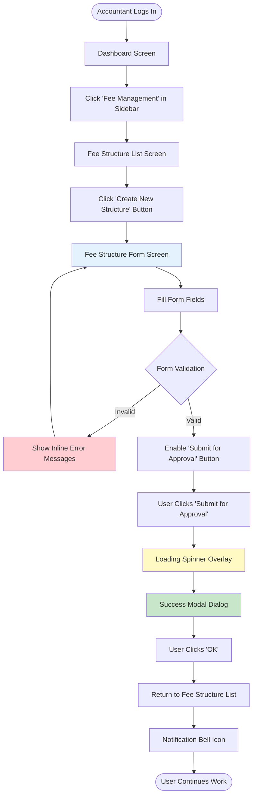
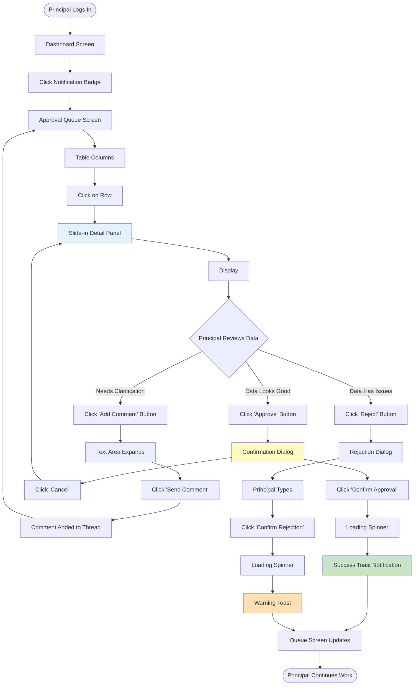
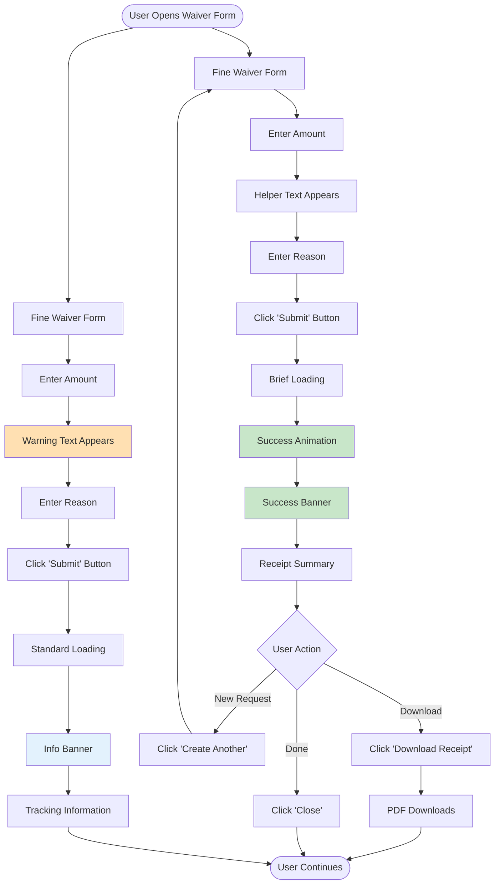
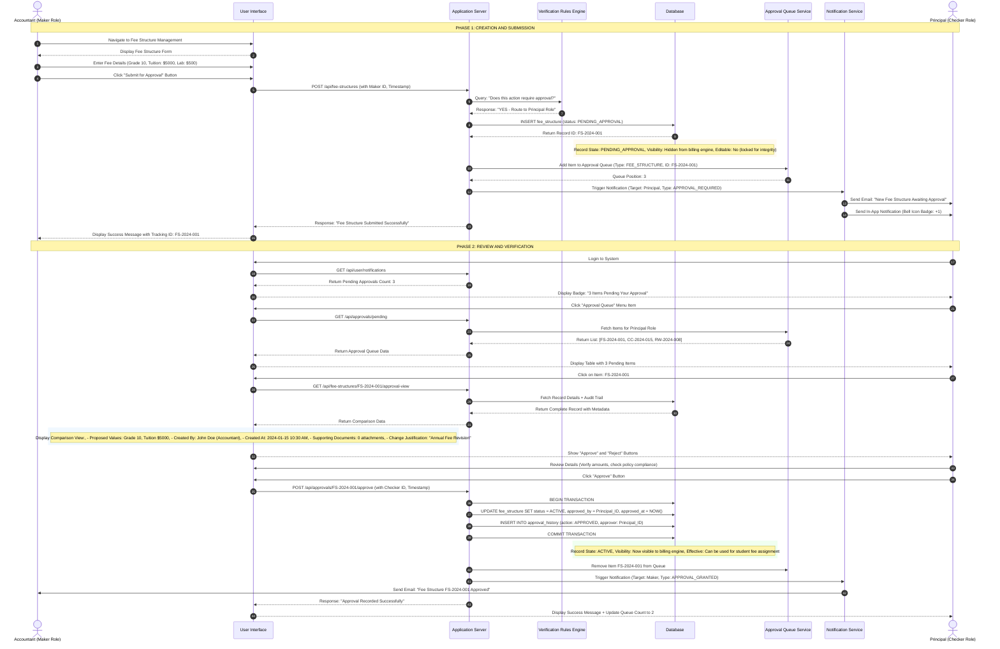
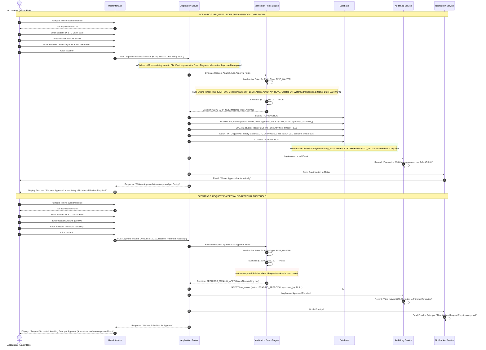

```mermaid
flowchart TD
    Start([Clerk Logs In]) --> Dashboard[Dashboard Screen]
    
    Dashboard --> AlertBanner[Red Alert Banner at Top]
    
    AlertBanner --> ClickAlert[Click Alert Banner]
    ClickAlert --> ReturnedList[My Submissions Screen]
    
    ReturnedList --> ShowItem[Item Card]
    
    ShowItem --> ClickItem[Click on Item Card]
    ClickItem --> DetailScreen[Request Detail Screen]
    
    DetailScreen --> ShowComment[Comment Thread Visible]
    
    ShowComment --> ClickEdit[Click 'Edit and Resubmit' Button]
    ClickEdit --> EditMode[Form Switches to Edit Mode]
    
    EditMode --> ShowUpload[Upload Section Highlighted]
    
    ShowUpload --> ClickUpload[Click 'Upload Document' Button]
    ClickUpload --> FileDialog[System File Picker Opens]
    
    FileDialog --> SelectFile[User Selects]
    SelectFile --> UploadProgress[Progress Bar]
    
    UploadProgress --> FilePreview[File Preview Card]
    
    FilePreview --> EnableResubmit[Resubmit Button Enabled]
    
    EnableResubmit --> ClickResubmit[Click 'Resubmit for Approval']
    ClickResubmit --> ConfirmResubmit[Confirmation Modal]
    
    ConfirmResubmit --> ClickConfirm[Click 'Yes, Resubmit']
    ClickConfirm --> LoadingState[Loading Overlay]
    
    LoadingState --> SuccessModal[Success Modal]
    
    SuccessModal --> ClickOK[Click 'OK']
    ClickOK --> UpdatedStatus[Return to My Submissions]
    
    UpdatedStatus --> End([Clerk Continues Work])
    
    style AlertBanner fill:#ffcdd2
    style ShowComment fill:#fff9c4
    style FilePreview fill:#e3f2fd
    style SuccessModal fill:#c8e6c9
```

```mermaid
sequenceDiagram
    autonumber
    actor Maker as Clerk (Maker Role)
    participant UI as User Interface
    participant API as Application Server
    participant DB as Database
    participant Queue as Approval Queue Service
    participant Notif as Notification Service
    participant Storage as Document Storage
    actor Checker as Principal (Checker Role)

    Note over Maker, Checker: PHASE 1: INITIAL SUBMISSION (WITH DEFICIENCY)

    Maker->>UI: Navigate to Fine Waiver Module
    UI-->>Maker: Display Waiver Request Form
    
    Maker->>UI: Enter Student ID: STU-2024-1234
    Maker->>UI: Enter Waiver Amount: $50 (Late Fee)
    Maker->>UI: Enter Reason: "Medical Emergency"
    
    rect rgb(255, 240, 240)
        Note over Maker: MISTAKE: Clerk forgets to attach, the required Medical Certificate document
    end
    
    Maker->>UI: Click "Submit for Approval" (without attachment)
    
    UI->>API: POST /api/fine-waivers (Student: STU-2024-1234, Amount: $50, Attachments: 0)
    API->>DB: INSERT fine_waiver (status: PENDING_APPROVAL, attachment_count: 0)
    DB-->>API: Return Record ID: FW-2024-042
    
    API->>Queue: Add to Approval Queue (Type: FINE_WAIVER, ID: FW-2024-042)
    API->>Notif: Notify Principal
    Notif->>Checker: Email + In-App Notification
    
    API-->>UI: Success Response
    UI-->>Maker: "Waiver Submitted. Tracking ID: FW-2024-042"

    Note over Maker, Checker: PHASE 2: REVIEW AND REJECTION

    Checker->>UI: Access Approval Queue
    UI->>API: GET /api/approvals/pending
    API-->>UI: Return Queue Items
    UI-->>Checker: Display Queue (including FW-2024-042)
    
    Checker->>UI: Click on FW-2024-042
    UI->>API: GET /api/fine-waivers/FW-2024-042/approval-view
    API->>DB: Fetch Waiver Details
    DB-->>API: Return Record (attachment_count: 0)
    API-->>UI: Return Waiver Data
    
    rect rgb(255, 245, 245)
        Note over UI: Principal's Review Screen Shows:, - Student: STU-2024-1234 (Sarah Johnson), - Amount: $50, - Reason: "Medical Emergency", - Attachments: NONE (0 files), - Policy Requirement: Medical waivers require proof
    end
    
    Checker->>UI: Identify Missing Documentation
    Checker->>UI: Click "Reject" Button
    
    UI-->>Checker: Display Rejection Comment Dialog
    
    Checker->>UI: Type Comment: "Request cannot be approved without supporting documentation. Please attach the medical certificate or doctor's note as proof of the medical emergency. Ensure the document is dated and signed by a licensed medical professional."
    
    Checker->>UI: Click "Submit Rejection"
    
    UI->>API: POST /api/approvals/FW-2024-042/reject (Comment: "Request cannot be approved...", Checker ID)
    
    API->>DB: BEGIN TRANSACTION
    API->>DB: UPDATE fine_waiver SET status = REJECTED_RETURNED, rejected_by = Principal_ID, rejected_at = NOW()
    API->>DB: INSERT INTO approval_history (action: REJECTED, reason: "Missing documentation", rejector: Principal_ID)
    API->>DB: INSERT INTO approval_comments (text: "Request cannot be approved...", author: Principal_ID)
    API->>DB: COMMIT TRANSACTION
    
    API->>Queue: Update Queue Item Status (Mark as RETURNED_TO_MAKER)
    
    API->>Notif: Trigger Notification (Target: Maker, Type: APPROVAL_REJECTED)
    Notif->>Maker: Send Email: "Action Required: Waiver FW-2024-042 Returned for Correction"
    Notif->>Maker: Send In-App Alert (High Priority)
    
    API-->>UI: Rejection Recorded
    UI-->>Checker: "Request Rejected and Returned to Maker"

    Note over Maker, Checker: PHASE 3: CORRECTION AND RESUBMISSION

    Maker->>UI: Login and See Alert: "1 Returned Request Requires Attention"
    Maker->>UI: Click Alert to View Returned Items
    
    UI->>API: GET /api/my-submissions/returned
    API->>DB: Fetch Submissions WHERE status = REJECTED_RETURNED AND maker_id = Clerk_ID
    DB-->>API: Return [FW-2024-042]
    API-->>UI: Return Returned Submissions
    
    UI-->>Maker: Display Table with FW-2024-042 (Status: Returned)
    
    Maker->>UI: Click on FW-2024-042
    UI->>API: GET /api/fine-waivers/FW-2024-042/edit-view
    API->>DB: Fetch Record + Comments
    DB-->>API: Return Record with Rejection Comment
    API-->>UI: Return Editable Form + Comment Thread
    
    rect rgb(255, 250, 240)
        Note over UI: Clerk Sees:, - Original Submission (Read-Only), - Principal's Comment (Highlighted), - Attachment Upload Section (Enabled), - "Resubmit" Button
    end
    
    UI-->>Maker: Display Form with Principal's Feedback
    
    Maker->>UI: Read Comment: "Please attach the medical certificate..."
    Maker->>UI: Click "Upload Document" Button
    Maker->>UI: Select File: "Medical_Certificate_Sarah_Johnson.pdf" (250 KB)
    
    UI->>Storage: Upload File
    Storage-->>UI: Return File URL: /documents/FW-2024-042/medical_cert.pdf
    
    UI->>API: PATCH /api/fine-waivers/FW-2024-042 (Add Attachment URL)
    API->>DB: UPDATE fine_waiver SET attachment_count = 1, attachments = JSON
    DB-->>API: Update Successful
    
    Maker->>UI: Click "Resubmit for Approval" Button
    
    UI->>API: POST /api/fine-waivers/FW-2024-042/resubmit
    
    API->>DB: BEGIN TRANSACTION
    API->>DB: UPDATE fine_waiver SET status = PENDING_APPROVAL, resubmitted_at = NOW()
    API->>DB: INSERT INTO approval_history (action: RESUBMITTED, maker: Clerk_ID)
    API->>DB: COMMIT TRANSACTION
    
    API->>Queue: Re-add to Approval Queue (Priority: RESUBMISSION)
    
    API->>Notif: Notify Principal
    Notif->>Checker: Email: "Updated Request: FW-2024-042 (Previously Rejected)"
    
    API-->>UI: Resubmission Successful
    UI-->>Maker: "Request Resubmitted. You will be notified of the decision."

    Note over Maker, Checker: PHASE 4: SECOND REVIEW AND APPROVAL

    Checker->>UI: Access Approval Queue
    UI-->>Checker: Display Queue (FW-2024-042 marked as "Resubmission")
    
    Checker->>UI: Click on FW-2024-042
    UI->>API: GET /api/fine-waivers/FW-2024-042/approval-view
    API->>DB: Fetch Updated Record
    DB-->>API: Return Record (attachment_count: 1, history: 2 entries)
    API-->>UI: Return Complete Data
    
    rect rgb(240, 255, 240)
        Note over UI: Principal Now Sees:, - Attachments: 1 file (Medical_Certificate_Sarah_Johnson.pdf), - History: Original submission → Rejected → Resubmitted, - Document Preview Available
    end
    
    UI-->>Checker: Display Updated Request with Attachment
    
    Checker->>UI: Click to Preview "Medical_Certificate_Sarah_Johnson.pdf"
    UI->>Storage: GET /documents/FW-2024-042/medical_cert.pdf
    Storage-->>UI: Return PDF Stream
    UI-->>Checker: Display PDF in Viewer
    
    Checker->>UI: Verify Document (Check signature, date, authenticity)
    Checker->>UI: Click "Approve" Button
    
    UI->>API: POST /api/approvals/FW-2024-042/approve
    
    API->>DB: BEGIN TRANSACTION
    API->>DB: UPDATE fine_waiver SET status = APPROVED, approved_by = Principal_ID, approved_at = NOW()
    API->>DB: UPDATE student_ledger SET fine_amount = fine_amount - 50 WHERE student_id = STU-2024-1234
    API->>DB: INSERT INTO approval_history (action: APPROVED, approver: Principal_ID)
    API->>DB: COMMIT TRANSACTION
    
    API->>Queue: Remove from Queue
    API->>Notif: Notify Maker
    Notif->>Maker: Email: "Waiver FW-2024-042 Approved"
    
    API-->>UI: Approval Successful
    UI-->>Checker: "Waiver Approved. Student's fine has been waived."
```

# User Flows: Verification Workflow (UI/UX Perspective)

## Introduction

This document visualizes the **user interface journey** through the Verification Workflow from a UI/UX design perspective. Each flowchart focuses on:
- **Screen states** and visual feedback
- **User actions** and decision points
- **Navigation paths** between interfaces
- **Error handling** and recovery flows

The flows are designed to help UI/UX designers, product managers, and developers understand the complete user experience.

---

## Flow 55: Standard Approval Journey (Maker's Perspective)

### User Story
*"As an Accountant, I want to create a new fee structure and submit it for approval, so that it can be reviewed by my supervisor before going live."*

### Interface Flow



### Screen States

**1. Fee Structure Form (Empty State)**
- All fields blank with placeholder text
- Submit button disabled (grayed out)
- Helper text below each field

**2. Fee Structure Form (Filled State)**
- Fields populated with data
- Real-time validation indicators (green checkmarks)
- Submit button enabled (blue, clickable)

**3. Fee Structure Form (Error State)**
- Invalid fields highlighted in red
- Error messages below problematic fields
- Submit button remains disabled

**4. Success Confirmation**
- Modal overlay with success icon
- Tracking ID prominently displayed
- Clear call-to-action button

---

## Flow 56: Standard Approval Journey (Checker's Perspective)

### User Story
*"As a Principal, I want to review pending fee structure requests and approve or reject them, so that only verified changes go live."*

### Interface Flow



### Screen States

**1. Approval Queue (Empty State)**
- Illustration: "All caught up!"
- Message: "No pending approvals"
- Badge shows "0"

**2. Approval Queue (Loaded State)**
- Table with sortable columns
- Color-coded priority indicators
- Hover effects on rows

**3. Detail Panel (Comparison View)**
- Split-screen layout
- Left: Old values (grayed out)
- Right: New values (highlighted)
- Changed fields marked with yellow highlight

**4. Action Buttons State**
- Approve: Green, primary
- Reject: Red, secondary
- Comment: Blue, tertiary
- All buttons show hover states

---

## Flow 57: Rejection and Correction Journey

### User Story
*"As a Clerk, I want to fix and resubmit a rejected request, so that I can address the reviewer's concerns and get approval."*

### Interface Flow



### Screen States

**1. Alert Banner**
- Fixed position at top
- Red background with white text
- Dismissible with X button
- Click anywhere to navigate

**2. Returned Item Card**
- Red left border
- "Returned" badge in red
- Comment preview (first 50 characters)
- Timestamp of rejection

**3. Edit Mode**
- Original values shown in gray boxes (read-only)
- Editable fields have white background
- Required fields marked with red asterisk
- Upload section highlighted if empty

**4. File Upload States**
- Empty: Dashed border, "Drag & drop or click"
- Uploading: Progress bar with percentage
- Complete: File card with preview
- Error: Red border with error message

---

## Flow 58: Auto-Approval User Experience

### User Story
*"As an Accountant, I want small waivers to be approved instantly, so that I don't have to wait for routine corrections."*

### Interface Flow



### Visual Design Elements

**1. Auto-Approval Indicator**
- Green badge: "Instant Approval Available"
- Appears when amount < $10
- Tooltip explains the rule

**2. Success Animation**
- Checkmark icon scales in
- Brief confetti animation
- Smooth transition to receipt

**3. Manual Approval Indicator**
- Orange badge: "Requires Approval"
- Appears when amount ≥ $10
- Shows estimated wait time

**4. Receipt Summary**
- Clean card layout
- QR code for verification
- Print and download options
- Share via email button

---

## UI/UX Design Patterns Used

### Visual Feedback Patterns

**Loading States**
- Skeleton screens for data loading
- Progress bars for file uploads
- Spinners for quick actions
- Percentage indicators for long operations

**Success States**
- Green color scheme
- Checkmark icons
- Toast notifications (auto-dismiss in 5s)
- Confetti animations for instant approvals

**Error States**
- Red color scheme
- Inline error messages
- Field-level validation
- Clear recovery instructions

**Warning States**
- Orange/yellow color scheme
- Info icons
- Non-blocking notifications
- Helpful context

### Navigation Patterns

**Breadcrumbs**
- Always visible at top
- Clickable path back
- Current page highlighted

**Back Buttons**
- Consistent placement (top-left)
- Keyboard shortcut (ESC)
- Confirms if unsaved changes

**Modal Overlays**
- Dim background
- Focus trap
- Click outside to close
- ESC key to dismiss

### Accessibility Considerations

**Keyboard Navigation**
- Tab order follows visual flow
- Enter to submit forms
- ESC to cancel/close
- Arrow keys in tables

**Screen Reader Support**
- ARIA labels on all interactive elements
- Status announcements for dynamic content
- Descriptive button text
- Alt text for icons

**Color Contrast**
- WCAG AA compliant
- Not relying on color alone
- Icons accompany color coding
- High contrast mode support

---

## Mobile Responsive Considerations

**Queue Screen (Mobile)**
- Cards instead of table
- Swipe actions (approve/reject)
- Bottom sheet for details
- Floating action button

**Form Screen (Mobile)**
- Single column layout
- Larger touch targets (44px minimum)
- Native file picker
- Sticky submit button at bottom

**Approval Detail (Mobile)**
- Full-screen overlay
- Swipe down to dismiss
- Tabs for different sections
- Bottom action bar

---

## Flow 55: Standard Approval Lifecycle (Happy Path)

### Business Context

This flow represents the most common scenario in the Maker-Checker workflow: a routine creation or modification that proceeds smoothly through the approval process without complications. In this example, an Accountant creates a new Fee Structure for Grade 10 students, and the Principal reviews and approves it.

### Prerequisites

Before this flow can execute, the following conditions must be met:
1. The Maker must have the "Fee Structure Creation" permission assigned to their role.
2. The Checker must have the "Fee Structure Approval" permission assigned to their role.
3. The system must have a configured approval rule that routes Fee Structure changes to the Principal role.
4. Both users must have active accounts with valid credentials.

### Detailed Step-by-Step Process



### Key Technical Details

**Database Status Transitions:**
- `DRAFT` → `PENDING_APPROVAL` → `ACTIVE`
- Each transition is logged in the `approval_history` table with timestamp and user ID.

**Security Enforcement:**
- The system validates that `Checker ID ≠ Maker ID` before allowing approval.
- Even if the Maker has administrative privileges, they cannot approve their own submission.

**Notification Channels:**
- Email: Sent immediately via configured SMTP gateway.
- In-App: Real-time notification via WebSocket connection.
- SMS (Optional): Can be enabled for high-priority approvals.

**Performance Considerations:**
- The approval queue is indexed by `assigned_role` and `created_at` for fast retrieval.
- The comparison view uses a cached snapshot to prevent race conditions if the underlying data changes.

---

## Flow 56: Rejection and Correction Loop

### Business Context

This flow handles the scenario where the Checker identifies an issue with the submitted request and returns it to the Maker for correction. This is a critical quality control mechanism that prevents incomplete or incorrect data from entering the system.

In this example, a Clerk attempts to waive a late payment fine for a student but fails to attach the required supporting documentation (medical certificate). The Principal catches this omission during review and rejects the request with specific instructions for correction.

### Prerequisites

1. An existing approval request must be in `PENDING_APPROVAL` status.
2. The Checker must have identified a deficiency or error in the submission.
3. The system must support bidirectional communication (comments/notes) between Maker and Checker.

### Detailed Step-by-Step Process



### Key Technical Details

**Status State Machine:**
```
PENDING_APPROVAL → REJECTED_RETURNED → PENDING_APPROVAL → APPROVED
```

**Edit Permissions:**
- When status is `REJECTED_RETURNED`, only the original Maker can edit.
- The Maker cannot change fundamental fields (Student ID, Amount) without creating a new request.
- Only attachments and supporting notes can be modified.

**Resubmission Priority:**
- Resubmitted items are flagged in the queue to indicate they've been previously reviewed.
- Some organizations configure higher priority for resubmissions to avoid delays.

**Audit Trail:**
- Every status change is logged with timestamp, user ID, and reason.
- Comments are preserved in a separate table with threading support.
- Document upload events are logged with file hash for integrity verification.

---

## Flow 57: Rule-Based Auto-Approval

### Business Context

Not every action requires human intervention. For low-risk, routine operations that fall within predefined safe parameters, the system can automatically approve requests without involving a human Checker. This reduces approval bottlenecks, decreases processing time, and allows supervisors to focus on high-value decisions.

In this example, the system is configured with a rule that automatically approves fine waivers under $10, as these small amounts represent minimal financial risk and are typically granted for minor administrative corrections.

### Prerequisites

1. Auto-approval rules must be configured in the Verification Rules Engine.
2. Rules must define clear thresholds and conditions.
3. The Maker must still have permission to create the request.
4. Auto-approved actions must still be logged for audit purposes.

### Detailed Step-by-Step Process



### Key Technical Details

**Rule Evaluation Order:**
1. **Exact Match Rules**: Checked first (e.g., "Student ID = X").
2. **Threshold Rules**: Checked second (e.g., "Amount < $10").
3. **Default Rule**: If no rules match, default to manual approval.

**Rule Configuration Example:**
```json
{
  "rule_id": "AR-001",
  "entity_type": "FINE_WAIVER",
  "conditions": [{ "field"],
  "action": "AUTO_APPROVE",
  "created_by": "admin@school.edu",
  "effective_from": "2024-01-01",
  "expires_at": null,
  "enabled": true
}
```

**Security Safeguards:**
- Auto-approval rules cannot be created by regular users; only System Administrators can configure them.
- All auto-approvals are logged with the rule ID for accountability.
- Daily reports summarize auto-approval activity for management review.
- Rules can be temporarily disabled if abuse is detected.

**Performance Optimization:**
- Rules are cached in memory and refreshed every 5 minutes.
- Rule evaluation typically completes in under 50 milliseconds.
- Complex rules with multiple conditions use indexed database queries.

**Audit and Compliance:**
- Auto-approved transactions are flagged in audit reports.
- Monthly reviews compare auto-approval rates to manual approval rates.
- Anomaly detection alerts administrators if auto-approval volume spikes unexpectedly.


