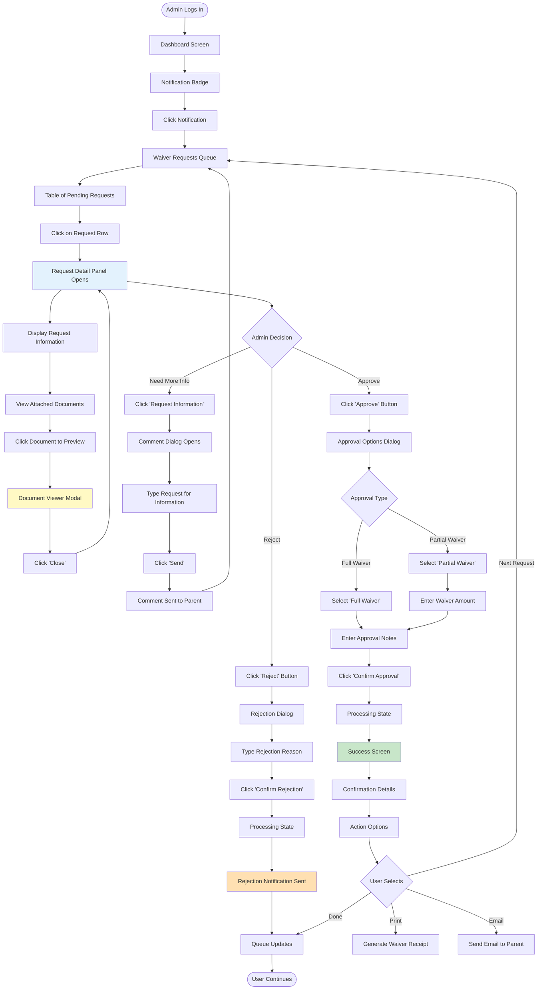

```mermaid
flowchart TD
    Start([Admin Logs In]) --> Dashboard[Dashboard Screen]
    
    Dashboard --> ClickFines[Click 'Fine Management' Menu]
    ClickFines --> FineModule[Fine Management Page]
    
    FineModule --> ClickRules[Click 'Fine Rules' Tab]
    ClickRules --> RulesList[Fine Rules List Screen]
    
    RulesList --> ClickNew[Click 'Create New Rule' Button]
    ClickNew --> RuleWizard[Fine Rule Creation Wizard]
    
    RuleWizard --> Step1[Step 1]
    
    Step1 --> FillBasic[Fill Fields]
    FillBasic --> ValidateStep1{Validate Step 1}
    
    ValidateStep1 -->|Invalid| ShowErrors[Show Validation Errors]
    ShowErrors --> Step1
    
    ValidateStep1 -->|Valid| ClickNext1[Click 'Next']
    ClickNext1 --> Step2[Step 2]
    
    Step2 --> SelectMethod[Select Calculation Type]
    SelectMethod --> MethodChoice{User Selects}
    
    MethodChoice -->|Flat Amount| FlatConfig[Configure Flat Amount]
    MethodChoice -->|Percentage| PercentConfig[Configure Percentage]
    MethodChoice -->|Daily| DailyConfig[Configure Daily Rate]
    
    FlatConfig --> EnterFlat[Enter Amount]
    PercentConfig --> EnterPercent[Enter Percentage]
    DailyConfig --> EnterDaily[Enter Daily Rate]
    
    EnterFlat --> ClickNext2[Click 'Next']
    EnterPercent --> ClickNext2
    EnterDaily --> ClickNext2
    
    ClickNext2 --> Step3[Step 3]
    
    Step3 --> SetTrigger[Set Trigger Days]
    SetTrigger --> SetMaxCap[Set Maximum Cap]
    SetMaxCap --> SelectFeeTypes[Select Applicable Fee Types]
    
    SelectFeeTypes --> ClickNext3[Click 'Next']
    ClickNext3 --> Step4[Step 4]
    
    Step4 --> ShowSummary[Summary Display]
    ShowSummary --> SimulateButton[Click 'Simulate' Button]
    
    SimulateButton --> SimulationModal[Simulation Results Modal]
    SimulationModal --> CloseSimulation[Click 'Close']
    CloseSimulation --> Step4
    
    Step4 --> ActivateChoice{Activate Now?}
    
    ActivateChoice -->|Save as Draft| ClickDraft[Click 'Save as Draft']
    ClickDraft --> DraftSuccess[Success Toast]
    
    ActivateChoice -->|Activate| ClickActivate[Click 'Save and Activate']
    ClickActivate --> ConfirmActivate[Confirmation Dialog]
    
    ConfirmActivate --> ClickConfirmActivate[Click 'Activate']
    ClickConfirmActivate --> ProcessingState[Processing Overlay]
    
    ProcessingState --> SuccessScreen[Success Screen]
    SuccessScreen --> UpdatedList[Rules List Updates]
    
    UpdatedList --> End([User Continues])
    
    style Step1 fill:#e3f2fd
    style Step2 fill:#e3f2fd
    style Step3 fill:#e3f2fd
    style Step4 fill:#e3f2fd
    style SuccessScreen fill:#c8e6c9
    style SimulationModal fill:#fff9c4
```

```mermaid
flowchart TD
    Start([Admin on Fine Management]) --> ClickGrace[Click 'Grace Periods' Tab]
    ClickGrace --> GraceList[Grace Period List Screen]
    
    GraceList --> ClickNew[Click 'Create Grace Period' Button]
    ClickNew --> GraceForm[Grace Period Form]
    
    GraceForm --> SelectFeeType[Select Fee Type]
    SelectFeeType --> EnterDays[Enter Grace Days]
    EnterDays --> HolidayToggle[Toggle 'Exclude Holidays']
    
    HolidayToggle --> HolidaySection[Holiday Exclusion Section Expands]
    HolidaySection --> SelectHolidays[Select Days to Exclude]
    
    SelectHolidays --> WeekendCheck[Checkboxes]
    WeekendCheck --> CalendarPicker[Holiday Calendar Picker]
    
    CalendarPicker --> ClassSection[Class-Specific Overrides]
    ClassSection --> AddOverride{Add Override?}
    
    AddOverride -->|Yes| ClickAddClass[Click 'Add Class Override']
    ClickAddClass --> SelectClass[Select Class]
    SelectClass --> EnterOverrideDays[Enter Override Days]
    EnterOverrideDays --> AddAnother{Add Another?}
    
    AddAnother -->|Yes| ClickAddClass
    AddAnother -->|No| PreviewSection[Preview Section]
    
    AddOverride -->|No| PreviewSection
    
    PreviewSection --> ShowExamples[Example Scenarios Display]
    ShowExamples --> ValidateForm{Validate Form}
    
    ValidateForm -->|Invalid| ShowFormErrors[Show Errors]
    ShowFormErrors --> GraceForm
    
    ValidateForm -->|Valid| ClickSave[Click 'Save Grace Period']
    ClickSave --> LoadingState[Loading State]
    
    LoadingState --> SuccessToast[Success Toast]
    SuccessToast --> UpdatedList[Grace Period List Updates]
    
    UpdatedList --> End([User Continues])
    
    style GraceForm fill:#e3f2fd
    style PreviewSection fill:#fff9c4
    style SuccessToast fill:#c8e6c9
```

```mermaid
flowchart TD
    Start([Admin on Fine Management]) --> ClickExemptions[Click 'Exemptions' Tab]
    ClickExemptions --> ExemptionList[Exemption Rules List]
    
    ExemptionList --> ClickNew[Click 'Create Exemption Rule']
    ClickNew --> ExemptionWizard[Exemption Rule Wizard]
    
    ExemptionWizard --> Step1Basic[Step 1]
    Step1Basic --> FillBasic[Fill Rule Name and Description]
    FillBasic --> ClickNext1[Click 'Next']
    
    ClickNext1 --> Step2Criteria[Step 2]
    Step2Criteria --> CriteriaBuilder[Criteria Builder Interface]
    
    CriteriaBuilder --> SelectField[Select Field]
    SelectField --> SelectOperator[Select Operator]
    SelectOperator --> SelectValue[Select Value]
    
    SelectValue --> AddCondition{Add Another Condition?}
    
    AddCondition -->|Yes| ClickAnd[Click 'AND' or 'OR']
    ClickAnd --> SelectField
    
    AddCondition -->|No| PreviewCriteria[Preview Matching Students]
    PreviewCriteria --> ShowCount[Display]
    
    ShowCount --> ClickNext2[Click 'Next']
    ClickNext2 --> Step3Scope[Step 3]
    
    Step3Scope --> SelectScope[Select Scope]
    SelectScope --> ScopeChoice{User Selects}
    
    ScopeChoice -->|All Fines| AllFines[Exempt from All Fines]
    ScopeChoice -->|Specific Types| SpecificTypes[Select Fine Types]
    ScopeChoice -->|Partial| PartialExempt[Set Exemption Percentage]
    
    AllFines --> ClickNext3[Click 'Next']
    SpecificTypes --> SelectTypes[Select Fine Types]
    SelectTypes --> ClickNext3
    PartialExempt --> EnterPercent[Enter Percentage]
    EnterPercent --> ClickNext3
    
    ClickNext3 --> Step4Review[Step 4]
    Step4Review --> ShowSummary[Summary Display]
    
    ShowSummary --> TestButton[Click 'Test Rule' Button]
    TestButton --> TestModal[Test Results Modal]
    TestModal --> CloseTest[Click 'Close']
    CloseTest --> Step4Review
    
    Step4Review --> ClickActivate[Click 'Save and Activate']
    ClickActivate --> ConfirmDialog[Confirmation Dialog]
    
    ConfirmDialog --> ClickConfirm[Click 'Confirm']
    ClickConfirm --> ProcessingState[Processing State]
    
    ProcessingState --> SuccessScreen[Success Screen]
    SuccessScreen --> ShowImpact[Impact Report]
    
    ShowImpact --> ActionChoice{User Action}
    
    ActionChoice -->|Download| DownloadReport[Generate PDF Report]
    ActionChoice -->|View Students| StudentList[List of Exempt Students]
    ActionChoice -->|Done| UpdatedList[Exemptions List Updates]
    
    UpdatedList --> End([User Continues])
    
    style Step1Basic fill:#e3f2fd
    style Step2Criteria fill:#e3f2fd
    style Step3Scope fill:#e3f2fd
    style Step4Review fill:#e3f2fd
    style SuccessScreen fill:#c8e6c9
```

```mermaid
flowchart TD
    Start([Admin on Dashboard]) --> ClickFines[Click 'Fine Management']
    ClickFines --> FineModule[Fine Management Page]
    
    FineModule --> ClickAdjustments[Click 'Adjustments' Tab]
    ClickAdjustments --> SearchStudent[Student Search Section]
    
    SearchStudent --> TypeSearch[Type Student Name or ID]
    TypeSearch --> ShowResults[Search Results Dropdown]
    
    ShowResults --> SelectStudent[Select Student]
    SelectStudent --> LoadStudent[Loading Student Data]
    
    LoadStudent --> StudentCard[Student Info Card Displays]
    StudentCard --> ShowFines[Fine History Table]
    
    ShowFines --> SelectFine[Select Fine to Adjust]
    SelectFine --> FineDetail[Fine Detail Panel Opens]
    
    FineDetail --> ShowFineInfo[Display Fine Information]
    ShowFineInfo --> ClickAdjust[Click 'Adjust Fine' Button]
    
    ClickAdjust --> AdjustmentForm[Adjustment Form Modal]
    
    AdjustmentForm --> SelectAdjustType[Select Adjustment Type]
    SelectAdjustType --> AdjustChoice{User Selects}
    
    AdjustChoice -->|Reduce Amount| ReduceOption[Reduce Amount Option]
    AdjustChoice -->|Waive Completely| WaiveOption[Waive Completely Option]
    AdjustChoice -->|Reverse Fine| ReverseOption[Reverse Fine Option]
    
    ReduceOption --> EnterNewAmount[Enter New Amount]
    WaiveOption --> ConfirmWaive[Confirm Waiver]
    ReverseOption --> ConfirmReverse[Confirm Reversal]
    
    EnterNewAmount --> ShowDifference[Show Difference]
    ShowDifference --> EnterReason[Enter Justification]
    
    ConfirmWaive --> EnterReason
    ConfirmReverse --> EnterReason
    
    EnterReason --> TypeJustification[Type]
    TypeJustification --> AttachDoc{Attach Supporting Document?}
    
    AttachDoc -->|Yes| UploadDoc[Upload Document]
    UploadDoc --> DocUploaded[Document Uploaded]
    DocUploaded --> ReviewAdjustment[Review Adjustment Summary]
    
    AttachDoc -->|No| ReviewAdjustment
    
    ReviewAdjustment --> ValidateForm{Validate Form}
    
    ValidateForm -->|Invalid| ShowErrors[Show Validation Errors]
    ShowErrors --> AdjustmentForm
    
    ValidateForm -->|Valid| ClickSubmit[Click 'Submit Adjustment']
    ClickSubmit --> AuthCheck{Requires Higher Approval?}
    
    AuthCheck -->|Yes| SubmitForApproval[Submit for Approval]
    SubmitForApproval --> ApprovalPending[Approval Pending Status]
    ApprovalPending --> PendingToast[Pending Notification]
    
    AuthCheck -->|No| ProcessAdjustment[Process Adjustment Immediately]
    ProcessAdjustment --> ProcessingState[Processing State]
    
    ProcessingState --> SuccessScreen[Success Screen]
    SuccessScreen --> ShowConfirmation[Adjustment Confirmation]
    
    ShowConfirmation --> UpdatedFineList[Fine History Updates]
    UpdatedFineList --> ActionOptions[Action Options]
    
    ActionOptions --> ActionChoice{User Selects}
    
    ActionChoice -->|Print| PrintAdjustment[Print Adjustment Receipt]
    ActionChoice -->|Notify Parent| SendNotification[Send Email/SMS]
    ActionChoice -->|Another Adjustment| SearchStudent
    ActionChoice -->|Done| End([User Continues])
    
    PendingToast --> End
    
    style AdjustmentForm fill:#e3f2fd
    style ReviewAdjustment fill:#fff9c4
    style SuccessScreen fill:#c8e6c9
    style PendingToast fill:#ffe0b2
```

# User Flows: Fine & Penalty Management (UI/UX Perspective)

## Introduction

This document visualizes the **user interface journey** through the Fine & Penalty Management module from a UI/UX design perspective. This module automates the calculation, application, and management of late payment penalties while providing mechanisms for exemptions and waivers.

Each flowchart focuses on:
- **Screen states** and visual feedback
- **User actions** and decision points
- **Navigation paths** between interfaces
- **Error handling** and recovery flows

---

## Flow 7: Configure Fine Rules

### User Story
*"As a Fee Structure Admin, I want to create a fine rule that charges ₹50 after 7 days of the due date, so that late payments are automatically penalized."*

### Interface Flow

### Screen States

**1. Rules List**
- Table: Name, Type, Amount, Trigger Days, Status, Actions
- Filter by: Status, Fee Type, Calculation Method
- Sort by: Name, Amount, Created Date
- Quick toggle to activate/deactivate

**2. Step 1: Basic Information**
- Rule Name input
- Description textarea
- Effective date range pickers
- Priority dropdown

**3. Step 2: Calculation Method**
- Radio buttons for method selection
- Dynamic form based on selection
- Live preview of calculation
- Example scenarios shown

**4. Step 3: Trigger Configuration**
- Number input for trigger days
- Maximum cap input
- Fee type multi-select checkboxes
- Visual timeline showing when fine applies

**5. Simulation Modal**
- Sample student scenarios
- Calculated fine amounts
- Impact analysis
- Export to Excel option

---

## Flow 8: Set Up Grace Period

### User Story
*"As a Fee Structure Admin, I want to set a 7-day grace period for tuition fees, so that parents have reasonable time before fines are applied."*

### Interface Flow

### Screen States

**1. Grace Period List**
- Card-based layout
- Each card shows: Fee Type, Days, Holiday Exclusions, Overrides
- Filter by: Fee Type, Status
- Sort by: Fee Type, Days

**2. Grace Period Form**
- Fee type dropdown
- Number input for days
- Toggle for holiday exclusion
- Expandable sections for advanced options

**3. Holiday Exclusion Section**
- Checkboxes for weekends
- Calendar widget for custom holidays
- Integration with school calendar
- Preview of excluded dates

**4. Class Override Section**
- Table of overrides
- Add/Remove buttons
- Inline editing
- Validation warnings

**5. Preview Section**
- Example calculations
- Timeline visualization
- "What-if" scenarios
- Impact summary

---

## Flow 9: Configure Exemption Rules

### User Story
*"As a Fee Structure Admin, I want to create an exemption rule for SC/ST students, so that they are automatically exempt from all fines."*

### Interface Flow

### Screen States

**1. Exemption Rules List**
- Table view: Name, Criteria, Scope, Students, Status
- Filter by: Status, Scope Type
- Sort by: Name, Student Count
- Quick activate/deactivate toggle

**2. Criteria Builder**
- Visual query builder
- Drag-and-drop interface
- AND/OR logic support
- Live student count preview
- Syntax validation

**3. Scope Selection**
- Radio buttons for scope type
- Dynamic form based on selection
- Visual representation of scope
- Impact calculator

**4. Test Modal**
- Sample student profiles
- Exemption application results
- Edge case scenarios
- Validation warnings

---

## Flow 10: Process Manual Fine Waiver

### User Story
*"As an Accounts Admin, I want to review and approve a parent's fine waiver request, so that justified cases can be handled fairly."*

### Interface Flow

### Screen States

**1. Waiver Queue**
- Table: Student Name, Fine Amount, Request Date, Reason, Status, Actions
- Filter by: Status, Date Range, Amount Range
- Sort by: Date, Amount, Student Name
- Priority indicators

**2. Request Detail Panel**
- Student information card
- Fine details
- Request reason
- Attached documents
- Request history
- Action buttons

**3. Document Viewer**
- PDF/Image preview
- Zoom controls
- Download button
- Print button
- Navigation for multiple documents

**4. Approval Options Dialog**
- Radio buttons for waiver type
- Amount input for partial waiver
- Notes textarea
- Impact summary
- Confirmation button

**5. Success Screen**
- Waiver confirmation
- Updated fine amount
- Receipt preview
- Next actions

---

## Flow 11: Adjust Fine Amount

### User Story
*"As an Accounts Admin, I want to reduce a student's fine from ₹500 to ₹200 due to genuine hardship, so that the penalty is fair."*

### Interface Flow

### Screen States

**1. Student Search**
- Large search input
- Live search results
- Recent adjustments shown
- Quick filters

**2. Student Card**
- Photo and basic info
- Current fine total
- Payment history summary
- Quick actions

**3. Fine History Table**
- Columns: Date, Type, Amount, Status, Actions
- Color-coded status
- Expandable rows for details
- Export to Excel

**4. Adjustment Form**
- Adjustment type selector
- Amount inputs with validation
- Justification textarea
- Document upload
- Preview of impact

**5. Authorization Check**
- Shows approval threshold
- Displays required approver
- Estimated approval time
- Option to notify approver

---

## UI/UX Design Patterns Used

### Visual Feedback Patterns

**Loading States**
- Skeleton screens for data loading
- Progress bars for processing
- Spinners for quick actions
- Status indicators

**Success States**
- Green color scheme
- Checkmark animations
- Toast notifications
- Success screens with next actions

**Error States**
- Red color scheme
- Inline error messages
- Field-level validation
- Clear recovery instructions

**Warning States**
- Orange/yellow color scheme
- Warning icons
- Confirmation dialogs
- Impact previews

### Form Design Patterns

**Multi-Step Wizards**
- Progress indicator
- Back/Next navigation
- Save draft option
- Step validation

**Conditional Forms**
- Dynamic fields based on selections
- Show/hide sections
- Progressive disclosure
- Context-sensitive help

**Validation**
- Real-time validation
- Inline error messages
- Summary of errors
- Prevent submission if invalid

### Data Visualization

**Impact Previews**
- Before/After comparisons
- Affected student counts
- Financial impact summaries
- Timeline visualizations

**Simulation Tools**
- Sample scenarios
- What-if analysis
- Impact calculators
- Export capabilities

---

## Mobile Responsive Considerations

**Queue Screens**
- Card layout instead of tables
- Swipe actions
- Bottom sheets for details
- Floating action buttons

**Forms**
- Single column layout
- Larger touch targets
- Native pickers
- Sticky action buttons

**Wizards**
- Full-screen steps
- Swipe navigation
- Progress dots
- Bottom navigation bar
