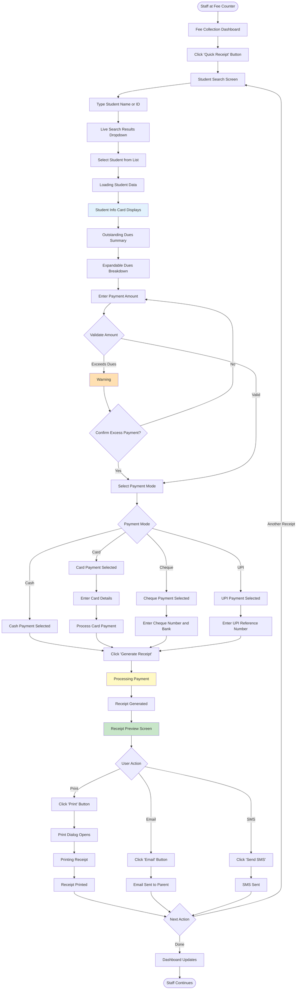
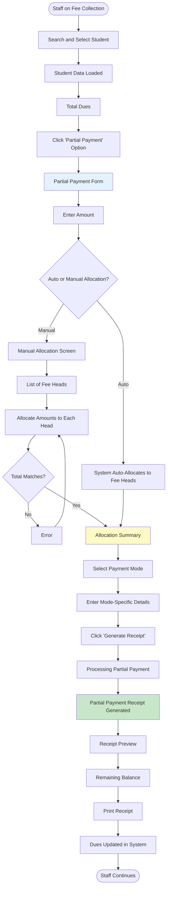
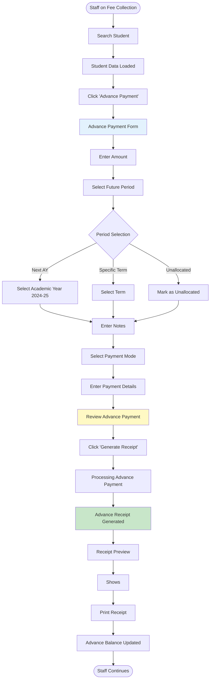
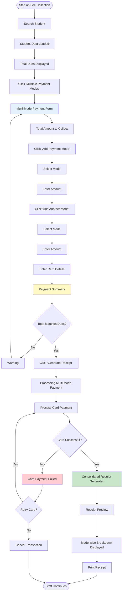
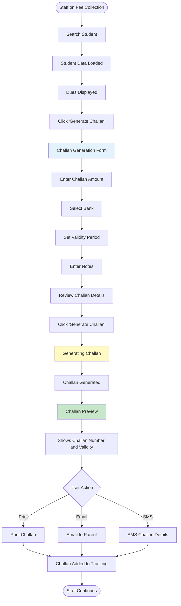
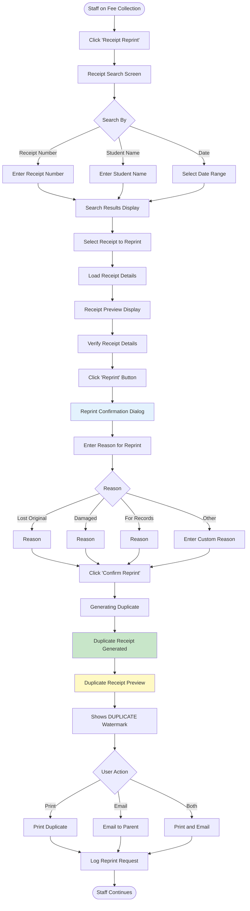
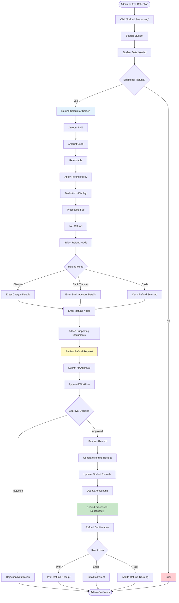

```mermaid
flowchart TD
    Start([Admin on Fee Collection]) --> ClickCancellation[Click 'Receipt Cancellation']
    ClickCancellation --> SearchReceipt[Receipt Search Screen]
    
    SearchReceipt --> TypeReceiptNo[Enter Receipt Number]
    TypeReceiptNo --> SearchResults[Search Results]
    
    SearchResults --> SelectReceipt[Select Receipt to Cancel]
    SelectReceipt --> LoadReceipt[Load Receipt Details]
    
    LoadReceipt --> ReceiptPreview[Receipt Preview Display]
    ReceiptPreview --> CheckStatus{Receipt Status}
    
    CheckStatus -->|Already Cancelled| ShowError[Error]
    CheckStatus -->|Valid| ClickCancel[Click 'Cancel Receipt' Button]
    
    ClickCancel --> CancellationDialog[Cancellation Dialog Opens]
    CancellationDialog --> SelectReason[Select Cancellation Reason]
    
    SelectReason --> ReasonChoice{Reason Type}
    
    ReasonChoice -->|Wrong Amount| WrongAmount[Reason]
    ReasonChoice -->|Wrong Student| WrongStudent[Reason]
    ReasonChoice -->|Duplicate| Duplicate[Reason]
    ReasonChoice -->|Other| OtherReason[Enter Custom Reason]
    
    WrongAmount --> EnterDetails[Enter Detailed Explanation]
    WrongStudent --> EnterDetails
    Duplicate --> EnterDetails
    OtherReason --> TypeCustomReason[Type Custom Reason]
    TypeCustomReason --> EnterDetails
    
    EnterDetails --> AttachDoc{Attach Supporting Document?}
    
    AttachDoc -->|Yes| UploadDoc[Upload Document]
    UploadDoc --> ReviewCancellation[Review Cancellation Request]
    
    AttachDoc -->|No| ReviewCancellation
    
    ReviewCancellation --> AuthCheck{Requires Higher Approval?}
    
    AuthCheck -->|Yes| SubmitForApproval[Submit for Approval]
    SubmitForApproval --> ApprovalPending[Approval Pending Status]
    ApprovalPending --> PendingNotif[Pending Notification]
    
    AuthCheck -->|No| ClickConfirm[Click 'Confirm Cancellation']
    ClickConfirm --> ProcessingState[Processing Cancellation]
    
    ProcessingState --> ReversalSteps[Reversal Process]
    ReversalSteps --> UpdateDues[Update Student Dues]
    UpdateDues --> UpdateAccounting[Update Accounting Records]
    UpdateAccounting --> MarkCancelled[Mark Receipt as Cancelled]
    
    MarkCancelled --> SuccessScreen[Cancellation Success]
    SuccessScreen --> ShowConfirmation[Cancellation Confirmation]
    
    ShowConfirmation --> ActionChoice{User Action}
    
    ActionChoice -->|Generate New| NewReceipt[Generate Correct Receipt]
    ActionChoice -->|Print Cancellation| PrintCancel[Print Cancellation Receipt]
    ActionChoice -->|Done| End([Admin Continues])
    
    PendingNotif --> End
    ShowError --> End
    
    style CancellationDialog fill:#e3f2fd
    style ReviewCancellation fill:#fff9c4
    style SuccessScreen fill:#c8e6c9
    style ShowError fill:#ffcdd2
```

# User Flows: Fee Collection & Receipts (UI/UX Perspective)

## Introduction

This document visualizes the **user interface journey** through the Fee Collection & Receipts module from a UI/UX design perspective. This module is the operational heart of the fee management system, handling all payment processing and receipt generation.

Each flowchart focuses on:
- **Screen states** and visual feedback
- **User actions** and decision points
- **Navigation paths** between interfaces
- **Error handling** and recovery flows

---

## Flow 12: Quick Fee Receipt

### User Story
*"As a Fee Counter Staff, I want to quickly generate a receipt for a parent's cash payment, so that the transaction is completed efficiently."*

### Interface Flow

### Screen States

**1. Student Search**
- Large search input with icon
- Live search results
- Recent students shown
- Quick filters by class

**2. Student Card**
- Photo and basic info
- Total dues highlighted
- Payment history summary
- Quick actions

**3. Dues Breakdown**
- Expandable table
- Fee heads with amounts
- Color-coded status
- Total calculation

**4. Payment Mode Selection**
- Radio buttons with icons
- Mode-specific fields appear
- Validation per mode
- Quick toggle between modes

**5. Receipt Preview**
- Full receipt display
- Print/Email/SMS buttons
- Download PDF option
- New receipt button

---

## Flow 13: Partial Payment Processing

### User Story
*"As a Fee Counter Staff, I want to accept a partial payment of ₹5,000 when the total due is ₹15,000, so that parents can pay in installments."*

### Interface Flow

### Screen States

**1. Partial Payment Form**
- Amount input with validation
- Auto/Manual allocation toggle
- Real-time balance calculation
- Payment mode selector

**2. Manual Allocation Screen**
- Table of fee heads
- Amount input for each
- Running total
- Validation indicators

**3. Allocation Summary**
- Before/After comparison
- Allocated amounts per head
- Remaining balance
- Confirm button

---

## Flow 14: Advance Payment

### User Story
*"As a Fee Counter Staff, I want to record an advance payment of ₹70,000 for the next academic year, so that it can be adjusted when the year starts."*

### Interface Flow

### Screen States

**1. Advance Payment Form**
- Amount input
- Period selector dropdown
- Notes textarea
- Payment mode selector

**2. Period Selection**
- Academic year dropdown
- Term selector
- Unallocated option
- Future date picker

**3. Review Screen**
- Amount summary
- Period tagging
- Payment mode
- Confirm button

---

## Flow 15: Multiple Payment Modes

### User Story
*"As a Fee Counter Staff, I want to accept ₹10,000 cash and ₹15,000 by card in a single transaction, so that the parent can use multiple payment methods."*

### Interface Flow

### Screen States

**1. Multi-Mode Form**
- Total amount display
- Add mode button
- List of added modes
- Running total

**2. Mode Entry**
- Mode selector
- Amount input
- Mode-specific fields
- Remove button

**3. Payment Summary**
- Mode-wise breakdown table
- Total calculation
- Validation status
- Generate button

---

## Flow 16: Fee Challan Generation

### User Story
*"As a Fee Counter Staff, I want to generate a bank challan for a parent who prefers to pay at the bank, so that the payment can be tracked."*

### Interface Flow

### Screen States

**1. Challan Form**
- Amount input
- Bank dropdown
- Validity date picker
- Notes textarea

**2. Challan Preview**
- Challan number
- Student details
- Amount and bank
- Validity date
- Barcode/QR code

**3. Challan Tracking**
- Status: Pending
- Validity countdown
- Bank details
- Actions: Cancel, Extend

---

## Flow 17: Receipt Cancellation

### User Story
*"As an Accounts Admin, I want to cancel an incorrect receipt and reverse the payment, so that a correct receipt can be generated."*

### Interface Flow

### Screen States

**1. Receipt Search**
- Search by receipt number
- Search by date range
- Search by student
- Recent cancellations

**2. Cancellation Dialog**
- Reason dropdown
- Detailed explanation textarea
- Document upload
- Warning message

**3. Authorization Check**
- Shows approval threshold
- Displays required approver
- Estimated approval time
- Notification option

---

## Flow 18: Receipt Reprint

### User Story
*"As a Fee Counter Staff, I want to reprint a lost receipt for a parent, so that they have a copy for their records."*

### Interface Flow

### Screen States

**1. Receipt Search**
- Multiple search options
- Advanced filters
- Recent reprints shown
- Quick search

**2. Receipt Preview**
- Full receipt display
- Original/Duplicate indicator
- Reprint history
- Verify button

**3. Duplicate Receipt**
- DUPLICATE watermark
- Original receipt number
- Reprint date and time
- Reprint reason shown

---

## Flow 19: Refund Processing

### User Story
*"As an Accounts Admin, I want to process a refund of ₹36,000 for a student who withdrew mid-year, so that the parent receives their money back."*

### Interface Flow

### Screen States

**1. Refund Calculator**
- Amount paid display
- Amount used calculation
- Refundable amount
- Policy deductions
- Net refund highlighted

**2. Refund Mode Selection**
- Radio buttons for modes
- Mode-specific form fields
- Validation per mode
- Processing time estimates

**3. Approval Workflow**
- Current approver
- Approval status
- Estimated time
- Notification options

**4. Refund Receipt**
- Refund details
- Calculation breakdown
- Mode of refund
- Reference numbers

---

## UI/UX Design Patterns Used

### Visual Feedback Patterns

**Loading States**
- Skeleton screens for data loading
- Progress bars for processing
- Spinners for quick actions
- Status indicators

**Success States**
- Green color scheme
- Checkmark animations
- Toast notifications
- Success screens

**Error States**
- Red color scheme
- Inline error messages
- Field-level validation
- Recovery instructions

**Warning States**
- Orange/yellow color scheme
- Warning icons
- Confirmation dialogs
- Impact previews

### Form Design Patterns

**Quick Entry Forms**
- Minimal fields
- Auto-complete
- Keyboard shortcuts
- Tab navigation

**Multi-Step Processes**
- Progress indicators
- Back/Next navigation
- Save draft option
- Step validation

**Validation**
- Real-time validation
- Inline error messages
- Summary of errors
- Prevent submission if invalid

### Receipt Design

**Receipt Preview**
- Professional layout
- School branding
- Clear amount breakdown
- QR code for verification
- Print-optimized format

**Duplicate Marking**
- DUPLICATE watermark
- Different color scheme
- Original receipt reference
- Reprint information

---

## Mobile Responsive Considerations

**Fee Collection Dashboard**
- Card layout
- Quick action buttons
- Recent transactions
- Summary widgets

**Receipt Forms**
- Single column layout
- Larger touch targets
- Native input types
- Sticky action buttons

**Receipt Preview**
- Optimized for mobile viewing
- Pinch to zoom
- Share options
- Mobile-friendly print
