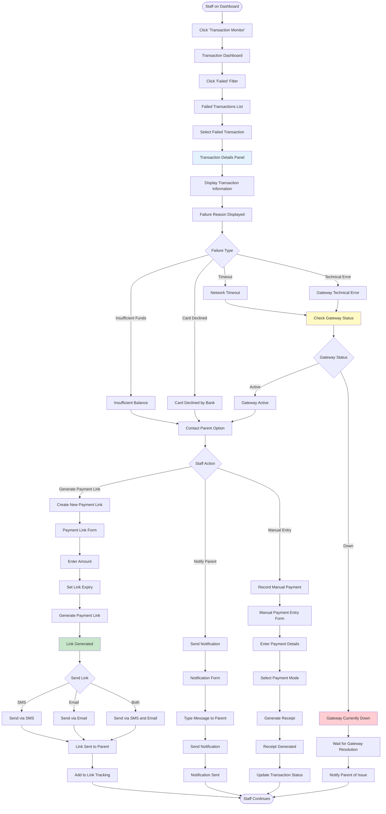

```mermaid
flowchart TD
    Start([Parent Logs into Portal]) --> Dashboard[Parent Portal Dashboard]
    
    Dashboard --> ViewFees[View Fee Dues Section]
    ViewFees --> ShowDues[Outstanding Dues Displayed]
    
    ShowDues --> ClickPay[Click 'Pay Now' Button]
    ClickPay --> PaymentScreen[Payment Amount Screen]
    
    PaymentScreen --> AmountChoice{Payment Amount}
    
    AmountChoice -->|Full Payment| SelectFull[Select Full Amount]
    AmountChoice -->|Partial Payment| SelectPartial[Select Partial Amount]
    AmountChoice -->|Custom Amount| EnterCustom[Enter Custom Amount]
    
    SelectFull --> ValidateAmount[Validate Amount]
    SelectPartial --> ValidateAmount
    EnterCustom --> ValidateAmount
    
    ValidateAmount --> ShowBreakdown[Fee Breakdown Display]
    ShowBreakdown --> ConvenienceFee[Convenience Fee Added]
    
    ConvenienceFee --> TotalDisplay[Total Amount Display]
    TotalDisplay --> ClickProceed[Click 'Proceed to Payment']
    
    ClickProceed --> GatewaySelection[Payment Gateway Selection]
    GatewaySelection --> SelectGateway[Select Payment Method]
    
    SelectGateway --> MethodChoice{Payment Method}
    
    MethodChoice -->|Credit Card| CardOption[Credit/Debit Card]
    MethodChoice -->|UPI| UPIOption[UPI Payment]
    MethodChoice -->|Net Banking| NetBankingOption[Net Banking]
    MethodChoice -->|Wallet| WalletOption[Digital Wallet]
    
    CardOption --> RedirectGateway[Redirect to Gateway]
    UPIOption --> RedirectGateway
    NetBankingOption --> RedirectGateway
    WalletOption --> RedirectGateway
    
    RedirectGateway --> GatewayPage[Payment Gateway Page]
    GatewayPage --> EnterDetails[Enter Payment Details]
    
    EnterDetails --> ProcessPayment[Processing Payment]
    ProcessPayment --> GatewayResponse{Gateway Response}
    
    GatewayResponse -->|Success| PaymentSuccess[Payment Successful]
    GatewayResponse -->|Failed| PaymentFailed[Payment Failed]
    GatewayResponse -->|Timeout| PaymentTimeout[Payment Timeout]
    
    PaymentSuccess --> RedirectBack[Redirect to School Portal]
    RedirectBack --> VerifyPayment[Verify Payment Status]
    
    VerifyPayment --> GenerateReceipt[Generate Receipt]
    GenerateReceipt --> SuccessScreen[Success Screen]
    
    SuccessScreen --> ShowReceipt[Receipt Display]
    ShowReceipt --> DownloadOptions[Download/Email Options]
    
    DownloadOptions --> ActionChoice{User Action}
    
    ActionChoice -->|Download| DownloadPDF[Download PDF Receipt]
    ActionChoice -->|Email| EmailReceipt[Email Receipt]
    ActionChoice -->|Print| PrintReceipt[Print Receipt]
    ActionChoice -->|Done| UpdatedDashboard[Dashboard Updates]
    
    PaymentFailed --> FailureScreen[Payment Failure Screen]
    FailureScreen --> ShowReason[Failure Reason Displayed]
    ShowReason --> RetryOptions[Retry Options]
    
    RetryOptions --> RetryChoice{User Choice}
    
    RetryChoice -->|Retry| PaymentScreen
    RetryChoice -->|Try Different Method| GatewaySelection
    RetryChoice -->|Cancel| Dashboard
    
    PaymentTimeout --> TimeoutScreen[Timeout Screen]
    TimeoutScreen --> CheckStatus[Check Payment Status]
    CheckStatus --> StatusResult{Status Check}
    
    StatusResult -->|Success| PaymentSuccess
    StatusResult -->|Failed| PaymentFailed
    StatusResult -->|Pending| PendingScreen[Payment Pending Screen]
    
    PendingScreen --> WaitNotification[Wait for Confirmation]
    WaitNotification --> End([Parent Continues])
    
    UpdatedDashboard --> End
    
    style PaymentScreen fill:#e3f2fd
    style SuccessScreen fill:#c8e6c9
    style FailureScreen fill:#ffcdd2
    style ProcessPayment fill:#fff9c4
    style TimeoutScreen fill:#ffe0b2
```

```mermaid
flowchart TD
    Start([Admin Logs In]) --> Dashboard[Admin Dashboard]
    
    Dashboard --> ClickSettings[Click 'Settings' Menu]
    ClickSettings --> SettingsPage[Settings Page]
    
    SettingsPage --> ClickGateway[Click 'Payment Gateway' Tab]
    ClickGateway --> GatewayList[Payment Gateway List]
    
    GatewayList --> ShowGateways[Available Gateways Display]
    ShowGateways --> SelectGateway[Select Gateway to Configure]
    
    SelectGateway --> GatewayChoice{Gateway Selection}
    
    GatewayChoice -->|Razorpay| RazorpayConfig[Razorpay Configuration]
    GatewayChoice -->|PayU| PayUConfig[PayU Configuration]
    GatewayChoice -->|Paytm| PaytmConfig[Paytm Configuration]
    GatewayChoice -->|Stripe| StripeConfig[Stripe Configuration]
    
    RazorpayConfig --> ConfigForm[Gateway Configuration Form]
    PayUConfig --> ConfigForm
    PaytmConfig --> ConfigForm
    StripeConfig --> ConfigForm
    
    ConfigForm --> ModeSelection[Select Mode]
    ModeSelection --> ModeChoice{Mode}
    
    ModeChoice -->|Test Mode| TestMode[Test Mode Selected]
    ModeChoice -->|Live Mode| LiveMode[Live Mode Selected]
    
    TestMode --> EnterTestKeys[Enter Test API Keys]
    LiveMode --> EnterLiveKeys[Enter Live API Keys]
    
    EnterTestKeys --> EnterMerchantID[Enter Merchant ID]
    EnterLiveKeys --> EnterMerchantID
    
    EnterMerchantID --> EnterSecretKey[Enter Secret Key]
    EnterSecretKey --> WebhookURL[Configure Webhook URL]
    
    WebhookURL --> PaymentMethods[Select Payment Methods]
    PaymentMethods --> MethodsChoice[Choose Methods to Enable]
    
    MethodsChoice --> EnableCard[Enable Credit/Debit Cards]
    EnableCard --> EnableUPI[Enable UPI]
    EnableUPI --> EnableNetBanking[Enable Net Banking]
    EnableNetBanking --> EnableWallet[Enable Wallets]
    
    EnableWallet --> ConvenienceFee[Configure Convenience Fee]
    ConvenienceFee --> FeeChoice{Fee Type}
    
    FeeChoice -->|Percentage| EnterPercent[Enter Percentage]
    FeeChoice -->|Fixed Amount| EnterFixed[Enter Fixed Amount]
    FeeChoice -->|No Fee| NoFee[No Convenience Fee]
    
    EnterPercent --> TestConnection[Test Connection Button]
    EnterFixed --> TestConnection
    NoFee --> TestConnection
    
    TestConnection --> ClickTest[Click 'Test Connection']
    ClickTest --> TestingState[Testing Gateway Connection]
    
    TestingState --> TestResult{Test Result}
    
    TestResult -->|Success| TestSuccess[Connection Successful]
    TestResult -->|Failed| TestFailed[Connection Failed]
    
    TestFailed --> ShowError[Error Details Displayed]
    ShowError --> FixIssue{Fix Issue?}
    
    FixIssue -->|Yes| ConfigForm
    FixIssue -->|No| GatewayList
    
    TestSuccess --> ReviewConfig[Review Configuration]
    ReviewConfig --> ClickSave[Click 'Save Configuration']
    
    ClickSave --> ConfirmDialog[Confirmation Dialog]
    ConfirmDialog --> ConfirmChoice{Confirm?}
    
    ConfirmChoice -->|No| ConfigForm
    ConfirmChoice -->|Yes| SaveConfig[Save Configuration]
    
    SaveConfig --> ActivateGateway[Activate Gateway]
    ActivateGateway --> SuccessScreen[Configuration Saved]
    
    SuccessScreen --> ShowConfirmation[Success Confirmation]
    ShowConfirmation --> UpdatedList[Gateway List Updates]
    
    UpdatedList --> GatewayStatus[Gateway Status]
    GatewayStatus --> End([Admin Continues])
    
    style ConfigForm fill:#e3f2fd
    style TestingState fill:#fff9c4
    style SuccessScreen fill:#c8e6c9
    style TestFailed fill:#ffcdd2
```

# User Flows: Payment Gateway Integration (UI/UX Perspective)

## Introduction

This document visualizes the **user interface journey** through the Payment Gateway Integration module from a UI/UX design perspective. This module enables parents to pay fees online securely through integrated payment gateways.

Each flowchart focuses on:
- **Screen states** and visual feedback
- **User actions** and decision points
- **Navigation paths** between interfaces
- **Error handling** and recovery flows

---

## Flow 20: Online Payment Processing

### User Story
*"As a Parent, I want to pay my child's school fees online using my credit card, so that I can make payment from home without visiting the school."*

### Interface Flow

### Screen States

**1. Payment Amount Screen**
- Outstanding dues highlighted
- Payment amount options
- Fee breakdown expandable
- Convenience fee calculator
- Total amount prominent

**2. Gateway Selection**
- Payment method icons
- Recommended methods
- Processing time estimates
- Security badges
- Terms and conditions

**3. Processing State**
- Loading animation
- "Do not refresh" warning
- Progress indicator
- Estimated time
- Support contact info

**4. Success Screen**
- Green checkmark animation
- Transaction ID
- Receipt preview
- Download/Email/Print options
- Return to dashboard button

**5. Failure Screen**
- Red error icon
- Failure reason
- Retry button
- Try different method
- Contact support link

---

## Flow 21: Configure Payment Gateway

### User Story
*"As a Super Admin, I want to configure Razorpay payment gateway with our API keys, so that parents can make online payments."*

### Interface Flow

### Screen States

**1. Gateway List**
- Available gateways with logos
- Status indicators
- Configure/Edit buttons
- Test/Live mode badges
- Quick enable/disable toggle

**2. Configuration Form**
- Mode selector
- API key inputs
- Webhook URL field
- Payment methods checkboxes
- Convenience fee settings

**3. Test Connection**
- Test button
- Loading state
- Success/Failure message
- Error details
- Retry option

**4. Review Screen**
- Configuration summary
- Enabled payment methods
- Fee structure
- Webhook status
- Save button

---

## Flow 22: Handle Failed Payment

### User Story
*"As a Fee Counter Staff, I want to help a parent whose online payment failed, so that they can successfully complete the payment."*

### Interface Flow

### Screen States

**1. Transaction Dashboard**
- Summary cards
- Filter options
- Search bar
- Date range selector
- Export button

**2. Failed Transactions List**
- Table with columns
- Failure reason column
- Amount column
- Student name
- Retry count
- Actions

**3. Transaction Details**
- Full transaction info
- Failure reason highlighted
- Gateway response
- Retry history
- Action buttons

**4. Payment Link Form**
- Amount input
- Expiry date picker
- Student selector
- Send method options
- Preview link

---

## UI/UX Design Patterns Used

### Visual Feedback Patterns

**Loading States**
- Gateway redirect loading
- Payment processing animation
- Status check spinner
- Connection testing indicator

**Success States**
- Green checkmark animation
- Confetti effect
- Success banner
- Receipt preview

**Error States**
- Red error icon
- Failure reason
- Retry button
- Support contact

**Warning States**
- Orange timeout warning
- Pending status
- Gateway down alert
- Retry limit warning

### Security Patterns

**Secure Input**
- Masked API keys
- HTTPS indicators
- Security badges
- PCI compliance logos

**Redirect Handling**
- Clear redirect message
- "Do not refresh" warning
- Return URL display
- Timeout handling

### Transaction Monitoring

**Real-time Updates**
- Live transaction feed
- Status change notifications
- Auto-refresh
- Sound alerts

**Filtering and Search**
- Status filters
- Date range
- Amount range
- Student search
- Gateway filter

---

## Mobile Responsive Considerations

**Payment Flow**
- Mobile-optimized gateway
- Touch-friendly buttons
- Simplified forms
- Native payment methods

**Transaction Monitor**
- Card-based layout
- Swipe actions
- Bottom sheets
- Pull to refresh

**Configuration**
- Accordion sections
- Collapsible forms
- Sticky save button
- Mobile-friendly testing
