```mermaid
flowchart TD
    Start([Admin Logs In]) --> Dashboard[Reconciliation Dashboard]
    
    Dashboard --> ClickBank[Click 'Bank Reconciliation']
    ClickBank --> BankReconScreen[Bank Reconciliation Screen]
    
    BankReconScreen --> SelectBank[Select Bank Account]
    SelectBank --> SelectPeriod[Select Date Range]
    
    SelectPeriod --> ImportChoice{Import Statement}
    
    ImportChoice -->|Upload File| ClickUpload[Click 'Upload Statement']
    ImportChoice -->|Manual Entry| ManualEntry[Manual Entry Mode]
    
    ClickUpload --> FileDialog[File Upload Dialog]
    FileDialog --> SelectFile[Select CSV/Excel File]
    
    SelectFile --> UploadProgress[Upload Progress Bar]
    UploadProgress --> ParseFile[Parsing File]
    
    ParseFile --> ValidateFormat{Validate Format}
    
    ValidateFormat -->|Invalid| FormatError[Format Error Message]
    FormatError --> ShowSample[Show Expected Format]
    ShowSample --> FileDialog
    
    ValidateFormat -->|Valid| ShowTransactions[Bank Transactions Loaded]
    
    ShowTransactions --> TransactionTable[Bank Transactions Table]
    TransactionTable --> FetchReceipts[Fetch System Receipts]
    
    FetchReceipts --> ReceiptsLoaded[Receipts for Period Loaded]
    ReceiptsLoaded --> AutoMatch[Click 'Auto-Match' Button]
    
    AutoMatch --> MatchingProcess[Auto-Matching Algorithm Running]
    MatchingProcess --> MatchingProgress[Progress Indicator]
    
    MatchingProgress --> MatchResults[Matching Results Display]
    MatchResults --> ShowSummary[Summary Statistics]
    
    ShowSummary --> CategoryDisplay[Display Categories]
    CategoryDisplay --> ShowMatched[Matched Transactions]
    ShowMatched --> ShowUnmatched[Unmatched Transactions]
    ShowUnmatched --> ShowDiscrepancies[Discrepancies]
    
    ShowDiscrepancies --> ReviewChoice{Review Unmatched}
    
    ReviewChoice -->|Manual Match| SelectUnmatched[Select Unmatched Transaction]
    SelectUnmatched --> ShowDetails[Transaction Details Panel]
    
    ShowDetails --> SearchReceipts[Search Matching Receipts]
    SearchReceipts --> SuggestedMatches[Suggested Matches Display]
    
    SuggestedMatches --> SelectMatch[Select Matching Receipt]
    SelectMatch --> ConfirmMatch[Confirm Match]
    
    ConfirmMatch --> UpdateMatched[Update Matched List]
    UpdateMatched --> ReviewChoice
    
    ReviewChoice -->|Mark as Discrepancy| MarkDiscrepancy[Mark as Discrepancy]
    MarkDiscrepancy --> EnterReason[Enter Discrepancy Reason]
    EnterReason --> SaveDiscrepancy[Save Discrepancy]
    SaveDiscrepancy --> ReviewChoice
    
    ReviewChoice -->|Complete| FinalReview[Final Review Screen]
    
    FinalReview --> ShowFinalSummary[Final Summary Display]
    ShowFinalSummary --> ValidateRecon{All Matched?}
    
    ValidateRecon -->|No| ShowWarning[Warning]
    ShowWarning --> WarningChoice{Proceed Anyway?}
    
    WarningChoice -->|No| ReviewChoice
    WarningChoice -->|Yes| ClickFinalize[Click 'Finalize Reconciliation']
    
    ValidateRecon -->|Yes| ClickFinalize
    
    ClickFinalize --> ProcessingState[Processing Reconciliation]
    ProcessingState --> GenerateReport[Generate Reconciliation Report]
    
    GenerateReport --> SuccessScreen[Reconciliation Complete]
    SuccessScreen --> ShowReport[Report Preview]
    
    ShowReport --> ActionChoice{User Action}
    
    ActionChoice -->|Download| DownloadReport[Download PDF Report]
    ActionChoice -->|Email| EmailReport[Email Report]
    ActionChoice -->|Print| PrintReport[Print Report]
    ActionChoice -->|Done| UpdatedDashboard[Dashboard Updates]
    
    UpdatedDashboard --> End([Admin Continues])
    
    ManualEntry --> ManualForm[Manual Transaction Entry]
    ManualForm --> EnterTransaction[Enter Transaction Details]
    EnterTransaction --> AddTransaction[Add to List]
    AddTransaction --> ManualChoice{Add Another?}
    
    ManualChoice -->|Yes| EnterTransaction
    ManualChoice -->|No| ShowTransactions
    
    style BankReconScreen fill:#e3f2fd
    style MatchingProcess fill:#fff9c4
    style SuccessScreen fill:#c8e6c9
    style FormatError fill:#ffcdd2
    style ShowWarning fill:#ffe0b2
```

```mermaid
flowchart TD
    Start([Admin on Reconciliation]) --> ClickGateway[Click 'Gateway Settlement']
    ClickGateway --> GatewayScreen[Gateway Settlement Screen]
    
    GatewayScreen --> SelectGateway[Select Payment Gateway]
    SelectGateway --> GatewayChoice{Gateway Selection}
    
    GatewayChoice -->|Razorpay| RazorpaySelected[Razorpay Selected]
    GatewayChoice -->|PayU| PayUSelected[PayU Selected]
    GatewayChoice -->|Paytm| PaytmSelected[Paytm Selected]
    
    RazorpaySelected --> SelectPeriod[Select Settlement Period]
    PayUSelected --> SelectPeriod
    PaytmSelected --> SelectPeriod
    
    SelectPeriod --> ImportMethod{Import Method}
    
    ImportMethod -->|API Fetch| ClickFetch[Click 'Fetch from Gateway']
    ImportMethod -->|Upload File| ClickUpload[Click 'Upload Settlement File']
    
    ClickFetch --> APIConnection[Connecting to Gateway API]
    APIConnection --> FetchingData[Fetching Settlement Data]
    
    FetchingData --> APIResult{API Response}
    
    APIResult -->|Success| SettlementLoaded[Settlement Data Loaded]
    APIResult -->|Failed| APIError[API Connection Error]
    
    APIError --> ShowAPIError[Error Message Display]
    ShowAPIError --> RetryChoice{Retry?}
    
    RetryChoice -->|Yes| ClickFetch
    RetryChoice -->|No| ClickUpload
    
    ClickUpload --> FileDialog[File Upload Dialog]
    FileDialog --> SelectFile[Select Settlement File]
    SelectFile --> UploadFile[Upload File]
    
    UploadFile --> ParseSettlement[Parse Settlement Data]
    ParseSettlement --> SettlementLoaded
    
    SettlementLoaded --> ShowSettlement[Settlement Summary Display]
    ShowSettlement --> SettlementDetails[Settlement Details]
    
    SettlementDetails --> ShowGross[Gross Amount]
    ShowGross --> ShowFees[Gateway Fees Deducted]
    ShowFees --> ShowNet[Net Settlement Amount]
    ShowNet --> ShowTransactions[Transaction Count]
    
    ShowTransactions --> FetchReceipts[Fetch Online Payment Receipts]
    FetchReceipts --> ReceiptsLoaded[Receipts Loaded for Period]
    
    ReceiptsLoaded --> ClickAutoMatch[Click 'Auto-Match']
    ClickAutoMatch --> MatchingEngine[Matching Engine Running]
    
    MatchingEngine --> MatchProgress[Matching Progress]
    MatchProgress --> MatchComplete[Matching Complete]
    
    MatchComplete --> ShowResults[Results Display]
    ShowResults --> MatchedSection[Matched Transactions Section]
    
    MatchedSection --> UnmatchedSection[Unmatched Transactions Section]
    UnmatchedSection --> FeeValidation[Fee Validation Section]
    
    FeeValidation --> ValidateFees{Fees Match?}
    
    ValidateFees -->|No| FeeDiscrepancy[Fee Discrepancy Alert]
    FeeDiscrepancy --> InvestigateFee[Investigate Fee Difference]
    InvestigateFee --> AdjustFee[Adjust Fee or Report Issue]
    
    ValidateFees -->|Yes| ReviewUnmatched[Review Unmatched Items]
    AdjustFee --> ReviewUnmatched
    
    ReviewUnmatched --> UnmatchedChoice{Unmatched Items?}
    
    UnmatchedChoice -->|Yes| SelectUnmatched[Select Unmatched Item]
    SelectUnmatched --> ItemDetails[Item Details Panel]
    
    ItemDetails --> SearchMatch[Search for Match]
    SearchMatch --> MatchOptions{Match Found?}
    
    MatchOptions -->|Yes| ManualMatch[Manually Match]
    MatchOptions -->|No| MarkMissing[Mark as Missing]
    
    ManualMatch --> ConfirmMatch[Confirm Match]
    ConfirmMatch --> UpdateList[Update Matched List]
    UpdateList --> ReviewUnmatched
    
    MarkMissing --> EnterReason[Enter Reason]
    EnterReason --> SaveMissing[Save as Discrepancy]
    SaveMissing --> ReviewUnmatched
    
    UnmatchedChoice -->|No| FinalReview[Final Review Screen]
    
    FinalReview --> ReconciliationSummary[Reconciliation Summary]
    ReconciliationSummary --> ShowMatchRate[Match Rate Display]
    ShowMatchRate --> ShowDiscrepancies[Discrepancies Summary]
    
    ShowDiscrepancies --> ApprovalCheck{Requires Approval?}
    
    ApprovalCheck -->|Yes| SubmitApproval[Submit for Approval]
    SubmitApproval --> ApprovalPending[Approval Pending]
    ApprovalPending --> End([Admin Continues])
    
    ApprovalCheck -->|No| ClickFinalize[Click 'Finalize Settlement']
    ClickFinalize --> ProcessingState[Processing Settlement]
    
    ProcessingState --> UpdateRecords[Update Settlement Records]
    UpdateRecords --> GenerateReport[Generate Settlement Report]
    
    GenerateReport --> SuccessScreen[Settlement Reconciled]
    SuccessScreen --> ShowReport[Report Preview]
    
    ShowReport --> ActionChoice{User Action}
    
    ActionChoice -->|Download| DownloadReport[Download Report]
    ActionChoice -->|Email| EmailReport[Email to Accounts]
    ActionChoice -->|Archive| ArchiveReport[Archive Settlement]
    ActionChoice -->|Done| UpdatedDashboard[Dashboard Updates]
    
    UpdatedDashboard --> End
    
    style GatewayScreen fill:#e3f2fd
    style MatchingEngine fill:#fff9c4
    style SuccessScreen fill:#c8e6c9
    style APIError fill:#ffcdd2
    style FeeDiscrepancy fill:#ffe0b2
```

# User Flows: Payment Reconciliation (UI/UX Perspective)

## Introduction

This document visualizes the **user interface journey** through the Payment Reconciliation module from a UI/UX design perspective. This module ensures that all collected fees match with bank deposits and gateway settlements.

Each flowchart focuses on:
- **Screen states** and visual feedback
- **User actions** and decision points
- **Navigation paths** between interfaces
- **Error handling** and recovery flows

---

## Flow 23: Bank Reconciliation

### User Story
*"As an Accounts Admin, I want to match our bank statement with fee receipts, so that I can ensure all payments are accounted for."*

### Interface Flow

### Screen States

**1. Bank Reconciliation Screen**
- Bank account selector
- Date range picker
- Upload button
- Manual entry option
- Recent reconciliations list

**2. Transaction Table**
- Columns: Date, Description, Debit, Credit, Balance
- Search and filter
- Sort options
- Select all checkbox
- Bulk actions

**3. Auto-Matching Progress**
- Progress bar
- Matched count
- Unmatched count
- Processing message
- Cancel option

**4. Matching Results**
- Summary cards
- Matched transactions in green
- Unmatched in orange
- Discrepancies in red
- Match percentage

**5. Manual Matching Panel**
- Split screen layout
- Bank transaction on left
- Suggested receipts on right
- Match confidence score
- Confirm button

---

## Flow 24: Gateway Settlement Matching

### User Story
*"As an Accounts Admin, I want to match Razorpay settlement with our online payment receipts, so that I can verify all online payments are settled correctly."*

### Interface Flow

### Screen States

**1. Gateway Settlement Screen**
- Gateway selector dropdown
- Period selector
- Fetch/Upload options
- Recent settlements list
- Status indicators

**2. Settlement Summary**
- Gross amount card
- Fees deducted card
- Net settlement card
- Transaction count
- Settlement date

**3. Matching Engine**
- Progress bar
- Matched count
- Unmatched count
- Fee validation status
- Processing time estimate

**4. Results Display**
- Matched transactions table
- Unmatched transactions table
- Fee comparison
- Discrepancy alerts
- Match percentage

**5. Fee Validation**
- Expected fee calculation
- Actual fee charged
- Difference highlighted
- Fee breakdown
- Adjustment options

---

## UI/UX Design Patterns Used

### Visual Feedback Patterns

**Loading States**
- File upload progress
- Parsing indicators
- Matching progress bars
- API connection status

**Success States**
- Green checkmarks
- Match confirmation
- Reconciliation complete
- Report generated

**Error States**
- Red error icons
- Format validation errors
- API connection failures
- Discrepancy alerts

**Warning States**
- Orange unmatched items
- Fee discrepancies
- Incomplete reconciliation
- Approval required

### Data Visualization

**Summary Cards**
- Total transactions
- Matched count
- Unmatched count
- Match percentage
- Amount totals

**Progress Indicators**
- Matching progress
- Upload progress
- Processing status
- Completion percentage

**Comparison Views**
- Side-by-side comparison
- Before/After amounts
- Expected vs Actual
- Difference highlighting

### Reconciliation Patterns

**Auto-Matching**
- Algorithm-based matching
- Confidence scores
- Suggested matches
- Bulk matching

**Manual Matching**
- Search and filter
- Drag and drop
- Click to match
- Undo option

**Discrepancy Handling**
- Mark as discrepancy
- Enter reason
- Attach documentation
- Track resolution

---

## Mobile Responsive Considerations

**Reconciliation Dashboard**
- Card-based layout
- Summary widgets
- Quick actions
- Recent activity

**Transaction Lists**
- Swipeable cards
- Filter bottom sheet
- Expandable details
- Quick match actions

**Matching Interface**
- Full-screen mode
- Swipe to match
- Tap to expand
- Bottom action bar
