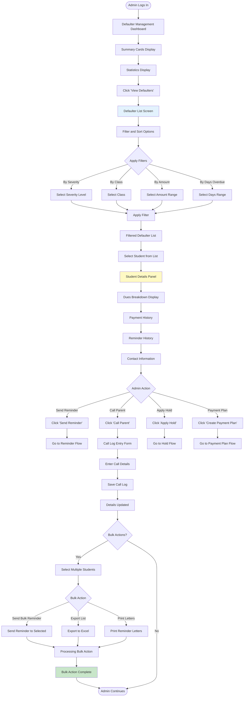
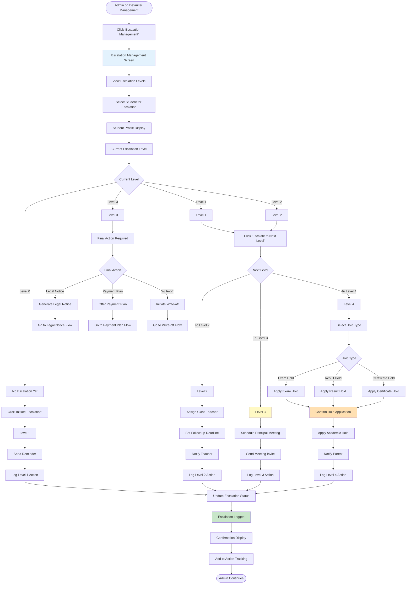

```mermaid
flowchart TD
    Start([Admin on Defaulter Management]) --> ClickReminders[Click 'Reminder Automation']
    ClickReminders --> ReminderScreen[Reminder Automation Screen]
    
    ReminderScreen --> ViewRules[View Existing Rules]
    ViewRules --> ClickNew[Click 'Create New Rule']
    
    ClickNew --> RuleWizard[Reminder Rule Wizard]
    RuleWizard --> Step1[Step 1]
    
    Step1 --> SelectTrigger[Select Trigger Type]
    SelectTrigger --> TriggerChoice{Trigger Type}
    
    TriggerChoice -->|Days Before Due| BeforeDue[Days Before Due Date]
    TriggerChoice -->|Days After Due| AfterDue[Days After Due Date]
    TriggerChoice -->|Amount Threshold| AmountThreshold[Amount Threshold]
    
    BeforeDue --> EnterDays[Enter Days]
    AfterDue --> EnterDays
    AmountThreshold --> EnterAmount[Enter Amount]
    
    EnterDays --> ClickNext1[Click 'Next']
    EnterAmount --> ClickNext1
    
    ClickNext1 --> Step2[Step 2]
    Step2 --> SelectChannel[Select Communication Channel]
    
    SelectChannel --> ChannelChoice{Channel Selection}
    
    ChannelChoice -->|SMS| SMSChannel[SMS Selected]
    ChannelChoice -->|Email| EmailChannel[Email Selected]
    ChannelChoice -->|WhatsApp| WhatsAppChannel[WhatsApp Selected]
    ChannelChoice -->|Multiple| MultiChannel[Multiple Channels]
    
    SMSChannel --> SelectTemplate[Select Message Template]
    EmailChannel --> SelectTemplate
    WhatsAppChannel --> SelectTemplate
    MultiChannel --> SelectTemplate
    
    SelectTemplate --> PreviewMessage[Preview Message]
    PreviewMessage --> CustomizeMessage[Customize Message]
    
    CustomizeMessage --> ClickNext2[Click 'Next']
    ClickNext2 --> Step3[Step 3]
    
    Step3 --> SelectAudience[Select Target Audience]
    SelectAudience --> AudienceChoice{Audience Type}
    
    AudienceChoice -->|All Defaulters| AllDefaulters[All Defaulters]
    AudienceChoice -->|By Class| ByClass[Select Classes]
    AudienceChoice -->|By Amount| ByAmount[Select Amount Range]
    AudienceChoice -->|Custom| CustomAudience[Custom Criteria]
    
    AllDefaulters --> ClickNext3[Click 'Next']
    ByClass --> ClickNext3
    ByAmount --> ClickNext3
    CustomAudience --> ClickNext3
    
    ClickNext3 --> Step4[Step 4]
    Step4 --> ScheduleChoice{Schedule Type}
    
    ScheduleChoice -->|Immediate| ImmediateSchedule[Send Immediately]
    ScheduleChoice -->|Scheduled| ScheduledTime[Select Date and Time]
    ScheduleChoice -->|Recurring| RecurringSchedule[Set Recurrence Pattern]
    
    ImmediateSchedule --> ReviewRule[Review Rule]
    ScheduledTime --> ReviewRule
    RecurringSchedule --> ReviewRule
    
    ReviewRule --> ShowSummary[Rule Summary Display]
    ShowSummary --> TestRule[Click 'Test Rule']
    
    TestRule --> TestModal[Test Modal Opens]
    TestModal --> EnterTestNumber[Enter Test Phone/Email]
    EnterTestNumber --> SendTest[Send Test Message]
    
    SendTest --> TestResult{Test Successful?}
    
    TestResult -->|No| TestError[Error Message]
    TestError --> ReviewRule
    
    TestResult -->|Yes| TestSuccess[Test Message Sent]
    TestSuccess --> ClickActivate[Click 'Activate Rule']
    
    ClickActivate --> ProcessingState[Activating Rule]
    ProcessingState --> RuleActivated[Rule Activated]
    
    RuleActivated --> SuccessScreen[Success Screen]
    SuccessScreen --> ShowConfirmation[Confirmation Display]
    
    ShowConfirmation --> UpdatedRules[Rules List Updates]
    UpdatedRules --> End([Admin Continues])
    
    style RuleWizard fill:#e3f2fd
    style PreviewMessage fill:#fff9c4
    style SuccessScreen fill:#c8e6c9
    style TestError fill:#ffcdd2
```

```mermaid
flowchart TD
    Start([Principal on Defaulter Management]) --> ClickHolds[Click 'Academic Holds']
    ClickHolds --> HoldsScreen[Academic Holds Screen]
    
    HoldsScreen --> ViewActive[View Active Holds]
    ViewActive --> ClickNew[Click 'Apply New Hold']
    
    ClickNew --> HoldForm[Hold Application Form]
    HoldForm --> SearchStudent[Search Student]
    
    SearchStudent --> SelectStudent[Select Student]
    SelectStudent --> LoadStudent[Load Student Data]
    
    LoadStudent --> ShowDues[Display Outstanding Dues]
    ShowDues --> CheckEligibility{Eligible for Hold?}
    
    CheckEligibility -->|No| IneligibleError[Error]
    IneligibleError --> ShowReason[Show Ineligibility Reason]
    ShowReason --> HoldsScreen
    
    CheckEligibility -->|Yes| SelectHoldType[Select Hold Type]
    SelectHoldType --> HoldTypeChoice{Hold Type}
    
    HoldTypeChoice -->|Exam Hold| ExamHold[Exam Hold Selected]
    HoldTypeChoice -->|Result Hold| ResultHold[Result Hold Selected]
    HoldTypeChoice -->|Certificate Hold| CertificateHold[Certificate Hold Selected]
    HoldTypeChoice -->|Library Hold| LibraryHold[Library Hold Selected]
    
    ExamHold --> EnterDetails[Enter Hold Details]
    ResultHold --> EnterDetails
    CertificateHold --> EnterDetails
    LibraryHold --> EnterDetails
    
    EnterDetails --> SetEffectiveDate[Set Effective Date]
    SetEffectiveDate --> EnterReason[Enter Reason for Hold]
    EnterReason --> AttachDoc{Attach Documentation?}
    
    AttachDoc -->|Yes| UploadDoc[Upload Supporting Document]
    UploadDoc --> ReviewHold[Review Hold Details]
    
    AttachDoc -->|No| ReviewHold
    
    ReviewHold --> ShowSummary[Hold Summary Display]
    ShowSummary --> ConfirmChoice{Confirm Hold?}
    
    ConfirmChoice -->|No| HoldForm
    ConfirmChoice -->|Yes| ClickApply[Click 'Apply Hold']
    
    ClickApply --> ProcessingState[Processing Hold Application]
    ProcessingState --> ApplyToSystem[Apply Hold to Academic System]
    
    ApplyToSystem --> SystemUpdate[Update Academic Records]
    SystemUpdate --> GenerateNotification[Generate Parent Notification]
    
    GenerateNotification --> NotificationChoice{Notification Method}
    
    NotificationChoice -->|SMS| SendSMS[Send SMS to Parent]
    NotificationChoice -->|Email| SendEmail[Send Email to Parent]
    NotificationChoice -->|Both| SendBoth[Send SMS and Email]
    
    SendSMS --> NotificationSent[Notification Sent]
    SendEmail --> NotificationSent
    SendBoth --> NotificationSent
    
    NotificationSent --> LogHold[Log Hold Action]
    LogHold --> SuccessScreen[Hold Applied Successfully]
    
    SuccessScreen --> ShowConfirmation[Confirmation Display]
    ShowConfirmation --> ActionOptions{Admin Action}
    
    ActionOptions -->|Print Notice| PrintNotice[Print Hold Notice]
    ActionOptions -->|View Hold| ViewHoldDetails[View Hold Details]
    ActionOptions -->|Apply Another| HoldForm
    ActionOptions -->|Done| UpdatedList[Holds List Updates]
    
    UpdatedList --> End([Principal Continues])
    
    style HoldForm fill:#e3f2fd
    style ReviewHold fill:#fff9c4
    style SuccessScreen fill:#c8e6c9
    style IneligibleError fill:#ffcdd2
```

# User Flows: Defaulter & Dues Management (UI/UX Perspective)

## Introduction

This document visualizes the **user interface journey** through the Defaulter & Dues Management module from a UI/UX design perspective. This module identifies students with overdue payments and manages the entire lifecycle from reminder to resolution.

Each flowchart focuses on:
- **Screen states** and visual feedback
- **User actions** and decision points
- **Navigation paths** between interfaces
- **Error handling** and recovery flows

---

## Flow 25: Identify Defaulters

### User Story
*"As an Accounts Admin, I want to view all students with overdue payments, so that I can take appropriate action."*

### Interface Flow

### Screen States

**1. Dashboard Summary**
- Total defaulters count
- Amount overdue total
- Severity breakdown
- Trend charts

**2. Defaulter List**
- Table with columns
- Color-coded severity
- Quick actions
- Bulk select

**3. Student Details Panel**
- Student info card
- Dues breakdown
- Payment history timeline
- Reminder history
- Action buttons

---

## Flow 26: Automate Due Reminders

### User Story
*"As an Accounts Admin, I want to set up automated reminders for students with pending dues, so that parents are notified without manual effort."*

### Interface Flow

### Screen States

**1. Reminder Rules List**
- Active rules
- Inactive rules
- Quick toggle
- Edit/Delete actions

**2. Rule Wizard**
- Step indicator
- Form fields
- Preview panel
- Navigation buttons

**3. Message Preview**
- Template preview
- Variable substitution
- Character count
- Multi-language support

---

## Flow 27: Escalation Workflow

### User Story
*"As a Principal, I want to escalate persistent defaulters through multiple levels, so that appropriate action is taken."*

### Interface Flow

### Screen States

**1. Escalation Levels**
- Level indicator
- Timeline view
- Action history
- Next action button

**2. Level Forms**
- Level-specific fields
- Assignee selector
- Deadline picker
- Notes textarea

**3. Hold Application**
- Hold type selector
- Effective date
- Release conditions
- Parent notification

---

## Flow 28: Apply Academic Hold

### User Story
*"As a Principal, I want to apply an exam hold for a student with 60+ days overdue payment, so that payment is prioritized."*

### Interface Flow

### Screen States

**1. Active Holds List**
- Table of active holds
- Hold type badges
- Student details
- Release button

**2. Hold Application Form**
- Student selector
- Hold type dropdown
- Effective date picker
- Reason textarea
- Document upload

**3. Hold Summary**
- Student info
- Hold details
- Effective date
- Release conditions
- Confirm button

**4. Hold Release**
- Hold details
- Payment verification
- Release reason
- Approval workflow

---

## UI/UX Design Patterns Used

### Visual Feedback Patterns

**Severity Indicators**
- Color-coded badges
- Mild: Yellow
- Moderate: Orange
- Severe: Red

**Status Indicators**
- Active holds: Red
- Released holds: Green
- Pending: Orange

**Progress Tracking**
- Escalation timeline
- Payment history
- Reminder history

### Communication Patterns

**Multi-Channel Support**
- SMS templates
- Email templates
- WhatsApp templates
- Print letters

**Template Management**
- Variable substitution
- Preview before send
- Multi-language support
- Personalization

### Escalation Patterns

**Level-Based Workflow**
- Clear level indicators
- Automatic progression
- Manual override
- Action tracking

**Authority Routing**
- Role-based assignment
- Approval workflows
- Notification chains

---

## Mobile Responsive Considerations

**Defaulter List**
- Card-based layout
- Swipe actions
- Quick call button
- Filter bottom sheet

**Student Details**
- Expandable sections
- Sticky action bar
- One-tap actions
- Call integration

**Hold Management**
- Simplified forms
- Native date pickers
- Quick apply
- Confirmation dialogs
