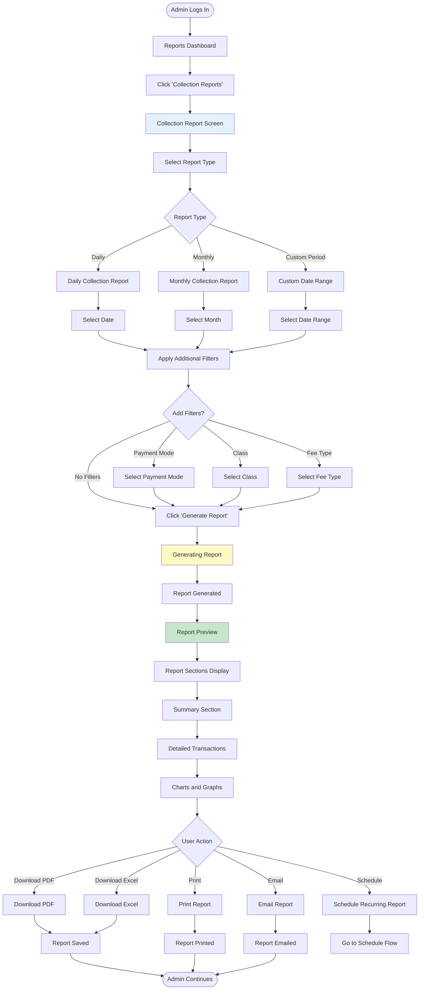
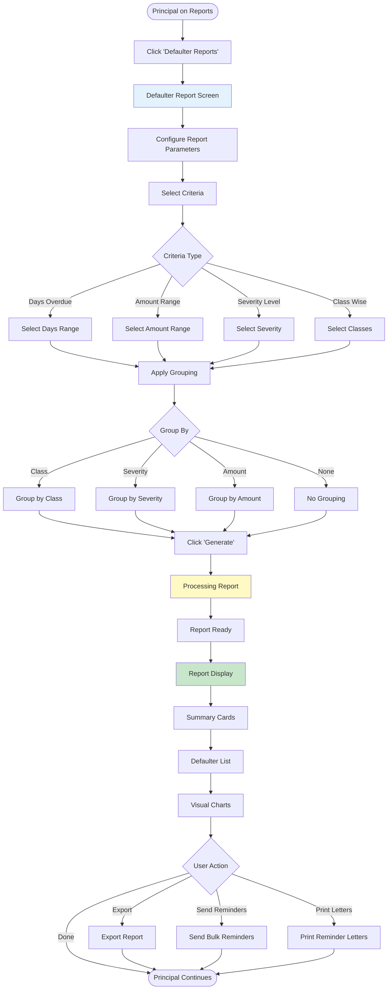
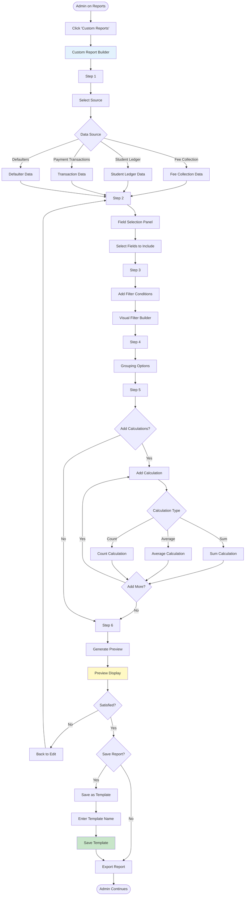
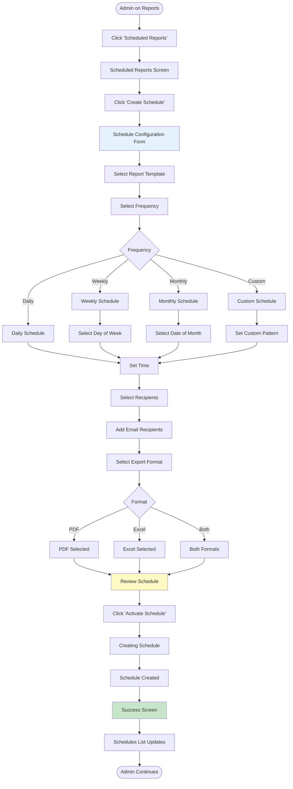
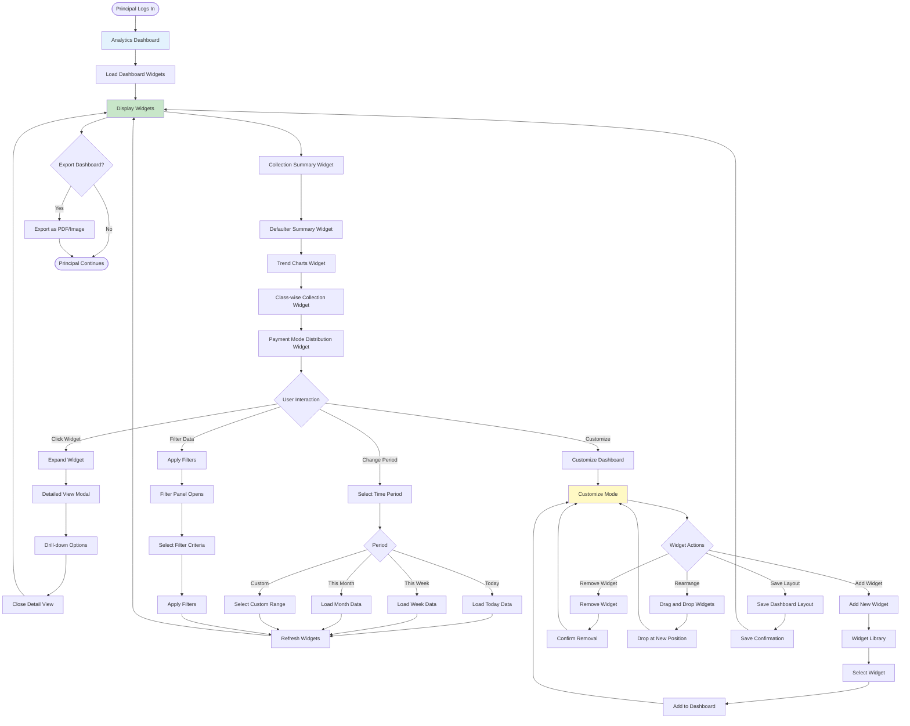

# User Flows: Fee Reports & Analytics (UI/UX Perspective)

## Introduction

This document visualizes the **user interface journey** through the Fee Reports & Analytics module from a UI/UX design perspective. This module provides comprehensive reporting and analytics capabilities for fee management.

Each flowchart focuses on:
- **Screen states** and visual feedback
- **User actions** and decision points
- **Navigation paths** between interfaces
- **Error handling** and recovery flows

---

## Flow 29: Generate Collection Report

### User Story
*"As an Accounts Admin, I want to generate a daily collection report showing all payments received, so that I can submit it to the Principal."*

### Interface Flow

### Screen States

**1. Report Selection**
- Report type cards
- Quick date selectors
- Recent reports
- Saved templates

**2. Report Preview**
- Summary cards
- Data tables
- Charts and graphs
- Export options

---

## Flow 30: Generate Defaulter Report

### User Story
*"As a Principal, I want to generate a defaulter report showing all students with pending dues, so that I can review the situation."*

### Interface Flow

### Screen States

**1. Report Configuration**
- Criteria selectors
- Grouping options
- Sort preferences
- Template selection

**2. Report Display**
- Summary statistics
- Defaulter table
- Charts
- Action buttons

---

## Flow 31: Create Custom Report

### User Story
*"As an Accounts Admin, I want to create a custom report with specific fields and filters, so that I can analyze fee data my way."*

### Interface Flow

### Screen States

**1. Report Builder**
- Drag-and-drop fields
- Filter builder
- Preview panel
- Save template option

**2. Field Selection**
- Available fields list
- Selected fields list
- Field properties
- Reorder option

---

## Flow 32: Schedule Recurring Report

### User Story
*"As an Accounts Admin, I want to schedule a monthly collection report to be emailed automatically, so that I don't have to generate it manually."*

### Interface Flow

### Screen States

**1. Schedule List**
- Active schedules
- Inactive schedules
- Next run time
- Edit/Delete actions

**2. Schedule Form**
- Report selector
- Frequency options
- Time picker
- Recipients list

---

## Flow 33: View Analytics Dashboard

### User Story
*"As a Principal, I want to view an analytics dashboard with key fee metrics, so that I can understand the overall fee collection status at a glance."*

### Interface Flow

### Screen States

**1. Dashboard View**
- Grid layout
- Widget cards
- Summary metrics
- Interactive charts

**2. Widget Types**
- KPI cards
- Line charts
- Bar charts
- Pie charts
- Tables

**3. Customize Mode**
- Widget library
- Drag-and-drop
- Add/Remove buttons
- Save layout

---

## UI/UX Design Patterns Used

### Visual Feedback Patterns

**Report Generation**
- Progress indicators
- Estimated time
- Cancel option
- Success confirmation

**Data Visualization**
- Charts and graphs
- Color-coded metrics
- Trend indicators
- Comparison views

### Report Patterns

**Export Options**
- PDF format
- Excel format
- CSV format
- Print option

**Scheduling**
- Frequency selector
- Time picker
- Recipient management
- Format selection

### Dashboard Patterns

**Widget System**
- Modular widgets
- Drag-and-drop
- Responsive grid
- Customizable layout

**Drill-down**
- Click to expand
- Detail modals
- Back navigation
- Breadcrumbs

---

## Mobile Responsive Considerations

**Reports**
- Simplified layout
- Swipe for sections
- Mobile-optimized charts
- Easy export

**Dashboard**
- Stacked widgets
- Swipe between widgets
- Tap to expand
- Pull to refresh
