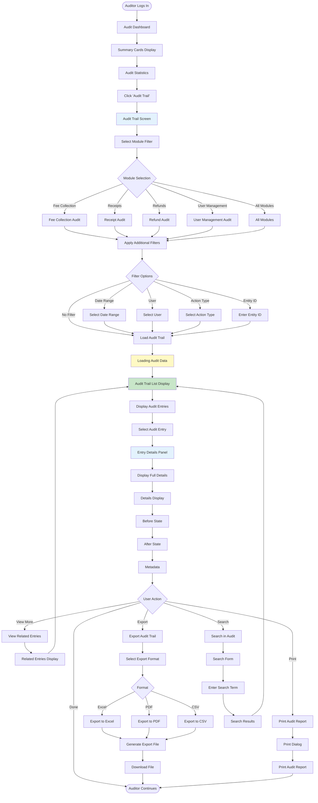

```mermaid
flowchart TD
    Start([Admin on Audit]) --> ClickActivity[Click 'User Activity']
    ClickActivity --> ActivityScreen[User Activity Screen]
    
    ActivityScreen --> SelectUser[Select User to Track]
    SelectUser --> UserSearch[User Search]
    
    UserSearch --> SearchChoice{Search Method}
    
    SearchChoice -->|By Name| SearchName[Search by Name]
    SearchChoice -->|By Role| SearchRole[Search by Role]
    SearchChoice -->|By Department| SearchDept[Search by Department]
    
    SearchName --> UserList[User List Display]
    SearchRole --> UserList
    SearchDept --> UserList
    
    UserList --> SelectTargetUser[Select Target User]
    SelectTargetUser --> SelectPeriod[Select Time Period]
    
    SelectPeriod --> PeriodChoice{Period Selection}
    
    PeriodChoice -->|Today| TodayActivity[Today's Activity]
    PeriodChoice -->|Last 7 Days| WeekActivity[Last Week Activity]
    PeriodChoice -->|Last 30 Days| MonthActivity[Last Month Activity]
    PeriodChoice -->|Custom Range| CustomRange[Custom Date Range]
    
    TodayActivity --> LoadActivity[Load User Activity]
    WeekActivity --> LoadActivity
    MonthActivity --> LoadActivity
    CustomRange --> SelectCustomRange[Select Custom Range]
    SelectCustomRange --> LoadActivity
    
    LoadActivity --> ProcessingState[Loading Activity Data]
    ProcessingState --> ActivityList[Activity List Display]
    
    ActivityList --> ShowTimeline[Activity Timeline]
    ShowTimeline --> TimelineDisplay[Timeline Display]
    
    TimelineDisplay --> SessionGroups[Grouped by Sessions]
    SessionGroups --> SelectSession[Select Session]
    
    SelectSession --> SessionDetails[Session Details Panel]
    SessionDetails --> ShowSessionInfo[Session Information]
    
    ShowSessionInfo --> LoginTime[Login Time]
    LoginTime --> LogoutTime[Logout Time]
    LogoutTime --> IPAddress[IP Address]
    IPAddress --> Location[Location]
    Location --> DeviceInfo[Device Information]
    DeviceInfo --> ActivityCount[Activity Count]
    
    ActivityCount --> ViewActions[View Session Actions]
    ViewActions --> ActionList[Action List]
    
    ActionList --> ActionChoice{User Action}
    
    ActionChoice -->|View Details| ViewActionDetails[View Action Details]
    ActionChoice -->|Flag Suspicious| FlagActivity[Flag as Suspicious]
    ActionChoice -->|Export| ExportActivity[Export Activity Report]
    ActionChoice -->|Compare Sessions| CompareSessions[Compare with Other Sessions]
    ActionChoice -->|Done| End([Admin Continues])
    
    ViewActionDetails --> ActionDetailPanel[Action Detail Panel]
    ActionDetailPanel --> ActivityList
    
    FlagActivity --> FlagDialog[Flag Dialog]
    FlagDialog --> EnterReason[Enter Reason]
    EnterReason --> SubmitFlag[Submit Flag]
    SubmitFlag --> FlaggedSuccess[Activity Flagged]
    FlaggedSuccess --> End
    
    ExportActivity --> SelectFormat[Select Export Format]
    SelectFormat --> GenerateReport[Generate Activity Report]
    GenerateReport --> DownloadReport[Download Report]
    DownloadReport --> End
    
    CompareSessions --> SelectCompareSession[Select Session to Compare]
    SelectCompareSession --> ComparisonView[Comparison View]
    ComparisonView --> End
    
    style ActivityScreen fill:#e3f2fd
    style ActivityList fill:#c8e6c9
    style ProcessingState fill:#fff9c4
    style SessionDetails fill:#e3f2fd
```

```mermaid
flowchart TD
    Start([Officer on Audit]) --> ClickCompliance[Click 'Compliance Reports']
    ClickCompliance --> ComplianceScreen[Compliance Report Screen]
    
    ComplianceScreen --> ViewTemplates[View Report Templates]
    ViewTemplates --> SelectReportType[Select Report Type]
    
    SelectReportType --> TypeChoice{Report Type}
    
    TypeChoice -->|Financial Audit| FinancialReport[Financial Audit Report]
    TypeChoice -->|Data Protection| DataProtectionReport[Data Protection Report]
    TypeChoice -->|Access Control| AccessControlReport[Access Control Report]
    TypeChoice -->|Transaction Audit| TransactionReport[Transaction Audit Report]
    TypeChoice -->|Custom| CustomReport[Custom Compliance Report]
    
    FinancialReport --> SelectPeriod[Select Audit Period]
    DataProtectionReport --> SelectPeriod
    AccessControlReport --> SelectPeriod
    TransactionReport --> SelectPeriod
    CustomReport --> ConfigureCustom[Configure Custom Report]
    
    ConfigureCustom --> SelectPeriod
    
    SelectPeriod --> PeriodChoice{Period Selection}
    
    PeriodChoice -->|Quarterly| SelectQuarter[Select Quarter]
    PeriodChoice -->|Annual| SelectYear[Select Year]
    PeriodChoice -->|Custom| SelectCustomPeriod[Select Custom Period]
    
    SelectQuarter --> ConfigureReport[Configure Report Parameters]
    SelectYear --> ConfigureReport
    SelectCustomPeriod --> ConfigureReport
    
    ConfigureReport --> SelectScope[Select Scope]
    SelectScope --> ScopeChoice{Scope}
    
    ScopeChoice -->|All Modules| AllModules[All Modules]
    ScopeChoice -->|Specific Modules| SelectModules[Select Specific Modules]
    ScopeChoice -->|Specific Users| SelectUsers[Select Specific Users]
    
    AllModules --> ReviewConfig[Review Configuration]
    SelectModules --> ReviewConfig
    SelectUsers --> ReviewConfig
    
    ReviewConfig --> ClickGenerate[Click 'Generate Report']
    ClickGenerate --> ProcessingState[Generating Compliance Report]
    
    ProcessingState --> ReportGenerated[Report Generated]
    ReportGenerated --> ShowReport[Report Preview]
    
    ShowReport --> ReportSections[Report Sections]
    ReportSections --> ExecutiveSummary[Executive Summary]
    ExecutiveSummary --> DetailedFindings[Detailed Findings]
    DetailedFindings --> Recommendations[Recommendations]
    Recommendations --> Appendices[Appendices]
    
    Appendices --> ActionChoice{User Action}
    
    ActionChoice -->|Download| DownloadReport[Download PDF]
    ActionChoice -->|Sign| DigitalSign[Apply Digital Signature]
    ActionChoice -->|Submit| SubmitReport[Submit to Authority]
    ActionChoice -->|Edit| EditReport[Edit Report]
    ActionChoice -->|Share| ShareReport[Share Report]
    
    DownloadReport --> DownloadFile[Download File]
    DownloadFile --> End([Officer Continues])
    
    DigitalSign --> SignatureDialog[Digital Signature Dialog]
    SignatureDialog --> SelectCertificate[Select Certificate]
    SelectCertificate --> EnterPIN[Enter PIN]
    EnterPIN --> ApplySignature[Apply Signature]
    ApplySignature --> SignedReport[Report Signed]
    SignedReport --> End
    
    SubmitReport --> SubmissionForm[Submission Form]
    SubmissionForm --> SelectAuthority[Select Authority]
    SelectAuthority --> EnterDetails[Enter Submission Details]
    EnterDetails --> AttachDocuments[Attach Supporting Documents]
    AttachDocuments --> ReviewSubmission[Review Submission]
    ReviewSubmission --> ClickSubmit[Click 'Submit']
    ClickSubmit --> SubmissionProcessing[Processing Submission]
    SubmissionProcessing --> SubmissionSuccess[Submission Successful]
    SubmissionSuccess --> TrackingNumber[Tracking Number Generated]
    TrackingNumber --> End
    
    EditReport --> ReportEditor[Report Editor]
    ReportEditor --> MakeEdits[Make Edits]
    MakeEdits --> SaveEdits[Save Edits]
    SaveEdits --> ShowReport
    
    ShareReport --> ShareDialog[Share Dialog]
    ShareDialog --> SelectRecipients[Select Recipients]
    SelectRecipients --> AddMessage[Add Message]
    AddMessage --> SendShare[Send Share]
    SendShare --> ShareSuccess[Report Shared]
    ShareSuccess --> End
    
    style ComplianceScreen fill:#e3f2fd
    style ShowReport fill:#c8e6c9
    style ProcessingState fill:#fff9c4
    style SignedReport fill:#c8e6c9
    style SubmissionSuccess fill:#c8e6c9
```

# User Flows: Audit & Compliance (UI/UX Perspective)

## Introduction

This document visualizes the **user interface journey** through the Audit & Compliance module from a UI/UX design perspective. This module maintains comprehensive audit trails of all fee-related transactions and changes.

Each flowchart focuses on:
- **Screen states** and visual feedback
- **User actions** and decision points
- **Navigation paths** between interfaces
- **Error handling** and recovery flows

---

## Flow 34: View Audit Trail

### User Story
*"As an Auditor, I want to view the complete audit trail of all fee transactions, so that I can verify system integrity and track all changes."*

### Interface Flow

### Screen States

**1. Audit Dashboard**
- Total entries count
- Recent activity
- Top users
- Module breakdown chart

**2. Audit Trail Screen**
- Module filter dropdown
- Date range picker
- User filter
- Action type filter
- Search bar

**3. Audit List**
- Table with columns: Timestamp, User, Module, Action, Entity, Status
- Color-coded action types
- Pagination
- Sort options

**4. Entry Details Panel**
- Before/After comparison
- User information
- IP address and location
- Session details
- Related entries link

---

## Flow 35: Track User Activity

### User Story
*"As a Super Admin, I want to track all user activities in the system, so that I can monitor system usage and identify suspicious behavior."*

### Interface Flow

### Screen States

**1. User Activity Screen**
- User search bar
- Recent users list
- Active users indicator
- Suspicious activity alerts

**2. Activity Timeline**
- Chronological timeline
- Session grouping
- Activity type icons
- Time markers

**3. Session Details**
- Session duration
- IP address with geolocation
- Device and browser info
- Activity count
- Suspicious indicators

**4. Action List**
- Action type
- Timestamp
- Module
- Entity affected
- Success/Failure status

---

## Flow 36: Generate Compliance Report

### User Story
*"As a Compliance Officer, I want to generate a compliance report for the audit period, so that I can submit it to regulatory authorities."*

### Interface Flow

### Screen States

**1. Compliance Report Screen**
- Report templates library
- Recent reports
- Scheduled reports
- Submission status

**2. Report Configuration**
- Report type selector
- Period selector
- Scope configuration
- Parameter settings

**3. Report Preview**
- Executive summary
- Detailed findings with charts
- Recommendations
- Appendices with raw data

**4. Digital Signature**
- Certificate selection
- PIN entry
- Signature preview
- Verification status

**5. Submission Form**
- Authority selection
- Submission details
- Document attachments
- Tracking information

---

## UI/UX Design Patterns Used

### Visual Feedback Patterns

**Audit Trail Display**
- Chronological timeline
- Color-coded actions
- Before/After comparison
- Search highlighting

**User Activity Tracking**
- Session grouping
- Activity heatmap
- Suspicious activity alerts
- Real-time updates

**Compliance Reporting**
- Template-based generation
- Progress indicators
- Digital signature workflow
- Submission tracking

### Data Visualization

**Audit Statistics**
- Activity charts
- User distribution
- Module usage
- Time-based trends

**Activity Timeline**
- Session visualization
- Action grouping
- Time markers
- Drill-down capability

### Security Patterns

**Access Control**
- Role-based viewing
- Sensitive data masking
- Audit log protection
- Tamper detection

**Digital Signatures**
- Certificate validation
- Signature verification
- Timestamp inclusion
- Non-repudiation

---

## Mobile Responsive Considerations

**Audit Trail**
- Card-based layout
- Swipe for details
- Filter bottom sheet
- Export options

**User Activity**
- Timeline view
- Session cards
- Tap to expand
- Quick actions

**Compliance Reports**
- Simplified preview
- Mobile-optimized PDF
- Easy sharing
- Offline viewing
