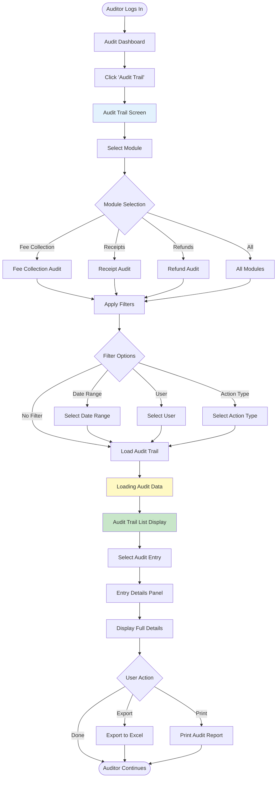
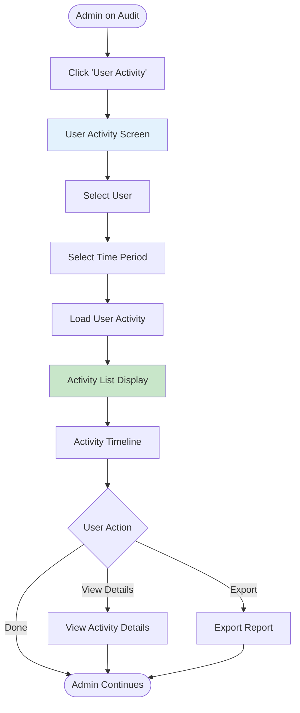
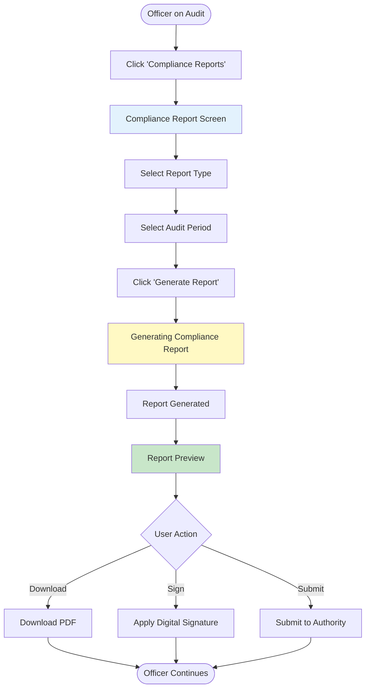

# User Flows: Audit & Compliance (UI/UX Perspective)

## Introduction

This document visualizes the **user interface journey** through the Audit & Compliance module from a UI/UX design perspective. This module maintains comprehensive audit trails of all fee-related transactions and changes.

Each flowchart focuses on:
- **Screen states** and visual feedback
- **User actions** and decision points
- **Navigation paths** between interfaces
- **Error handling** and recovery flows

---

## Flow 34: View Audit Trail

### User Story
*"As an Auditor, I want to view the complete audit trail of all fee transactions, so that I can verify system integrity."*

### Interface Flow

---

## Flow 35: Track User Activity

### User Story
*"As a Super Admin, I want to track all user activities in the system, so that I can monitor system usage and identify suspicious behavior."*

### Interface Flow

---

## Flow 36: Generate Compliance Report

### User Story
*"As a Compliance Officer, I want to generate a compliance report for the audit period, so that I can submit it to regulatory authorities."*

### Interface Flow

---

## UI/UX Design Patterns

**Audit Trail Display**
- Chronological timeline
- Filter and search
- Detailed view
- Export capabilities

**User Activity Tracking**
- Activity timeline
- Session tracking
- IP address logging
- Action categorization

**Compliance Reporting**
- Template-based reports
- Digital signatures
- Regulatory compliance
- Submission tracking
