```mermaid
flowchart TD
    Start([Admin Logs In]) --> Dashboard[Notifications Dashboard]
    
    Dashboard --> ViewSummary[Summary Display]
    ViewSummary --> ClickTemplates[Click 'Templates']
    
    ClickTemplates --> TemplateScreen[Template Management Screen]
    TemplateScreen --> ViewTemplates[View Existing Templates]
    
    ViewTemplates --> TemplateList[Template List Display]
    TemplateList --> ClickNew[Click 'Create Template']
    
    ClickNew --> TemplateWizard[Template Creation Wizard]
    TemplateWizard --> Step1[Step 1]
    
    Step1 --> EnterName[Enter Template Name]
    EnterName --> SelectCategory[Select Category]
    
    SelectCategory --> CategoryChoice{Category}
    
    CategoryChoice -->|Payment Reminder| PaymentCategory[Payment Reminder]
    CategoryChoice -->|Receipt Confirmation| ReceiptCategory[Receipt Confirmation]
    CategoryChoice -->|Due Alert| DueCategory[Due Alert]
    CategoryChoice -->|Fine Notification| FineCategory[Fine Notification]
    CategoryChoice -->|Custom| CustomCategory[Custom Category]
    
    PaymentCategory --> ClickNext1[Click 'Next']
    ReceiptCategory --> ClickNext1
    DueCategory --> ClickNext1
    FineCategory --> ClickNext1
    CustomCategory --> ClickNext1
    
    ClickNext1 --> Step2[Step 2]
    Step2 --> SelectChannel[Select Communication Channel]
    
    SelectChannel --> ChannelChoice{Channel}
    
    ChannelChoice -->|SMS| SMSTemplate[SMS Template]
    ChannelChoice -->|Email| EmailTemplate[Email Template]
    ChannelChoice -->|WhatsApp| WhatsAppTemplate[WhatsApp Template]
    ChannelChoice -->|Push Notification| PushTemplate[Push Notification Template]
    ChannelChoice -->|Multiple| MultiChannel[Multiple Channels]
    
    SMSTemplate --> ClickNext2[Click 'Next']
    EmailTemplate --> ClickNext2
    WhatsAppTemplate --> ClickNext2
    PushTemplate --> ClickNext2
    MultiChannel --> SelectMultiple[Select Multiple Channels]
    SelectMultiple --> ClickNext2
    
    ClickNext2 --> Step3[Step 3]
    Step3 --> ContentEditor[Content Editor]
    
    ContentEditor --> EnterSubject[Enter Subject Line]
    EnterSubject --> EnterContent[Enter Template Content]
    
    EnterContent --> AddVariables[Add Dynamic Variables]
    AddVariables --> VariableLibrary[Variable Library Panel]
    
    VariableLibrary --> SelectVariable[Select Variable]
    SelectVariable --> VariableChoice{Variable Type}
    
    VariableChoice -->|Student Name| StudentName[Student Name Variable]
    VariableChoice -->|Amount| Amount[Amount Variable]
    VariableChoice -->|Due Date| DueDate[Due Date Variable]
    VariableChoice -->|Receipt Number| ReceiptNo[Receipt Number Variable]
    
    StudentName --> InsertVariable[Insert Variable]
    Amount --> InsertVariable
    DueDate --> InsertVariable
    ReceiptNo --> InsertVariable
    
    InsertVariable --> MoreVariables{Add More Variables?}
    
    MoreVariables -->|Yes| SelectVariable
    MoreVariables -->|No| ClickNext3[Click 'Next']
    
    ClickNext3 --> Step4[Step 4]
    Step4 --> PreviewTemplate[Preview Template]
    
    PreviewTemplate --> ShowPreview[Template Preview Display]
    ShowPreview --> TestTemplate[Click 'Test Template']
    
    TestTemplate --> TestDialog[Test Dialog]
    TestDialog --> EnterTestRecipient[Enter Test Phone/Email]
    EnterTestRecipient --> SendTest[Send Test Message]
    
    SendTest --> TestResult{Test Successful?}
    
    TestResult -->|No| TestError[Error Message]
    TestError --> ShowErrorDetails[Show Error Details]
    ShowErrorDetails --> FixIssue{Fix Issue?}
    
    FixIssue -->|Yes| Step3
    FixIssue -->|No| TemplateScreen
    
    TestResult -->|Yes| TestSuccess[Test Message Sent]
    TestSuccess --> ReviewTemplate[Review Template]
    
    ReviewTemplate --> ClickSave[Click 'Save Template']
    ClickSave --> ProcessingState[Saving Template]
    
    ProcessingState --> TemplateSaved[Template Saved]
    TemplateSaved --> SuccessScreen[Success Screen]
    
    SuccessScreen --> ActionChoice{User Action}
    
    ActionChoice -->|Create Another| TemplateWizard
    ActionChoice -->|View Templates| TemplateList
    ActionChoice -->|Done| End([Admin Continues])
    
    style TemplateWizard fill:#e3f2fd
    style PreviewTemplate fill:#fff9c4
    style SuccessScreen fill:#c8e6c9
    style TestError fill:#ffcdd2
```

```mermaid
flowchart TD
    Start([Admin on Notifications]) --> ClickBulk[Click 'Bulk Notifications']
    ClickBulk --> BulkScreen[Bulk Notification Screen]
    
    BulkScreen --> Step1[Step 1]
    Step1 --> RecipientSelection[Recipient Selection]
    
    RecipientSelection --> SelectionMethod{Selection Method}
    
    SelectionMethod -->|All Parents| AllParents[All Parents]
    SelectionMethod -->|Defaulters| Defaulters[Parents with Pending Dues]
    SelectionMethod -->|By Class| ByClass[Select Classes]
    SelectionMethod -->|By Amount| ByAmount[Select Amount Range]
    SelectionMethod -->|Custom Filter| CustomFilter[Custom Filter Builder]
    SelectionMethod -->|Upload List| UploadList[Upload Recipient List]
    
    AllParents --> ShowCount[Show Recipient Count]
    Defaulters --> ShowCount
    ByClass --> SelectClasses[Select Classes]
    SelectClasses --> ShowCount
    ByAmount --> SelectRange[Select Amount Range]
    SelectRange --> ShowCount
    CustomFilter --> BuildFilter[Build Custom Filter]
    BuildFilter --> ShowCount
    UploadList --> FileUpload[Upload CSV/Excel File]
    FileUpload --> ValidateFile[Validate File]
    ValidateFile --> ShowCount
    
    ShowCount --> PreviewRecipients[Preview Recipient List]
    PreviewRecipients --> ClickNext1[Click 'Next']
    
    ClickNext1 --> Step2[Step 2]
    Step2 --> TemplateSelection[Template Selection]
    
    TemplateSelection --> TemplateChoice{Template Source}
    
    TemplateChoice -->|Existing Template| SelectTemplate[Select from Templates]
    TemplateChoice -->|Create New| CreateTemplate[Create New Template]
    
    SelectTemplate --> TemplatePreview[Template Preview]
    CreateTemplate --> QuickEditor[Quick Template Editor]
    QuickEditor --> TemplatePreview
    
    TemplatePreview --> CustomizeTemplate[Customize Template]
    CustomizeTemplate --> ClickNext2[Click 'Next']
    
    ClickNext2 --> Step3[Step 3]
    Step3 --> ScheduleOptions[Schedule Options]
    
    ScheduleOptions --> ScheduleChoice{Delivery Time}
    
    ScheduleChoice -->|Send Now| SendNow[Send Immediately]
    ScheduleChoice -->|Schedule| ScheduleLater[Schedule for Later]
    
    SendNow --> ReviewSend[Review and Send]
    ScheduleLater --> SelectDateTime[Select Date and Time]
    SelectDateTime --> SetThrottling[Set Throttling Rate]
    SetThrottling --> ReviewSend
    
    ReviewSend --> FinalReview[Final Review Screen]
    FinalReview --> ShowSummary[Summary Display]
    
    ShowSummary --> RecipientCount[Recipient Count]
    RecipientCount --> TemplateInfo[Template Information]
    TemplateInfo --> ScheduleInfo[Schedule Information]
    ScheduleInfo --> EstimatedCost[Estimated Cost]
    
    EstimatedCost --> ConfirmChoice{Confirm Send?}
    
    ConfirmChoice -->|No| Step1
    ConfirmChoice -->|Yes| ClickSend[Click 'Send']
    
    ClickSend --> ProcessingState[Processing Bulk Send]
    ProcessingState --> SendingProgress[Sending Progress]
    
    SendingProgress --> ProgressBar[Progress Bar Display]
    ProgressBar --> SendComplete[Send Complete]
    
    SendComplete --> ShowResults[Results Display]
    ShowResults --> SuccessCount[Successful Sends]
    SuccessCount --> FailedCount[Failed Sends]
    FailedCount --> DeliveryReport[Delivery Report]
    
    DeliveryReport --> ActionChoice{User Action}
    
    ActionChoice -->|View Failed| ViewFailed[View Failed Recipients]
    ActionChoice -->|Retry Failed| RetryFailed[Retry Failed Sends]
    ActionChoice -->|Export Report| ExportReport[Export Delivery Report]
    ActionChoice -->|Done| End([Admin Continues])
    
    ViewFailed --> FailedList[Failed Recipients List]
    FailedList --> End
    
    RetryFailed --> RetryProcessing[Retrying Failed Sends]
    RetryProcessing --> End
    
    ExportReport --> DownloadReport[Download Report]
    DownloadReport --> End
    
    style BulkScreen fill:#e3f2fd
    style SendComplete fill:#c8e6c9
    style ProcessingState fill:#fff9c4
    style ProgressBar fill:#fff9c4
```

```mermaid
flowchart TD
    Start([Admin on Notifications]) --> ClickHistory[Click 'Notification History']
    ClickHistory --> HistoryScreen[Notification History Screen]
    
    HistoryScreen --> ViewList[View Notification List]
    ViewList --> FilterOptions[Filter Options]
    
    FilterOptions --> FilterChoice{Filter By}
    
    FilterChoice -->|Date Range| SelectDateRange[Select Date Range]
    FilterChoice -->|Status| SelectStatus[Select Status]
    FilterChoice -->|Channel| SelectChannel[Select Channel]
    FilterChoice -->|Template| SelectTemplate[Select Template]
    FilterChoice -->|No Filter| NotificationList[Notification List]
    
    SelectDateRange --> NotificationList
    SelectStatus --> NotificationList
    SelectChannel --> NotificationList
    SelectTemplate --> NotificationList
    
    NotificationList --> ShowNotifications[Display Notifications]
    ShowNotifications --> SelectNotification[Select Notification]
    
    SelectNotification --> NotificationDetails[Notification Details Panel]
    NotificationDetails --> ShowOverview[Overview Display]
    
    ShowOverview --> TotalSent[Total Sent]
    TotalSent --> Delivered[Delivered]
    Delivered --> Failed[Failed]
    Failed --> Pending[Pending]
    Pending --> DeliveryRate[Delivery Rate]
    
    DeliveryRate --> ViewDetails[View Detailed Status]
    ViewDetails --> RecipientList[Recipient List]
    
    RecipientList --> StatusFilter{Filter by Status}
    
    StatusFilter -->|All| AllRecipients[All Recipients]
    StatusFilter -->|Delivered| DeliveredList[Delivered Recipients]
    StatusFilter -->|Failed| FailedList[Failed Recipients]
    StatusFilter -->|Pending| PendingList[Pending Recipients]
    
    AllRecipients --> RecipientTable[Recipient Table Display]
    DeliveredList --> RecipientTable
    FailedList --> RecipientTable
    PendingList --> RecipientTable
    
    RecipientTable --> SelectRecipient[Select Recipient]
    SelectRecipient --> RecipientDetails[Recipient Details Panel]
    
    RecipientDetails --> ShowRecipientInfo[Recipient Information]
    ShowRecipientInfo --> DeliveryStatus[Delivery Status]
    DeliveryStatus --> DeliveryTime[Delivery Time]
    DeliveryTime --> ErrorDetails[Error Details]
    
    ErrorDetails --> ActionChoice{User Action}
    
    ActionChoice -->|Resend| ResendNotification[Resend to Recipient]
    ActionChoice -->|View Message| ViewMessage[View Sent Message]
    ActionChoice -->|Export| ExportDeliveryReport[Export Delivery Report]
    ActionChoice -->|Analyze| AnalyzeDelivery[Analyze Delivery Issues]
    ActionChoice -->|Done| End([Admin Continues])
    
    ResendNotification --> ConfirmResend[Confirm Resend]
    ConfirmResend --> ResendProcessing[Resending]
    ResendProcessing --> ResendSuccess[Resend Successful]
    ResendSuccess --> End
    
    ViewMessage --> MessagePreview[Message Preview]
    MessagePreview --> End
    
    ExportDeliveryReport --> SelectFormat[Select Export Format]
    SelectFormat --> GenerateExport[Generate Export]
    GenerateExport --> DownloadExport[Download Export]
    DownloadExport --> End
    
    AnalyzeDelivery --> AnalysisScreen[Delivery Analysis Screen]
    AnalysisScreen --> ShowAnalytics[Show Analytics]
    ShowAnalytics --> FailureReasons[Failure Reasons Chart]
    FailureReasons --> DeliveryTrends[Delivery Trends]
    DeliveryTrends --> End
    
    style HistoryScreen fill:#e3f2fd
    style RecipientTable fill:#c8e6c9
    style ResendSuccess fill:#c8e6c9
```

```mermaid
flowchart TD
    Start([Parent Logs into Portal]) --> Dashboard[Parent Dashboard]
    
    Dashboard --> ViewNotifications[View Notifications Badge]
    ViewNotifications --> ClickSettings[Click 'Settings']
    
    ClickSettings --> SettingsScreen[Settings Screen]
    SettingsScreen --> ClickNotifications[Click 'Notification Preferences']
    
    ClickNotifications --> PreferencesScreen[Notification Preferences Screen]
    PreferencesScreen --> CurrentSettings[Current Settings Display]
    
    CurrentSettings --> ChannelPreferences[Channel Preferences Section]
    ChannelPreferences --> SelectChannels[Select Preferred Channels]
    
    SelectChannels --> ChannelChoice{Channel Selection}
    
    ChannelChoice -->|SMS| SMSToggle[Enable/Disable SMS]
    ChannelChoice -->|Email| EmailToggle[Enable/Disable Email]
    ChannelChoice -->|WhatsApp| WhatsAppToggle[Enable/Disable WhatsApp]
    ChannelChoice -->|Push| PushToggle[Enable/Disable Push]
    
    SMSToggle --> VerifyContact[Verify Contact Information]
    EmailToggle --> VerifyContact
    WhatsAppToggle --> VerifyContact
    PushToggle --> VerifyContact
    
    VerifyContact --> ContactInfo[Contact Information]
    ContactInfo --> UpdateContact{Update Contact?}
    
    UpdateContact -->|Yes| EditContact[Edit Contact Information]
    EditContact --> VerifyNew[Verify New Contact]
    VerifyNew --> SendVerification[Send Verification Code]
    SendVerification --> EnterCode[Enter Verification Code]
    EnterCode --> VerifyCode{Code Valid?}
    
    VerifyCode -->|No| CodeError[Invalid Code Error]
    CodeError --> EnterCode
    
    VerifyCode -->|Yes| ContactVerified[Contact Verified]
    ContactVerified --> FrequencySettings[Frequency Settings]
    
    UpdateContact -->|No| FrequencySettings
    
    FrequencySettings --> SetFrequency[Set Notification Frequency]
    SetFrequency --> FrequencyChoice{Frequency}
    
    FrequencyChoice -->|Immediate| ImmediateNotif[Immediate Notifications]
    FrequencyChoice -->|Daily Digest| DailyDigest[Daily Digest]
    FrequencyChoice -->|Weekly Summary| WeeklySummary[Weekly Summary]
    
    ImmediateNotif --> CategoryPreferences[Category Preferences]
    DailyDigest --> SelectTime[Select Digest Time]
    SelectTime --> CategoryPreferences
    WeeklySummary --> SelectDay[Select Summary Day]
    SelectDay --> CategoryPreferences
    
    CategoryPreferences --> SelectCategories[Select Notification Categories]
    SelectCategories --> CategoryChoice{Category}
    
    CategoryChoice -->|Payment Reminders| PaymentToggle[Enable/Disable Payment Reminders]
    CategoryChoice -->|Receipt Confirmations| ReceiptToggle[Enable/Disable Receipt Confirmations]
    CategoryChoice -->|Due Alerts| DueToggle[Enable/Disable Due Alerts]
    CategoryChoice -->|Fine Notifications| FineToggle[Enable/Disable Fine Notifications]
    CategoryChoice -->|General Updates| GeneralToggle[Enable/Disable General Updates]
    
    PaymentToggle --> QuietHours[Quiet Hours Settings]
    ReceiptToggle --> QuietHours
    DueToggle --> QuietHours
    FineToggle --> QuietHours
    GeneralToggle --> QuietHours
    
    QuietHours --> SetQuietHours{Set Quiet Hours?}
    
    SetQuietHours -->|Yes| SelectQuietStart[Select Start Time]
    SelectQuietStart --> SelectQuietEnd[Select End Time]
    SelectQuietEnd --> ReviewPreferences[Review Preferences]
    
    SetQuietHours -->|No| ReviewPreferences
    
    ReviewPreferences --> ShowSummary[Preferences Summary]
    ShowSummary --> ClickSave[Click 'Save Preferences']
    
    ClickSave --> ProcessingState[Saving Preferences]
    ProcessingState --> PreferencesSaved[Preferences Saved]
    
    PreferencesSaved --> SuccessMessage[Success Message]
    SuccessMessage --> ConfirmationEmail[Confirmation Email Sent]
    
    ConfirmationEmail --> End([Parent Continues])
    
    style PreferencesScreen fill:#e3f2fd
    style ReviewPreferences fill:#fff9c4
    style SuccessMessage fill:#c8e6c9
```

# User Flows: Notifications & Communication (UI/UX Perspective)

## Introduction

This document visualizes the **user interface journey** through the Notifications & Communication module from a UI/UX design perspective. This module manages all communication with parents and students regarding fee-related matters.

Each flowchart focuses on:
- **Screen states** and visual feedback
- **User actions** and decision points
- **Navigation paths** between interfaces
- **Error handling** and recovery flows

---

## Flow 37: Configure Notification Templates

### User Story
*"As an Admin, I want to create notification templates for common fee-related messages, so that communications are consistent and professional."*

### Interface Flow

### Screen States

**1. Template Management Screen**
- Template list with categories
- Search and filter
- Quick actions
- Usage statistics

**2. Template Wizard**
- Step indicator
- Progress bar
- Back/Next navigation
- Save draft option

**3. Content Editor**
- Rich text editor
- Variable library
- Character count
- Preview panel

**4. Template Preview**
- Live preview
- Variable substitution
- Multi-device preview
- Test button

---

## Flow 38: Send Bulk Notifications

### User Story
*"As an Accounts Admin, I want to send payment reminders to all parents with pending dues, so that they are informed about outstanding payments."*

### Interface Flow

### Screen States

**1. Recipient Selection**
- Filter builder
- Recipient count
- Preview list
- Exclusion options

**2. Template Selection**
- Template library
- Preview panel
- Quick edit option
- Variable validation

**3. Schedule Options**
- Send now/later toggle
- Date/time picker
- Throttling settings
- Timezone selector

**4. Progress Display**
- Progress bar
- Current status
- Success/Failure count
- Estimated time remaining

---

## Flow 39: Track Notification Delivery

### User Story
*"As an Admin, I want to track the delivery status of sent notifications, so that I can ensure parents received the messages."*

### Interface Flow

### Screen States

**1. Notification History**
- List of sent notifications
- Status indicators
- Quick stats
- Search and filter

**2. Notification Details**
- Summary statistics
- Delivery rate chart
- Status breakdown
- Timeline view

**3. Recipient Table**
- Recipient name
- Contact info
- Delivery status
- Timestamp
- Error message

**4. Delivery Analysis**
- Failure reasons chart
- Delivery trends
- Channel comparison
- Recommendations

---

## Flow 40: Manage Parent Preferences

### User Story
*"As a Parent, I want to set my communication preferences, so that I receive notifications through my preferred channels."*

### Interface Flow

### Screen States

**1. Preferences Screen**
- Current settings display
- Channel toggles
- Contact information
- Save button

**2. Channel Settings**
- Enable/disable toggles
- Contact verification
- Test notification button
- Channel-specific options

**3. Frequency Settings**
- Frequency selector
- Time picker
- Day selector
- Preview of schedule

**4. Category Preferences**
- Category toggles
- Priority settings
- Quiet hours
- Do not disturb

---

## UI/UX Design Patterns Used

### Visual Feedback Patterns

**Template Management**
- Live preview
- Variable highlighting
- Character count
- Test functionality

**Bulk Notifications**
- Progress indicators
- Real-time status
- Success/Failure counts
- Delivery reports

**Delivery Tracking**
- Status indicators
- Timeline view
- Analytics charts
- Failure analysis

### Communication Patterns

**Multi-Channel Support**
- Channel selection
- Channel-specific settings
- Unified interface
- Cross-channel analytics

**Template System**
- Variable substitution
- Preview functionality
- Multi-language support
- Version control

### User Preference Patterns

**Preference Management**
- Easy toggles
- Contact verification
- Quiet hours
- Category selection

**Notification Control**
- Frequency settings
- Channel preferences
- Opt-in/opt-out
- Granular control

---

## Mobile Responsive Considerations

**Template Management**
- Simplified editor
- Mobile preview
- Touch-friendly controls
- Quick save

**Bulk Notifications**
- Wizard interface
- Progress tracking
- Mobile-optimized reports
- Quick actions

**Delivery Tracking**
- Card-based layout
- Swipe for details
- Filter bottom sheet
- Quick resend

**Parent Preferences**
- Simple toggles
- Native time pickers
- Easy verification
- Quick save
