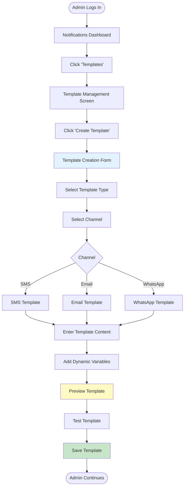
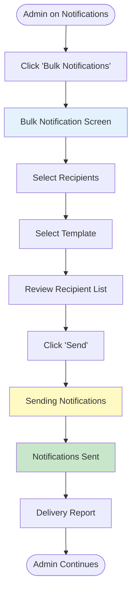
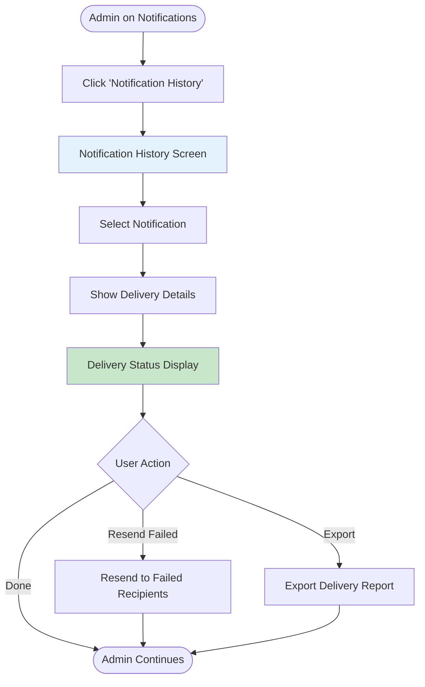
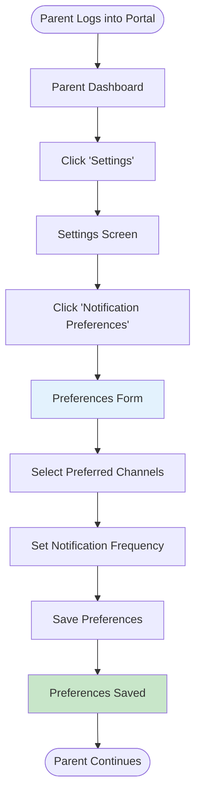

# User Flows: Notifications & Communication (UI/UX Perspective)

## Introduction

This document visualizes the **user interface journey** through the Notifications & Communication module from a UI/UX design perspective. This module manages all communication with parents and students regarding fee-related matters.

Each flowchart focuses on:
- **Screen states** and visual feedback
- **User actions** and decision points
- **Navigation paths** between interfaces
- **Error handling** and recovery flows

---

## Flow 37: Configure Notification Templates

### User Story
*"As an Admin, I want to create notification templates for common fee-related messages, so that communications are consistent and professional."*

### Interface Flow

---

## Flow 38: Send Bulk Notifications

### User Story
*"As an Accounts Admin, I want to send payment reminders to all parents with pending dues, so that they are informed about outstanding payments."*

### Interface Flow

---

## Flow 39: Track Notification Delivery

### User Story
*"As an Admin, I want to track the delivery status of sent notifications, so that I can ensure parents received the messages."*

### Interface Flow

---

## Flow 40: Manage Parent Preferences

### User Story
*"As a Parent, I want to set my communication preferences, so that I receive notifications through my preferred channels."*

### Interface Flow

---

## UI/UX Design Patterns

**Template Management**
- Template library
- Variable insertion
- Preview before send
- Multi-language support

**Bulk Notifications**
- Recipient selection
- Batch processing
- Progress tracking
- Delivery reports

**Delivery Tracking**
- Status indicators
- Failed delivery handling
- Resend capability
- Analytics dashboard
